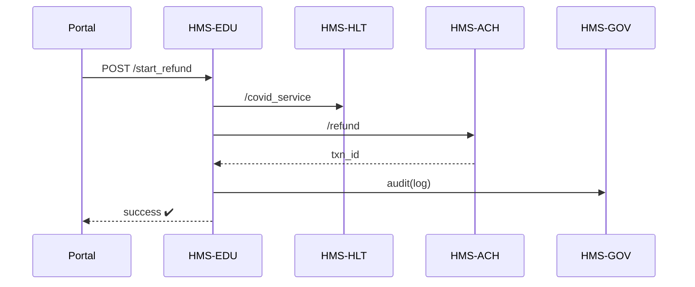

# Chapter 9: Domain-Specific Modules (HMS-ACH, HMS-HLT, HMS-EDU)

[← Back to Chapter 8: Backend Microservices Mesh (HMS-SVC)](08_backend_microservices_mesh__hms_svc__.md)

---

## 1. Why Do We Need “Departments” Inside the Platform?

### Central Use-Case: Fast-Track Student Loan Refund  
Congress approves a one-time **interest refund** for borrowers who worked in public hospitals during COVID-19.

Steps a citizen (Dana) expects:

1. **Verify employment** at a qualifying hospital.  
2. **Check health records** for COVID service dates.  
3. **Calculate refund** and push money to her bank.  

These actions cross **three** distinct knowledge areas:

| Task | Domain Module |
|------|---------------|
| Employment validation | HMS-HLT (health workforce data) |
| Eligibility logic | HMS-EDU (student aid policies) |
| Money movement | HMS-ACH (payments) |

If we jammed everything into one giant codebase, every little change would be risky, slow to audit, and hard to test.  
Instead, each “department” (ACH, HLT, EDU) owns its own:

* data schema  
* API contract  
* AI models  
* mini-governance settings  

Yet they all follow the **same platform rules** you learned in previous chapters.

---

## 2. Key Concepts (Plain-English Cheat-Sheet)

| Concept | Everyday Analogy | One-Liner |
|---------|------------------|-----------|
| Domain Module | Federal agency office | Encapsulates all logic for a policy area. |
| Canonical Schema | Official form template | Table/field names everyone agrees on. |
| Adapter Layer | Bilingual clerk | Translates outside data into the schema. |
| Domain AI Model | Subject-matter specialist | Trained only on that department’s data. |
| Compliance Mirror | CCTV camera | Auto-checks every change against domain-specific laws. |

---

## 3. Directory Snapshot

```
hms_modules/
 ├─ ach/      # payments
 │   ├─ api.py
 │   ├─ models.py
 │   └─ schema.yml
 ├─ hlt/      # health
 │   ├─ api.py
 │   ├─ ai_model.py
 │   └─ schema.yml
 └─ edu/      # education
     ├─ api.py
     ├─ ai_rules.py
     └─ schema.yml
```

Each folder is **autonomous** but registered with the same Governance Layer.

---

## 4. Talking to a Module – 14 Lines Total

Dana’s refund journey (simplified):

```python
from hms_svc import call          # Chapter 8 helper

def refund_flow(ssn):
    hlt = call("hms-hlt", "/covid_service", {"ssn": ssn})
    edu = call("hms-edu", "/eligibility",   {"ssn": ssn, "days": hlt["days"]})
    ach = call("hms-ach", "/refund",        {"ssn": ssn, "amount": edu["refund"]})
    return ach["txn_id"]
```

What happened?

1. HMS-HLT confirmed Dana worked 210 COVID days.  
2. HMS-EDU’s AI model mapped that to a \$950 refund.  
3. HMS-ACH pushed \$950 to her bank and returned a transaction ID.

_All with three `call()`s—exactly like any other micro-service!_

---

## 5. Under the Hood (No Code Yet)



Five participants keep it readable.

---

## 6. Mini Dive: Inside One Module (HMS-EDU)

### 6.1 Schema (snippet, 10 lines)

```yaml
# hms_modules/edu/schema.yml
StudentRefund:
  ssn:        string
  covid_days: int
  refund:     money
  issued_at:  datetime
```

Beginners’ takeaway: **one YAML file** defines the entire data shape.

### 6.2 API Router (12 lines)

```python
# hms_modules/edu/api.py
@router.post("/eligibility")
def eligibility(req):
    data = _validate(req.json(), "StudentRefund")
    days = data["covid_days"]
    refund = _ai_estimate(days)          # model below
    return {"refund": refund}
```

* `_validate` checks against the schema.  
* Returns only the refund amount—no stateful DB needed in this snippet.

### 6.3 AI Estimator (8 lines)

```python
def _ai_estimate(days):
    # Toy linear model: $5 per day + $50 bonus
    return 5 * days + 50
```

Real models live in `ai_rules.py`, but this keeps the example short.

### 6.4 Compliance Mirror (10 lines)

```python
def compliance_check(payload):
    # Enforce max refund set by statute
    if payload["refund"] > 2000:
        raise ValueError("Exceeds legal cap ($2k)")
```

The function runs **before** HMS-EDU responds; if it fails the call bubbles up to [HMS-GOV](01_governance_layer__hms_gov__.md).

---

## 7. Registering a New Module – 16 Lines

Suppose Congress creates “HMS-ENV” for environmental rebates.

```python
from hms_gov import register_module   # Chapter 1

env_spec = {
    "code": "hms-env",
    "owner": "EPA",
    "schema": "/path/env/schema.yml",
    "endpoints": ["/rebate", "/history"],
    "laws": ["CleanAirAct-2025"],
    "ai_model": "env_rebate_v1"
}
register_module(env_spec)
```

Governance will:

1. Validate schema shape.  
2. Scan AI model for bias.  
3. Link statutes for auditors.  
4. Emit an event `module.registered` so other layers can discover it.

---

## 8. How Modules Integrate with Other Layers

| Layer | Interaction |
|-------|-------------|
| Governance | Approves new schemas, AI models, and compliance mirrors. |
| Access Matrix | Issues role-based tokens like `role=hms_edu_client`. |
| Microservices Mesh | Routes `call("hms-edu", …)` with mTLS & retries. |
| Event Bus | Emits `edu.refund.issued` for dashboards & analytics. |
| Audit Ledger | Stores every refund with schema hash & reviewer ID. |

---

## 9. Beginner FAQ

**Q: Can HMS-HLT call HMS-ACH directly?**  
A: Yes, provided its service account has the `payment:write` scope in the [Access & Authorization Matrix](03_access___authorization_matrix_.md).

**Q: Do modules share the same database?**  
A: No. Each domain maintains its own storage to avoid accidental coupling.

**Q: How do we version a schema change?**  
A: Add `version: 2` in `schema.yml`; Governance enforces backward-compat rules and notifies dependent modules.

**Q: What if two modules define a field with the same name but different meaning?**  
A: Namespaces are module-prefixed (e.g., `edu.refund`, `hlt.refund`). No collision.

---

## 10. Quick Checklist

☑ Each policy area lives in its own folder (ACH, HLT, EDU).  
☑ One YAML file defines the canonical schema.  
☑ A tiny API router exposes endpoints; AI models stay local.  
☑ Compliance Mirror stops illegal responses.  
☑ All modules ride on the same governance, auth, and mesh plumbing.

---

## 11. Conclusion & What’s Next

You now know how HMS-ACH, HMS-HLT, and HMS-EDU act like **specialized departments**—independent yet guided by the same federal-grade rails.

Next we’ll see how these departments synchronize with **outside** agencies and vendors in real time:  
[External System Bridge (Real-Time Sync Connectors)](10_external_system_bridge__real_time_sync_connectors__.md)

---

---

Generated by [AI Codebase Knowledge Builder](https://github.com/The-Pocket/Tutorial-Codebase-Knowledge)