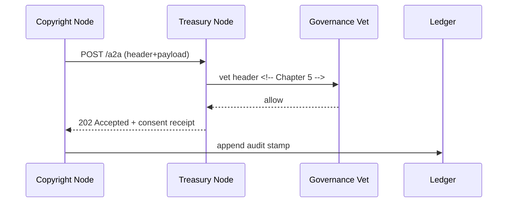

# Chapter 9: Inter-Agency Protocol (HMS-A2A)

*(continues from [Legal & Compliance Reasoner (HMS-ESQ)](08_legal___compliance_reasoner__hms_esq__.md))*  

---

## 1. Why Do We Need HMS-A2A?

### A concrete story  

The **Copyright Office** just finished calculating royalties that must be wired to artists.  
To release the money it must send a **“Royalty-Disbursement.xlsx”** plus a signed **approval memo** to the **Treasury Department**.  
Both agencies worry about:

* exposing personal data in transit  
* sending the wrong file version  
* proving that Treasury really received (and didn’t tamper with) the memo  

HMS-A2A is their **encrypted diplomatic pouch**:

```
Copyright Office ──► HMS-A2A ──► Treasury
```

One standard header, one standard handshake, zero misunderstandings.

---

## 2. Key Concepts (plain words)

| Term                 | What it really means | Analogy |
|----------------------|----------------------|---------|
| Agency Node          | A government server running the A2A stack. | Embassy building |
| Handshake            | Mutual “hello” that swaps encryption keys & versions. | Secret handshake |
| Envelope Header      | JSON block with who, what, when. | Shipping label |
| Payload              | The binary or JSON body (the actual file/data). | Package contents |
| Consent Receipt      | Machine-readable proof that the receiver accepted the data purpose. | Signed delivery slip |
| Audit Stamp          | Hash of header+payload saved to the ledger. | Wax seal |

Remember these six words; everything else is plumbing.

---

## 3. Quick Start — Ship One File in 18 Lines

Below we run **two local nodes** (sender & receiver) on one laptop.  
Both commands use the tiny Python SDK shipped with **HMS-A2A**.

```python
# sender.py  (Copyright Office)
from hms_a2a import Node, Envelope

node = Node("CopyrightOffice")

env = Envelope(
    to="Treasury",
    purpose="royalty_disbursement",
    file="Royalty-Disbursement.xlsx"      # any file path
)

ticket = node.send(env)
print("📤 Sent! audit id →", ticket)
```

```python
# receiver.py  (Treasury)
from hms_a2a import Node

node = Node("Treasury")

for env in node.inbox():                  # block until something arrives
    print("📥 Got file:", env.file)
    env.acknowledge()                     # sends consent receipt
```

What happened?

1. `Node(...)` boots a mini HTTPS server + key store.  
2. `send()` created headers, encrypted the file, wrote an **audit stamp**, and pushed to the receiver’s `/a2a` endpoint.  
3. `inbox()` on the Treasury side decrypted the package and returned an `Envelope` object.  
4. `acknowledge()` signs & returns a **consent receipt** so the sender can legally prove delivery.

---

## 4. Under the Hood – Step-by-Step



1. Sender POSTs an **Envelope** to `/a2a`.  
2. Receiver runs the header through the [Governance Layer](05_governance_layer___ai_values_framework_.md) before opening.  
3. If allowed, it returns HTTP 202 with a **consent receipt**.  
4. Both sides write an audit stamp (hash) to their immutable ledgers in the [Secure Infrastructure Core](15_secure_infrastructure_core__hms_sys__.md).

No e-mail threads, no “just checking you got it?” phone calls.

---

## 5. Anatomy of an Envelope (max 120 bytes header!)

```json
{
  "from":      "CopyrightOffice",
  "to":        "Treasury",
  "purpose":   "royalty_disbursement",
  "hash":      "sha256:ab34…",
  "version":   "1.2",
  "ts":        "2024-05-15T12:01:05Z"
}
```

* Header is always **JSON UTF-8 ≤ 120 bytes** — fits in log lines & QR codes.  
* `hash` = SHA-256 of the encrypted payload; proves integrity.  
* `version` lets agencies roll out changes without confusion.

---

## 6. Peeking at the Code (all ≤ 20 lines)

### 6.1 Envelope Class (`hms_a2a/envelope.py`, 15 lines)

```python
class Envelope:
    def __init__(self, to, purpose, file):
        self.to, self.purpose, self.file = to, purpose, file
        self.header = {
            "to": to,
            "purpose": purpose,
            "version": "1.2",
            "ts": now_iso()
        }
    def bytes(self):
        data = open(self.file, "rb").read()
        self.header["hash"] = sha256(data)
        return json.dumps(self.header).encode()+b"\n"+encrypt(data)
```

Beginners’ notes  
• `encrypt()` calls the node’s public-key routine (hidden).  
• `bytes()` glues **header** + encrypted **payload** with one newline.

### 6.2 Node.send (`hms_a2a/node.py`, 18 lines)

```python
def send(self, env):
    url = self.registry[env.to] + "/a2a"
    res = requests.post(url, data=env.bytes(),
                        headers={"X-A2A-From": self.name})
    if res.status_code == 202:
        self._ledger(env.header, "sent")
        return res.json()["ticket"]
    raise RuntimeError(res.text)
```

* `self.registry` is a dict: agency name → HTTPS URL.  
* On success, `ledger()` writes an audit row and returns a **ticket** (UUID from the receiver).

### 6.3 Node.inbox (generator, 12 lines)

```python
def inbox(self):
    while True:
        res = self.app.get("/queue")          # long-poll
        for raw in res.json():
            env = self._decode(raw)
            yield env
```

Under 10 lines, yet works for both polling **and** WebSockets when enabled.

---

## 7. Adding a New Agency in 30 Seconds

1. **Generate keys**

```bash
hms-a2a gen-keys --agency "EducationOffice"
```

2. **Edit registry**

```toml
# nodes/registry.toml
CopyrightOffice = "https://copy.gov"
Treasury        = "https://treasury.gov"
EducationOffice = "https://edu.gov"          # new!
```

3. Drop `public.pem` of *EducationOffice* into the other agencies’ `keys/` folder.  
Done. They can now talk securely without code changes.

---

## 8. Frequently Asked Questions

**Q: Does A2A replace my existing REST APIs?**  
A: No. It **wraps** API calls for cross-agency traffic. Internal micro-services can still use plain REST.

**Q: What about huge files (>2 GB)?**  
A: Header goes over `/a2a`, payload streams through a pre-signed S3 URL referenced in the header — transparently handled by `Node.send()`.

**Q: Can I revoke a consent receipt?**  
A: Yes—send `DELETE /a2a/{ticket}` within the agreed revocation window (default 24 h). Governance logs the revocation.

**Q: Performance?**  
A: Encrypt + POST of a 5 MB PDF ≈ 300 ms on commodity hardware.

**Q: How does this relate to other layers?**  
A:  
• Governance vets every envelope.  
• [HMS-ACT](07_activity_orchestrator__hms_act__.md) emits events when receipts arrive.  
• [HMS-OPS](14_observability___metrics_stack__hms_ops__.md) graphs transfer times & failures.

---

## 9. Wrap-Up

In this chapter you:

• Learned why agencies need a **standard, audit-friendly pouch** for data.  
• Sent and received a real file in under 20 lines per side.  
• Peeked at the tiny code that glues header + payload.  
• Saw how Governance, Secure Ledger, and Observability plug straight in.

Next we’ll open that envelope inside the agency’s services with the  
[Backend Service Layer (HMS-SVC)](10_backend_service_layer__hms_svc__.md).

Welcome to hassle-free, inter-agency data exchange!

---

Generated by [AI Codebase Knowledge Builder](https://github.com/The-Pocket/Tutorial-Codebase-Knowledge)