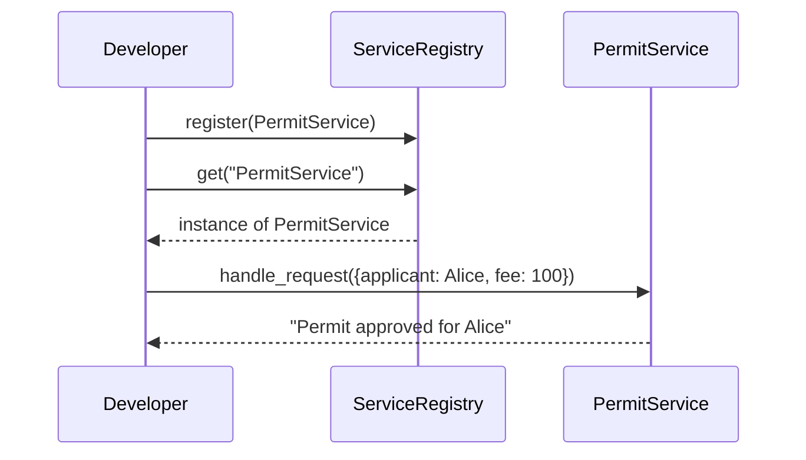
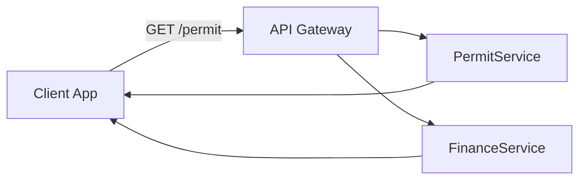

# Chapter 9: Microservice

In [Chapter 8: Authentication & Authorization](08_authentication___authorization_.md) we secured our front door. Now let’s look at the individual “offices” behind that door—**Microservices**. Each microservice is a self-contained unit responsible for one business capability, just like a Permit Office or Finance Office in a government complex.

---

## 1. Why Microservices?

Imagine your state’s permit system needs to:

- Approve building permits.  
- Calculate permit fees.  
- Check applicant credit scores.  

If all logic lived in one big application, a change in fee calculation might break permit approvals. With microservices, each function lives in its own “office,” communicates over APIs, and can be updated or scaled independently.

Use case:  
You want to deploy a new version of your FeeCalculation service without touching the PermitApproval service. Microservices make that possible.

---

## 2. Key Concepts

1. **Microservice**  
   A small, independent application that does one thing (e.g. `PermitService`).  
2. **Service Registry**  
   A central directory where microservices announce themselves (like a lobby directory).  
3. **API**  
   A public corridor (endpoint) through which services talk.  
4. **Independent Deployability**  
   Teams can build, test, and release each service on its own.

---

## 3. Using Microservices

Below is a minimal example. We’ll:

1. Define two services.  
2. Register them in a registry.  
3. Call each service for a request.

```python
# File: app.py
from microservice import ServiceRegistry, PermitService, FinanceService

# 1. Build the registry and register services
registry = ServiceRegistry()
registry.register(PermitService(name="PermitService"))
registry.register(FinanceService(name="FinanceService"))

# 2. Create a request: a citizen applies for a permit
request = {"applicant": "Alice", "fee": 100}

# 3. Call each service by name
for svc_name in ["PermitService", "FinanceService"]:
    svc = registry.get(svc_name)
    response = svc.handle_request(request)
    print(response)
```

What happens:

- We register two microservices.  
- We create a simple request dict.  
- We loop through each service name, fetch it, and ask it to `handle_request`.  
- Each service returns its own response.

---

## 4. Under the Hood: Step‐by‐Step Flow

When you call `svc.handle_request(request)`, here’s a simplified sequence:



1. **Registration**: Service tells the registry “I’m here.”  
2. **Discovery**: Caller asks “Give me PermitService.”  
3. **Execution**: Caller sends a request to the service.  
4. **Response**: Service returns its result.

---

## 5. Peek at the Code

Let’s look at a simplified implementation in two files.

### 5.1 Defining the Base Class and Registry

```python
# File: microservice.py

class Microservice:
    def __init__(self, name):
        self.name = name

    def handle_request(self, request):
        raise NotImplementedError

class ServiceRegistry:
    def __init__(self):
        self.services = {}  # name -> instance

    def register(self, service):
        self.services[service.name] = service

    def get(self, name):
        return self.services.get(name)
```

- `Microservice` is the abstract base class.  
- `ServiceRegistry` holds all registered services and lets you look them up.

### 5.2 Implementing Concrete Services

```python
# File: microservice.py (continued)

class PermitService(Microservice):
    def handle_request(self, request):
        owner = request["applicant"]
        return f"Permit approved for {owner}"

class FinanceService(Microservice):
    def handle_request(self, request):
        fee = request["fee"]
        return f"Fee of ${fee} recorded"
```

- `PermitService` and `FinanceService` each override `handle_request`.  
- They focus on a single business capability.

---

## 6. Service Communication

In a real system, microservices live in separate processes or containers and communicate over HTTP or gRPC. Our simple registry stands in for a **Service Discovery** mechanism.



- The **API Gateway** (see [Chapter 7: API Gateway](07_api_gateway_.md)) keeps internal services hidden.  
- Each microservice can be scaled or deployed without affecting the others.

---

## 7. Conclusion

You’ve learned how **Microservices**:

- Encapsulate one business capability per service.  
- Register themselves in a **Service Registry** for discovery.  
- Communicate via simple APIs, allowing independent development and scaling.

Next up, we’ll see how each microservice enforces business rules and policies in the [Policy Engine](10_policy_engine_.md).

---

Generated by [AI Codebase Knowledge Builder](https://github.com/The-Pocket/Tutorial-Codebase-Knowledge)