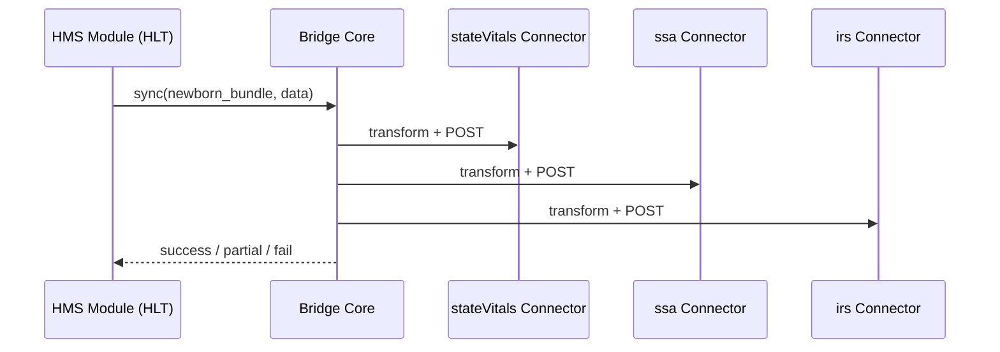

# Chapter 10: External System Bridge (Real-Time Sync Connectors)

[← Back to Chapter&nbsp;9: Domain-Specific Modules (HMS-ACH, HMS-HLT, HMS-EDU)](09_domain_specific_modules__hms_ach__hms_hlt__hms_edu__.md)

---

## 1. Why Do We Need a “Bridge”?

### Use-Case: **Newborn, One-Stop Paperwork**

When baby **Aaliyah** is born in a Virginia hospital, her parents expect one magical “Submit” button that:

1. Creates a **state birth certificate**  
2. Starts her **Social Security Number** application  
3. Enables the **Child Tax Credit** flag at the IRS  
4. Adds her to the **Immunization Registry**

Behind that button sit **four** different external systems—each with its own API quirks and data shapes.  
Without a _bridge_ the hospital clerk would:

* print three different paper forms  
* re-type the same data five times  
* wait weeks for confirmation

The **External System Bridge** acts like a **bilingual interpreter** sitting in the middle.  
Update one record inside HMS and—within seconds—every outside agency is in sync.

---

## 2. Key Concepts (Plain-English Cheat-Sheet)

| Concept | Analogy | One-Liner |
|---------|---------|-----------|
| Connector | Bilingual interpreter | Talks HMS → external system (and back). |
| Mapping Sheet | Phrasebook | Translates field names (`babyName` → `child_name`). |
| Throttle Gate | Speed governor | Keeps us under partner rate limits (e.g., 10 req/sec). |
| Conflict Resolver | Tie-breaker referee | Decides what wins if both sides changed the same field. |
| Health Ping | “Are you still there?” | Small GET every 30 s; raises alert if silent twice. |

---

## 3. Using the Bridge — 18 Lines Total

Below is **all** the code a hospital module needs to notify _every_ external system about baby Aaliyah.

```python
from hms_bridge import sync   # friendly helper

baby = {
    "id":        "BABY-1488",
    "firstName": "Aaliyah",
    "lastName":  "Nguyen",
    "bornAt":    "2024-06-05T08:42:00Z"
}

sync("newborn_bundle", baby)
```

What happens?

1. `sync()` looks up the **bundle** called `newborn_bundle` (see next section).  
2. The bundle contains three Connectors: `stateVitals`, `ssa`, `irsCredits`.  
3. Each Connector transforms the payload with its own **Mapping Sheet**, adds auth headers, and POSTs to the partner API.  
4. The call returns **only after** every partner replies _or_ the Throttle Gate’s retry policy expires.

No extra loops, no retry code—**perfect for beginners**.

---

## 4. Anatomy of a Bundle

```yaml
# file: bundles/newborn_bundle.yml
connectors:
  - stateVitals
  - ssa
  - irsCredits
strategy:
  retry: 3          # total attempts per connector
  backoff_ms: 200   # wait between attempts
  conflict: "prefer_hms"
```

*One bundle = list of Connector names + global strategy.*

---

## 5. How It Works (Step-By-Step)



Five participants—easy to memorize.

---

## 6. Internal Implementation (Friendly Dive)

### 6.1 File Layout

```
hms_bridge/
 ├─ core.py          # public sync()
 ├─ connectors/      # one file per outside system
 │    ├─ stateVitals.py
 │    ├─ ssa.py
 │    └─ irsCredits.py
 └─ mappings/        # YAML phrasebooks
      └─ irsCredits.yml
```

### 6.2 core.py (≤ 20 lines)

```python
import yaml, time, importlib

def sync(bundle_name, payload):
    bundle = yaml.safe_load(open(f"bundles/{bundle_name}.yml"))
    for name in bundle["connectors"]:
        _run_connector(name, payload, bundle["strategy"])

def _run_connector(name, payload, strat):
    mod = importlib.import_module(f"hms_bridge.connectors.{name}")
    for attempt in range(strat["retry"]):
        ok = mod.push(payload)           # returns True / False
        if ok:
            return
        time.sleep(strat["backoff_ms"]/1000)
    raise RuntimeError(f"{name} failed after retries")
```

**Explanation (for beginners):**  
1. Load bundle YAML.  
2. Import each Connector as a plugin (`importlib`).  
3. Retry if the plugin says “not yet.”  
4. `RuntimeError` bubbles up so [Event Bus & Real-Time Monitoring](11_event_bus___real_time_monitoring_.md) can alert ops.

### 6.3 A Tiny Connector (ssa.py, 15 lines)

```python
import requests, yaml

_map = yaml.safe_load(open("mappings/ssa.yml"))
URL  = "https://api.ssa.gov/v1/newborn"

def push(hms_data):
    ext = { _map[k]: v for k,v in hms_data.items() if k in _map }
    r = requests.post(URL, json=ext, timeout=1.2)
    return r.status_code == 202        # SSA returns 202 Accepted
```

*Highlights:*  
• Line 4 loads the **Mapping Sheet** once.  
• Line 7 translates HMS fields to SSA’s names.  
• Quick `POST`, return `True` only on HTTP 202.

### 6.4 Mapping Sheet Example (irsCredits.yml, 8 lines)

```yaml
id:             person_id
firstName:      given_name
lastName:       family_name
bornAt:         dob
```

*One sheet per connector. Change YAML, not code.*

### 6.5 Health Ping (bridge_monitor.py, 12 lines)

```python
import time, requests

TARGETS = ["https://api.ssa.gov/health", "https://state.vitals/ok"]

def tick():
    for url in TARGETS:
        up = requests.get(url, timeout=0.3).status_code == 200
        if not up:
            event_bus.publish("bridge.partner.down", {"url": url})
    time.sleep(30)
```

Runs in a background thread; failed pings raise an alert.

---

## 7. How the Bridge Talks to Other Layers

| Layer | Interaction |
|-------|-------------|
| [Governance Layer](01_governance_layer__hms_gov__.md) | Approves new Connector code & Mapping Sheets. |
| [Access & Authorization Matrix](03_access___authorization_matrix_.md) | Issues per-connector service tokens. |
| [Event Bus & Real-Time Monitoring](11_event_bus___real_time_monitoring_.md) | Receives `bridge.sync.success` / `.fail` events & health alerts. |
| [Management Layer](07_management_layer__service_orchestration__.md) | Scales connectors if a partner API slows down. |
| [Compliance & Audit Ledger](14_compliance___audit_ledger_.md) | Logs every field sent to outside systems for future audits. |

---

## 8. Beginner FAQ

**Q: What if two systems change the same field?**  
A: The bundle’s `conflict` rule (`prefer_hms`, `prefer_partner`, or `timestamp`) decides automatically.

**Q: Can I pause a Connector during partner maintenance?**  
A: Yes—run `bridge.disable("ssa")`; core skips it until you re-enable.

**Q: How do I add a brand-new partner?**  
A:  
1. Create `connectors/newPartner.py` (must expose `push(data)`),  
2. Add `mappings/newPartner.yml`,  
3. Update your bundle YAML,  
4. Submit both files to Governance for approval.  
No code changes elsewhere.

---

## 9. Quick Checklist

✅ One `sync(bundle, data)` call fans out to many partners.  
✅ Connectors live as simple plugins (<20 lines).  
✅ YAML Mapping Sheets keep transformations out of Python.  
✅ Throttle & retry policies are bundle-wide.  
✅ Pings and failures flow to the Event Bus for instant alerts.  

---

## 10. Conclusion & What’s Next

You now have a **bilingual interpreter** that keeps hospitals, tax agencies, and immigration databases on the same page—without extra spreadsheets or phone calls.

Next we’ll learn how all these pings, retries, and success events travel through a **central nervous system**:  
[Event Bus & Real-Time Monitoring](11_event_bus___real_time_monitoring_.md)

---

---

Generated by [AI Codebase Knowledge Builder](https://github.com/The-Pocket/Tutorial-Codebase-Knowledge)