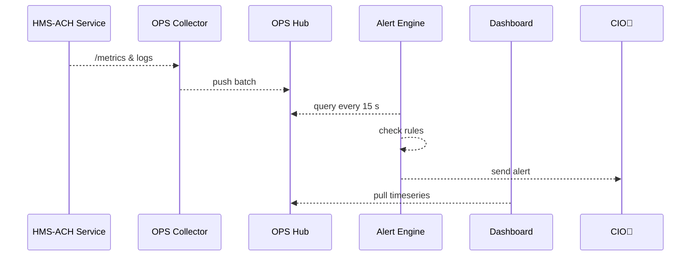

# Chapter 10: Operational Monitoring & Telemetry (HMS-OPS)

*(continuing from [Chapter 9: Central Data Repository (HMS-DTA)](09_central_data_repository__hms_dta__.md))*  

---

## 1. Why Do We Need HMS-OPS?

Picture a filing deadline day at **IRS.gov**.  
Millions of citizens hit **“Submit”** at once.  
If the servers stall or the [Payment & Clearinghouse Engine (HMS-ACH)](04_payment___clearinghouse_engine__hms_ach__.md) queues back up, the slightest hiccup can snowball into:

* 500-error storms (angry taxpayers & news headlines).  
* Mis-posted payments (audit nightmares).  
* Midnight calls from OMB asking, *“What went wrong and how big is it?”*

**HMS-OPS** is the federal equivalent of **NORAD radar for software**.  
It:

1. Collects **logs, metrics, and traces** from every HMS micro-service.  
2. Detects anomalies *(“500 errors > 5 %”)* and fires alerts.  
3. Feeds live dashboards so CIOs can spot a backlog **before** it hits citizens.

Result: agency teams sleep better, citizens see fewer outage banners.

---

## 2. Key Concepts (Plain English)

| Term | Friendly Description |
|------|----------------------|
| **Metric** | A number that changes over time (e.g., `payments_per_min`). |
| **Log** | A single line of text that says what just happened. |
| **Trace** | A breadcrumb trail that shows how one request hopped across services. |
| **Collector** | A tiny side-process that ships metrics/logs to OPS. |
| **Rule** | A “when-this-then-that” condition that triggers alerts. |
| **Dashboard** | A real-time display (graphs, gauges) you can pin on a war-room wall. |

---

## 3. Five-Minute Walking Tour  
*Goal: alert us if 500-errors on HMS-ACH exceed 5 % for 3 minutes.*

### 3.1. Emit Telemetry From a Service

```python
# file: ach_service.py  (simplified 16 lines)
from hms_ops import Telemetry
from fastapi import FastAPI, HTTPException
app, t = FastAPI(), Telemetry(service="hms-ach")

@app.get("/pay")
def pay():
    t.counter("requests_total").inc()
    try:
        # ...real payment logic...
        return {"ok": True}
    except Exception:
        t.counter("errors_total").inc()
        raise HTTPException(500, "payment failed")
```

Explanation  
1. `Telemetry` auto-creates two counters.  
2. Each request increments `requests_total`; failures also bump `errors_total`.  
3. The collector (next step) will scrape these numbers.

---

### 3.2. Run a Local Collector (10 sec command)

```bash
pip install hms-ops
hms-ops collect --scrape "http://localhost:8000/metrics"
```

The collector:

* Scrapes `metrics` every 15 s.  
* Tails `stdout` for logs.  
* Pushes everything to the OPS hub at `http://ops.local:9091`.

---

### 3.3. Create an Alert Rule (under 20 lines)

```yaml
# file: alert_rules.yaml
groups:
- name: ach_alerts
  rules:
  - alert: HighErrorRate
    expr: |
      rate(errors_total[3m])
      / rate(requests_total[3m]) > 0.05
    for: 3m
    labels:
      severity: critical
    annotations:
      summary: "HMS-ACH 500-error spike"
      description: |
        Error ratio is above 5 % for 3 minutes.
```

Load it:

```bash
hms-ops rules load alert_rules.yaml
```

---

### 3.4. See It on a Dashboard

Open `http://ops.local:3000` and select the **HMS-ACH** board:  

* *Green line* – requests / min  
* *Red line* – errors / min  
* Blinking banner appears when `HighErrorRate` fires.

*(Grafana is pre-wired; no extra setup.)*

---

## 4. What Happens Under the Hood?



*Five moving parts, one simple data flow.*

---

## 5. Inside HMS-OPS (Module Overview)

1. **Collector (Edge)** – Lightweight Go binary; scrapes Prometheus-style metrics & tails logs.  
2. **Hub (Core)** – Time-series DB + log store (Think *Prometheus + Loki*).  
3. **Alert Engine** – Evaluates rule expressions, sends email/SMS/Slack.  
4. **Trace Store** – Zipkin-compatible; each request trace spans services.  
5. **Dashboard UI** – Grafana with canned boards for every HMS chapter.

---

## 6. Peeking at the Code

### 6.1. Minimal Collector (14 lines)

```python
# hms_ops/collector.py
import requests, time, os, sys
HUB = os.getenv("OPS_HUB", "http://ops.local:9091")

def scrape(loop_url):
    while True:
        data = requests.get(loop_url).text
        requests.post(f"{HUB}/ingest", data=data)
        time.sleep(15)

def tail_logs():
    for line in sys.stdin:
        requests.post(f"{HUB}/logs", data=line)

# start!
scrape("http://localhost:8000/metrics")
```

Explanation  
*Just enough* code to show the idea: grab metrics → push; read logs → push.

---

### 6.2. Alert Engine Rule Check (18 lines)

```python
# hms_ops/alert_engine.py
import time, requests, yaml

RULES = yaml.safe_load(open("alert_rules.yaml"))["groups"][0]["rules"]

def eval_expr(expr):
    return float(requests.get(f"{HUB}/query", params={"q": expr}).text)

while True:
    for r in RULES:
        val = eval_expr(r["expr"])
        if val and val > 0:
            if r.get("_firing_since") is None:
                r["_firing_since"] = time.time()
            elif time.time() - r["_firing_since"] > 180:   # 3 m
                notify(r["alert"], r["annotations"]["summary"])
        else:
            r["_firing_since"] = None
    time.sleep(15)
```

Explanation  
1. Fetches rule expression results from the Hub.  
2. Tracks *firing duration* in memory.  
3. Calls `notify()` (stubbed) when conditions persist.

*(Real engine uses Prometheus Alertmanager, but this Python shows the gist.)*

---

## 7. Quick Glance at a Trace

```bash
hms-ops trace 7b3e...   # sample trace id
```

Command opens a mini sunburst:

```
Frontend ▸ Gateway ▸ HMS-ACH ▸ FedACH API  ─  240 ms total
```

Now you can answer, *“Where did we spend time?”* in seconds.

---

## 8. Frequently Asked Questions

**Q1: Do I need to change every micro-service?**  
Just import `hms_ops.Telemetry` and expose `/metrics`. No other code edits.

**Q2: Is OPS only for production?**  
Run it in dev! Catch regressions before citizens do.

**Q3: How does OPS integrate with security logs?**  
Collectors also tail `auth.log`; suspicious patterns can trigger rules that ping [Human-in-the-Loop Oversight (HITL)](15_human_in_the_loop_oversight__hitl__.md).

**Q4: Can I store custom metrics?**  
Yes—`t.gauge("queue_depth").set(value)` is a one-liner.

---

## 9. Mini Challenge (Optional)

1. Add `queue_depth` metric to HMS-ACH that records pending payments.  
2. Write a rule: *alert if `queue_depth > 500` for 5 minutes*.  
3. Stress-test by queuing fake payments; watch the dashboard turn red.

---

## 10. What We Learned

• **HMS-OPS** is the always-on radar that watches every request, log line, and trace across HMS.  
• A tiny `Telemetry` import + a collector is enough to join the radar network.  
• Alert rules and dashboards let teams spot trouble **before** citizens notice.

Ready to turn all these shiny metrics into automatic efficiency gains?  
Continue to [Chapter 11: Process Optimization Pipeline](11_process_optimization_pipeline_.md).

---

Generated by [AI Codebase Knowledge Builder](https://github.com/The-Pocket/Tutorial-Codebase-Knowledge)