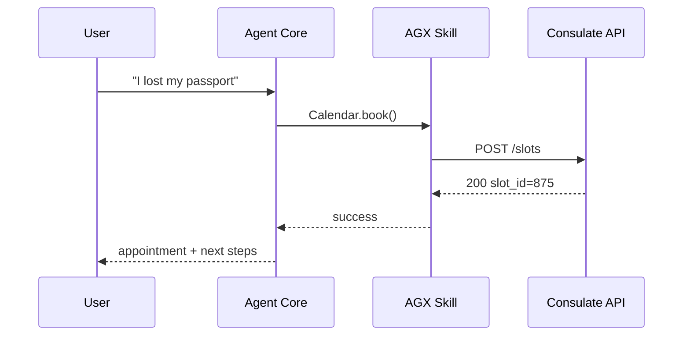

# Chapter 12: AI Agent Framework (HMS-AGT / AGX)

*(continuing from [Chapter 11: Process Optimization Pipeline](11_process_optimization_pipeline_.md))*  

---

## 1. Why Do We Need HMS-AGT?

Imagine a citizen chatting with **passport.gov**:

> “I lost my passport in Italy, can you help?”  

A human clerk normally has to:

1. Ask security questions.  
2. Check fee exemptions.  
3. Schedule a consulate appointment.  
4. Email a checklist of forms.

What if a **trained, badge-wearing AI clerk** did that 24 / 7—while obeying every federal rule, logging each step, and only touching the systems it’s cleared for?

That clerk lives inside the **AI Agent Framework**:

```
           ┌───────────────┐
Citizen ───►  HMS-AGT      │  (core brain)
           │   + AGX        │  (plug-in skills)
           └───────────────┘
```

*AGT* supplies dialogue, reasoning, and tool-calling.  
*AGX* snaps on specialized “skills” (calendar, payments, sentiment, etc.).  
Each agent is **versioned, sandboxed, and audited**—just like a real civil-servant with a badge.

---

## 2. Key Concepts (Plain English)

| Term | Friendly Description |
|------|----------------------|
| Agent | A single AI “employee” (e.g., Passport Helper v3). |
| Core (AGT) | The brain: chat flow, reasoning, safe tool calls. |
| Skill (AGX) | A bolt-on power—think “Excel for clerks” (scheduling, payment, translation). |
| Domain Badge | Like a building pass: *Finance*, *Healthcare*, etc. |
| Sandbox | A gated playground; if a skill misbehaves, it can’t hurt prod systems. |
| Audit Trail | Automatic diary: **who** (agent), did **what**, **when**. |
| Version Tag | `passport_helper@v3.2.1`—immutable after release. |

---

## 3. Running Example—“Passport Helper” Agent

Goal: build an agent that:

1. Verifies identity (simple question).  
2. Books a consulate slot (calendar skill).  
3. Sends a fee waiver form (document skill).

All snippets ≤ 20 lines.

### 3.1. Install & Bootstrap

```bash
pip install hms-agt hms-agx
```

```python
# file: passport_agent.py
from hms_agt import Agent
from hms_agx.skills import Calendar, Documents

helper = Agent(
    name="passport_helper",
    version="3.0.0",
    domain="State Department",
    skills=[Calendar(), Documents()]
)
```

**What happened?**  
* We created an agent with two AGX skills.  
* The domain limits it to State-Dept APIs only.

### 3.2. Start a Conversation

```python
print( helper.chat("I lost my passport in Italy") )
```

Output (conceptual):

```
AGENT: I'm sorry to hear that! I can help schedule an emergency appointment.
First, what is your date of birth?
```

The core AGT handled NLU and chose the **Calendar** skill for step 2.

### 3.3. Skill in Action (autonomous step)

```python
helper.chat("Jan 4 1989")     # ID check passes
```

Console (trimmed):

```
[AUDIT] passport_helper used Calendar.book(slot_id=875)
AGENT: You’re booked for 10 AM tomorrow at the Rome Consulate.
I’ve emailed the fee waiver form (DS-5504). Safe travels!
```

Behind the scenes the **Documents** skill fetched DS-5504 and sent it via the agency’s outgoing mail service.

---

## 4. What Happens Under the Hood?



* Note the **Audit hook** fires on every skill call (not shown in the diagram for clarity).

---

## 5. Peeking Inside (Gentle Code)

### 5.1. Agent Skeleton (15 lines)

```python
# hms_agt/core.py (excerpt)
class Agent:
    def __init__(self, name, version, domain, skills):
        self.name, self.version = name, version
        self.domain = domain
        self.skills = {s.name: s for s in skills}

    def chat(self, msg):
        intent = self._nlu(msg)            # toy regex matcher
        skill = self._route(intent)
        if not skill:
            return "Sorry, I can’t help with that."
        result = skill.handle(intent)
        self._audit(skill, intent, result)
        return result["reply"]
```

• `_nlu()` picks “book_appointment.”  
• `_route()` returns the Calendar skill if domain permits.  
• `_audit()` writes a JSON line to `agents.log`.

### 5.2. Skill Template (12 lines)

```python
# hms_agx/skills/calendar.py
class Calendar:
    name = "Calendar"
    badge_needed = "State Department"

    def handle(self, intent):
        # sandboxed HTTP call (helpers.http_post wraps retries & limits)
        slot = helpers.http_post("/consulate/slots", {"soonest": True})
        return {"reply": f"Booked slot #{slot['id']} for you."}
```

### 5.3. Tiny Auditor (10 lines)

```python
# hms_agt/audit.py
import json, time
def write(agent, skill, intent, res):
    line = {
        "ts": time.time(),
        "agent": agent.name,
        "ver": agent.version,
        "skill": skill.name,
        "intent": intent,
        "result": res
    }
    open("agents.log", "a").write(json.dumps(line)+"\n")
```

All agents use this one helper; logs are later ingested by [Operational Monitoring & Telemetry](10_operational_monitoring___telemetry__hms_ops__.md).

---

## 6. Safety Features in One Glance

| Feature | Mechanism |
|---------|-----------|
| Domain Badge | `skill.badge_needed` must match `agent.domain`. |
| Sandbox | HTTP helper caps CPU / RAM / time per call. |
| Version Lock | `version` is part of the log; changing code requires [Governance Layer](01_governance_layer__hms_gov__.md) sign-off. |
| HITL Override | Any message prefixed “/pause” detours to [Human-in-the-Loop Oversight](15_human_in_the_loop_oversight__hitl__.md). |

---

## 7. Common Questions

1. **Q: How do I add a new skill?**  
   *Subclass `Skill`, declare `badge_needed`, implement `handle()`, then pass it into `Agent(skills=[…])`.*  

2. **Q: Can an agent access payments?**  
   Only if you attach the **Payment** skill (which itself talks to [HMS-ACH](04_payment___clearinghouse_engine__hms_ach__.md)).  

3. **Q: What language model does AGT use?**  
   Swappable—defaults to an open-source small model unless the agency points to a larger endpoint.

4. **Q: How are prompts governed?**  
   Stored and versioned via [Model Context Protocol](13_model_context_protocol__hms_mcp__.md) (next chapter).

---

## 8. Mini Challenge (Optional)

1. Write a **Sentiment** skill that flags angry messages.  
2. If `sentiment=="angry"`, escalate to a human by returning:  
   `{"reply":"Connecting you to a live agent…", "hitl":True}`  
3. Confirm a log line appears with `"hitl":true`.

---

## 9. What We Learned

• HMS-AGT provides the **brain**; AGX provides **muscles** (skills).  
• Agents are **domain-badged, sandboxed, versioned, and audited**—mirroring real federal employees.  
• In ≤ 20 lines you built a Passport Helper that chats, reasons, calls tools, and keeps auditors happy.

Ready to see how prompts and context are safely packaged for these agents?  
Head over to [Chapter 13: Model Context Protocol (HMS-MCP)](13_model_context_protocol__hms_mcp__.md).

---

Generated by [AI Codebase Knowledge Builder](https://github.com/The-Pocket/Tutorial-Codebase-Knowledge)