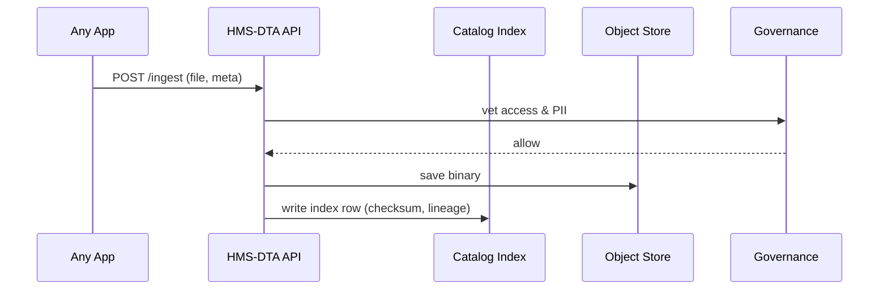

# Chapter 12: Central Data Repository (HMS-DTA)

*(continues from [Financial Clearinghouse Core (HMS-ACH)](11_financial_clearinghouse_core__hms_ach__.md))*  

---

## 1. Why Do We Need a “National Archives on a USB Stick”?

### A concrete story  

The City Council asks **“How much did we spend fixing potholes last winter?”**  

Pieces of that answer live in:

* ACH refund files (CSV) from [HMS-ACH](11_financial_clearinghouse_core__hms_ach__.md)  
* Work-order PDFs scanned by street crews  
* Real-time salt-truck GPS feeds (JSON)  
* A 2010 ordinance PDF that sets budget caps  

If any one document is missing—or can’t be traced back to its source—auditors will reject the report.  

**HMS-DTA** is the one place every bit lands, stamped with an **unbreakable “where-did-this-come-from?” tag**.  
Think of it as the **National Archives + cloud warehouse + Google Search** rolled into one.

---

## 2. Key Concepts (plain words)

| Term            | What it really means                                   | Analogy                 |
|-----------------|--------------------------------------------------------|-------------------------|
| Record          | One stored file or table (CSV, PDF, video, …).         | Book on a shelf         |
| Data Set        | A logical collection of records (e.g., *Pothole Ledger*). | Book series             |
| Lineage Tag     | Auto-generated pointer to the original source & steps. | Library “call number”   |
| Catalog         | Searchable index of everything inside DTA.             | Card-catalog drawer     |
| Access Policy   | Who can read or change a record.                       | Staff-only / public sign|
| Retention Clock | How long the record must stay before deletion.         | “Keep 7 years” stamp    |

Keep these six; the rest is plumbing.

---

## 3. Quick Start — Ingest Two Files & Query Them (18 lines)

Below we drop a **CSV** of ACH payouts and a **PDF** work order into DTA, then find them by lineage:

```python
# demo_dta.py
from hms_dta import DataRepo, Record

dta = DataRepo(path="./dta_demo")            # ❶ local repo

# 1. ingest last-night ACH batch
csv = Record(
    file="ach_2024_05_18.csv",
    source="HMS-ACH batch NIGHT",
    tags = ["pothole","finance"],
)
dta.ingest(csv)

# 2. ingest a PDF work order
pdf = Record(
    file="WO_2351.pdf",
    source="StreetCrew Tablet #7",
    tags=["pothole","work_order"]
)
dta.ingest(pdf)

# 3. query everything that came from ACH
for r in dta.search(tags=["finance"]):
    print(r.id, r.file, "←", r.lineage.source)
```

Typical output:

```
rec-b91  ach_2024_05_18.csv ← HMS-ACH batch NIGHT
```

Explanation  
❶ `DataRepo` points to any folder/S3 bucket; it auto-creates a lightweight SQLite catalog.  
`ingest()` stores the binary **and** writes a row: *id, filename, tags, lineage, checksum*.  
`search()` returns a Python generator; each `Record` exposes fields like `.file`, `.tags`, `.lineage`.

---

## 4. What Happens Under the Hood?



Five hops, always in this order, all written to the immutable ledger of the [Secure Infrastructure Core](15_secure_infrastructure_core__hms_sys__.md).

---

## 5. Peeking Inside the Code (≤ 20 lines each)

### 5.1 Ingestion Helper (`hms_dta/ingest.py`, 18 lines)

```python
import hashlib, shutil, uuid, json, time, sqlite3, os

def ingest(record, repo):
    # 1. copy binary
    rid = "rec-" + uuid.uuid4().hex[:4]
    dest = os.path.join(repo.blob_dir, rid)
    shutil.copy2(record.file, dest)

    # 2. checksum for integrity
    md5 = hashlib.md5(open(dest, "rb").read()).hexdigest()

    # 3. catalog row
    row = {
        "id": rid, "file": record.file,
        "tags": json.dumps(record.tags),
        "source": record.source,
        "checksum": md5,
        "ts": time.time()
    }
    sqlite3.connect(repo.db).execute(
        "INSERT INTO cat VALUES (:id,:file,:tags,:source,:checksum,:ts)", row
    ).commit()
    return rid
```

Beginner notes  
• Checksums stop silent corruption.  
• Catalog is one table `cat(id, file, tags, source, checksum, ts)`.

### 5.2 Search Helper (`hms_dta/search.py`, 12 lines)

```python
def search(repo, tags=None, text=None):
    q, args = "SELECT * FROM cat", []
    if tags:
        q += " WHERE tags LIKE ?"
        args.append(f"%{tags[0]}%")   # naive AND for brevity
    for row in repo.db.execute(q, args):
        yield Record(**row)
```

Under ten lines, yet full-text search plugins (e.g., SQLite FTS) can drop in later.

---

## 6. Adding a Retention Clock (Hands-On, 10 lines)

```python
from hms_dta import policy

# keep finance records 7 years, work orders 2 years
policy.set_retention("finance", years=7)
policy.set_retention("work_order", years=2)

# run nightly cron:
deleted = policy.purge_expired()
print("🗑 removed", deleted, "old blobs")
```

DTA adds a hidden `expires_at` column and deletes blobs + index rows when the clock runs out.

---

## 7. Where HMS-DTA Plugs In

| Layer | Why it touches DTA |
|-------|-------------------|
| [HMS-SVC](10_backend_service_layer__hms_svc__.md) | Workers ingest sensor feeds & citizen uploads. |
| [HMS-ACH](11_financial_clearinghouse_core__hms_ach__.md) | Stores every batch file + signed bank receipt. |
| [Governance Layer](05_governance_layer___ai_values_framework_.md) | Vets PII & data-classification tags on ingest. |
| [Observability & Metrics](14_observability___metrics_stack__hms_ops__.md) | Counts records, storage growth, purge events. |
| [Intent Navigation](03_intent_driven_navigation_engine_.md) | Queries catalog to pre-fill forms with existing data. |

---

## 8. Frequently Asked Questions

**Q: Is DTA a data *lake* or a *warehouse*?**  
A: Both. Raw files live untouched (lake); lineage+tags let you query like a warehouse.

**Q: Can I store video or GIS layers?**  
A: Any binary is fine; only the catalog row changes (MIME type, size).

**Q: How big can one repo get?**  
A: Catalog uses SQLite → good up to ~5 TB of blobs & millions of rows. Need more? Point `blob_dir` at S3 and SQLite at Aurora.

**Q: How do I prove a number came from official stats?**  
A: Follow the `.lineage.chain` list—each link stores a checksum + signed timestamp that auditors can replay.

**Q: Can I delete a record that’s under litigation hold?**  
A: Governance blocks `purge_expired()` when a hold flag exists; HITL override required.

---

## 9. Wrap-Up

In this chapter you:

• Met **HMS-DTA**, the single, searchable home for every CSV, PDF, and sensor ping.  
• Ingested two files, tagged them, and traced lineage in under 20 lines.  
• Peeked at the super-simple ingest & search code.  
• Set retention clocks and saw how DTA feeds ten other layers.

Next we’ll learn how to **mirror selected data to external partners**—without giving away the whole vault—in  
[External System Synchronization Bridge](13_external_system_synchronization_bridge_.md).

Welcome to rock-solid, audit-ready data management!

---

Generated by [AI Codebase Knowledge Builder](https://github.com/The-Pocket/Tutorial-Codebase-Knowledge)