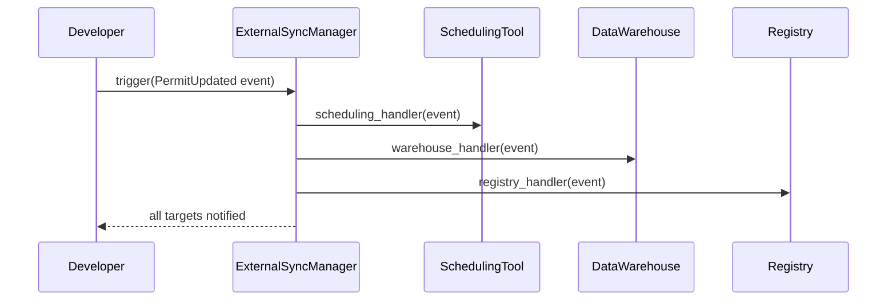

# Chapter 12: External System Synchronization

In [Chapter 11: Human Decision Maker](11_human_decision_maker_.md) we saw how officials review AI proposals before they go live. Now, imagine you also need to keep several outside platforms—like a scheduling tool, a data warehouse, and a third-party registry—in perfect sync with your core permit system, just like a courier delivering updated policy documents to all satellite offices in real time. That’s **External System Synchronization**!

---

## 1. Why External System Synchronization?

Consider a State Permitting Agency that:

- Uses a **scheduling tool** to book permit inspection slots.
- Feeds a **data warehouse** for analytics (budget forecasts, performance metrics).
- Publishes to a **third-party registry** so contractors can verify permit status.

When a permit’s status changes—say from “Pending” to “Approved”—all these systems must see the update **immediately**. If they don’t:

- Inspectors see wrong time slots.
- Analysts run reports on stale data.
- Contractors cite outdated registry records.

External System Synchronization ensures **every** downstream system is updated as soon as your core application changes.

---

## 2. Key Concepts

1. **Event**  
   A record of a change in your core system (e.g., `PermitCreated`, `PermitUpdated`, `PermitDeleted`).

2. **Sync Target**  
   An external platform you need to update (scheduling tool, data warehouse, registry).

3. **Handler (Adapter)**  
   A small piece of code that knows how to call the target’s API or endpoint.

4. **Delivery Strategy**  
   How you push events:  
   - **Immediate (Webhooks)**: send each event as it happens.  
   - **Batched**: collect events over time and push as a group.

5. **Idempotency & Retry**  
   Ensure that if the same event is sent twice, the target only applies it once, and retry on failures.

---

## 3. Using ExternalSyncManager

Below is a simple example showing how to register three sync targets and trigger an update whenever a permit changes.

```python
# File: app.py
from hms_ach.external_sync import ExternalSyncManager

# 1. Create the sync manager
sync = ExternalSyncManager()

# 2. Register external targets with their handlers
sync.register_target("SchedulingTool", handler=scheduling_handler)
sync.register_target("DataWarehouse", handler=warehouse_handler)
sync.register_target("Registry",       handler=registry_handler)

# 3. When a permit changes, fire an event
event = {
    "type": "PermitUpdated",
    "permit_id": "ABC-123",
    "status": "Approved"
}
sync.trigger(event)

# What happens:
# • scheduling_handler(event)   → updates time-slot system
# • warehouse_handler(event)    → writes to analytics DB
# • registry_handler(event)     → posts to public registry
```

Each `handler(event)` is your adapter code that knows how to translate the generic `event` into the right API call for that system.

---

## 4. Under the Hood: Step-by-Step Flow

Here’s a simplified view of what happens inside `sync.trigger(event)`:



1. **Developer** calls `trigger(event)`.  
2. **Sync Manager** loops through each registered target.  
3. **Handlers** run, pushing the update to external platforms.  
4. Finally, control returns to the developer.

---

## 5. Peek at the Implementation

### 5.1 external_sync.py

```python
# File: hms_ach/external_sync.py

class ExternalSyncManager:
    def __init__(self):
        # name -> handler function
        self.targets = {}

    def register_target(self, name, handler):
        self.targets[name] = handler

    def trigger(self, event):
        for name, handler in self.targets.items():
            try:
                handler(event)            # attempt to sync
            except Exception:
                handler(event)            # simple retry once
```

- `self.targets` holds each external system’s adapter.  
- `trigger()` calls each handler in turn, with a basic retry on failure.

### 5.2 Example Handler

```python
# File: handlers.py

def scheduling_handler(event):
    # Imagine code that does an HTTP POST to the scheduling API
    print(f"Pushing to SchedulingTool: {event}")

def warehouse_handler(event):
    # Code to write the event into your analytics DB
    print(f"Ingesting into DataWarehouse: {event}")

def registry_handler(event):
    # Code to call a third-party registry’s REST endpoint
    print(f"Posting to Registry: {event}")
```

Each handler is just a function that “knows” how to talk to one outside system. In production you’d add HTTP requests, authentication, and more robust retries.

---

## 6. Conclusion

In this chapter you learned how to:

- Define **Events** and **Sync Targets** for external systems.  
- Write simple **Handlers (Adapters)** that push updates to each platform.  
- Build an `ExternalSyncManager` that loops through targets, calls handlers, and retries on failure.

With this in place, your core system stays in lockstep with all downstream tools—just like a courier service delivering up-to-the-minute documents to every office.

Next up, we’ll explore how to build intelligent agents that act on behalf of users in [Chapter 13: AI Representative Agent](13_ai_representative_agent_.md).

---

Generated by [AI Codebase Knowledge Builder](https://github.com/The-Pocket/Tutorial-Codebase-Knowledge)