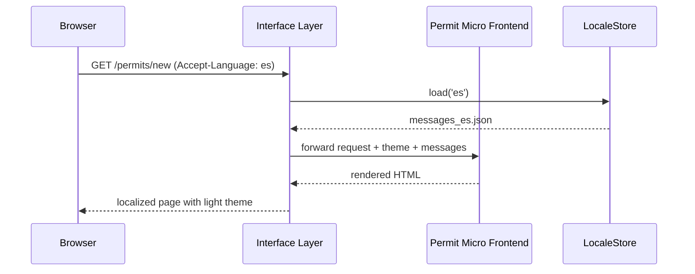

# Chapter 12: Interface Layer

Welcome back! In [Chapter 11: Human-in-the-Loop Oversight](11_human_in_the_loop_oversight_.md) we learned how to queue AI suggestions for human review and keep an immutable audit trail. Now we turn to the **Interface Layer**—the “city information desk” that guides visitors arriving by bus, car, or on foot. This layer connects micro frontends, the admin portal, and mobile clients into one seamless user journey, handling routing, theming, and localization.

## 1. Why an Interface Layer?

Imagine a tourist arriving at City Hall:  
- They might be using the public transit app (mobile client),  
- Browsing permit options on the government website (micro frontend), or  
- Logging in through the admin dashboard (administrative portal).  

The **Interface Layer** ensures each user sees the right interface:
- Routes them to the correct application shell,  
- Applies consistent branding and theme,  
- Displays content in their preferred language.

### Concrete Use Case: Permit Application Journey

1. A citizen opens the mobile app in Spanish → they see the Spanish UI and the flow to start a new permit.  
2. Later on their desktop browser → they land on the permit micro frontend with the same look-and-feel, but in English.  
3. An admin logs in → they get a darker “admin theme” with extra controls.

All of this is orchestrated by the Interface Layer.

## 2. Key Concepts

1. **Routing**  
   Decides which client shell (mobile, micro frontend, admin portal) serves a given URL or device.  
2. **Theming**  
   Applies a style guide (colors, logos) based on user role or agency (e.g., Public & Indian Housing vs. Northern Border Regional Commission).  
3. **Localization**  
   Selects the correct language bundle based on browser settings or user preference.  
4. **Feature Flags**  
   Toggles experimental UI features (e.g., a new “dark mode”) on or off.  
5. **Authentication Checkpoint**  
   Ensures only authorized users can reach admin pages while letting public pages be open.

## 3. Using the Interface Layer

Here’s a minimal example of bootstrapping the Interface Layer in JavaScript:

```javascript
// file: interface-layer/index.js
const iface = require('hms-interface').init({
  themes: {
    public: 'light',
    admin: 'dark'
  },
  locales: ['en', 'es', 'fr'],
  routes: [
    { path: '/admin/*', target: 'admin-portal', theme: 'admin', auth: true },
    { path: '/permits/*', target: 'permit-mfe', theme: 'public' },
    { path: '/mobile/*', target: 'mobile-shell', theme: 'public' }
  ]
})

iface.start()  // Launches the HTTP server
```

- We define three **routes**, each with its own target application and theme.  
- The `admin` route requires `auth: true` to protect sensitive pages.  
- Supported `locales` tell the layer which languages to load.

### What Happens When a User Visits `/permits/new`?

1. The Interface Layer matches `path: /permits/*`.  
2. It injects the `public` theme (logos, colors) into the HTML shell.  
3. It reads `Accept-Language` from the browser (`es`) and picks `locales/es.json`.  
4. It forwards the request to the `permit-mfe` micro frontend code.

## 4. Under the Hood: Step-by-Step



1. **Match Route**: Identify `/permits/new` → `permit-mfe`.  
2. **Load Locale**: Fetch Spanish messages from `LocaleStore`.  
3. **Apply Theme**: Use `public/light` CSS and logos.  
4. **Proxy Request**: Send enriched request to the micro frontend.  
5. **Return Page**: Send the final HTML to the browser.

## 5. Inside `hms-interface`: Core Implementation

Below is a simplified slice of the core code, showing how routing and localization tie together:

```javascript
// file: hms-interface/core.js
const express = require('express')
const fs = require('fs')

exports.init = ({ themes, locales, routes }) => {
  const app = express()

  app.use((req, res, next) => {
    // 1. Find matching route
    const route = routes.find(r => req.path.match(new RegExp(r.path.replace('*','.*'))))
    if (!route) return res.status(404).send('Not Found')

    // 2. Load theme
    res.locals.theme = themes[route.theme]

    // 3. Determine locale
    const lang = req.acceptsLanguages(locales) || locales[0]
    res.locals.messages = JSON.parse(fs.readFileSync(`locales/${lang}.json`))

    // 4. (Optional) Auth check
    if (route.auth && !req.isAuthenticated()) return res.redirect('/login')

    // 5. Proxy to target
    proxyRequest(route.target, req, res)
  })

  return {
    start: () => app.listen(8080)
  }
}

// proxyRequest would forward the HTTP call to the correct client or microservice.
```

- We use **Express** middleware to inspect every request.  
- `res.locals` holds `theme` and `messages` for templates or client scripts.  
- A simple regex matches paths; in production you’d use a dedicated router.  
- `proxyRequest` wraps the logic for forwarding to micro frontends or other clients.

## 6. Summary

In this chapter you learned how the **Interface Layer**:

- Acts as a “city information desk” to route citizens to the correct UI shell.  
- Applies consistent theming for public, agency, or admin views.  
- Loads localized content based on user preferences.  
- Secures admin routes and supports feature flags for experiments.

Up next, we’ll dive deeper into those micro frontends themselves in [Micro Frontend Interface (HMS-MFE)](13_micro_frontend_interface__hms_mfe__.md).

---

Generated by [AI Codebase Knowledge Builder](https://github.com/The-Pocket/Tutorial-Codebase-Knowledge)