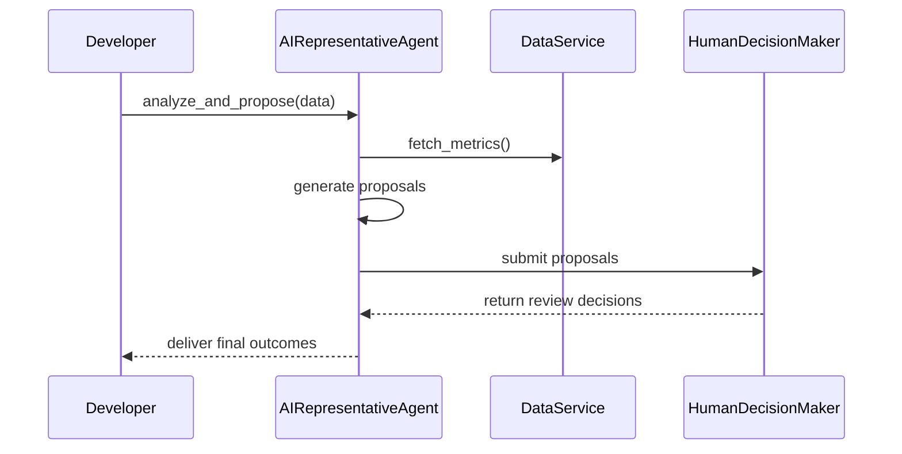

# Chapter 13: AI Representative Agent

In [Chapter 12: External System Synchronization](12_external_system_synchronization_.md) we learned how to keep downstream systems up-to-date. Now let’s introduce an **AI Representative Agent**—an autonomous digital assistant that analyzes data, proposes improvements, and interacts with other HMS-ACH components for review by a human manager.

---

## 1. Why an AI Representative Agent?

Imagine a policy office at the Farm Service Agency analyzing hundreds of grants waiting for disbursement. Manually spotting where delays happen—say too many approval steps or bottlenecks—can take weeks. An **AI Representative Agent** can:

1. **Fetch** performance data automatically.  
2. **Analyze** workloads and process metrics.  
3. **Propose** optimized workflows (e.g., reduce approval steps).  
4. **Submit** those proposals to a human decision maker.

This speeds up policy improvement cycles and keeps managers focused on high-value decisions.

---

## 2. Key Concepts

- **Agent**  
  The AI assistant coordinating analysis and proposals.  
- **Data Analyzer**  
  Fetches and preprocesses metrics (e.g., grant steps, delay days).  
- **Proposal Generator**  
  Uses simple heuristics (or ML) to craft recommendations.  
- **Integrator**  
  Hooks into services like the [Policy Engine](10_policy_engine_.md) or [External System Synchronization](12_external_system_synchronization_.md).  
- **Human Review Interface**  
  Sends proposals to a [Human Decision Maker](11_human_decision_maker_.md) for final sign-off.

---

## 3. Using the AI Representative Agent

Below is a minimalist example showing how to analyze grant data and submit recommendations for review.

```python
# File: app.py
from hms_ach.ai_agent import AIRepresentativeAgent

# 1. Create the agent (uses default services internally)
agent = AIRepresentativeAgent(data_service=SomeDataService())

# 2. Sample grant metrics
grant_data = [
    {"grant_id": "FSA-100", "steps": 8, "delay_days": 30},
    {"grant_id": "FSA-101", "steps": 4, "delay_days": 5}
]

# 3. Analyze and get proposals
proposals = agent.analyze_and_propose(grant_data)
print(proposals)
# [
#   {"grant_id": "FSA-100",
#    "recommendation": "Reduce steps from 8 to 5 to speed disbursement"}
# ]

# 4. Submit for human review
decisions = agent.submit_for_review(proposals)
print(decisions)
```

Explanation:
- We pass raw `grant_data` to `analyze_and_propose()`.  
- The agent returns a list of recommendations.  
- `submit_for_review()` wraps each recommendation as a `Proposal` and calls the human reviewer.

---

## 4. Under the Hood: Step-by-Step Flow



1. **analyze_and_propose()** invokes the data service to get metrics.  
2. The agent applies simple rules to craft recommendations.  
3. **submit_for_review()** sends each proposal to a human reviewer.  
4. The human’s decisions are returned to the caller.

---

## 5. Peek at the Implementation

### 5.1 Agent Setup & Analysis

```python
# File: hms_ach/ai_agent.py
from hms_ach.policy_engine import PolicyEngine
from hms_ach.human_decision_maker import HumanDecisionMaker, Proposal

class AIRepresentativeAgent:
    def __init__(self, data_service, policy_engine=None, reviewer=None):
        self.data_service = data_service
        self.policy_engine = policy_engine or PolicyEngine()
        self.reviewer = reviewer or HumanDecisionMaker("Policy Office Head")

    def analyze_and_propose(self, data):
        proposals = []
        for item in data:
            # Simple heuristic: too many steps?
            if item["steps"] > 5:
                proposals.append({
                    "grant_id": item["grant_id"],
                    "recommendation":
                      f"Reduce steps from {item['steps']} to 5"
                })
        return proposals
```

- The constructor wires in a data service, a [Policy Engine](10_policy_engine_.md) (for future rule checks), and a named human reviewer.

### 5.2 Submitting for Human Review

```python
    def submit_for_review(self, proposals):
        decisions = []
        for p in proposals:
            prop = Proposal(
                id=p["grant_id"],
                title="Workflow Improvement",
                details=p["recommendation"]
            )
            # Here we auto-approve (approve=True) for demo;
            # in real life the manager chooses True/False.
            decisions.append(self.reviewer.review(prop, approve=True))
        return decisions
```

- Each recommendation is wrapped in a `Proposal` object.  
- We call the [Human Decision Maker](11_human_decision_maker_.md) to record approval or rejection.

---

## 6. Conclusion

In this chapter you discovered how an **AI Representative Agent** can:

- Automatically analyze operational data.  
- Propose targeted improvements.  
- Integrate with the [Policy Engine](10_policy_engine_.md) and [External System Synchronization](12_external_system_synchronization_.md).  
- Submit proposals to a [Human Decision Maker](11_human_decision_maker_.md) for final review.

Next up, we’ll see how users embark on dynamic, AI-powered workflows in [Chapter 14: AI-Guided Journey](14_ai_guided_journey_.md).

---

Generated by [AI Codebase Knowledge Builder](https://github.com/The-Pocket/Tutorial-Codebase-Knowledge)