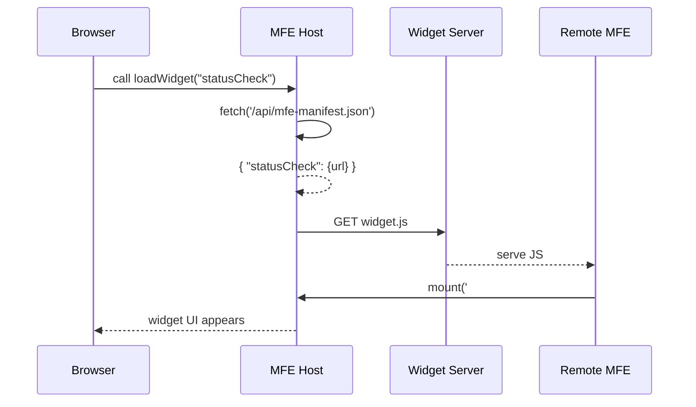

# Chapter 13: Micro Frontend Interface (HMS-MFE)

In [Chapter 12: Interface Layer](12_interface_layer_.md) we learned how to route users, apply themes, and load localized content for different shells (public, admin, mobile). Now we’ll zoom into the building blocks of those shells—the **Micro Frontend Interface (HMS-MFE)**. HMS-MFE lets you assemble small, self-contained UI “widgets” into a full portal, so you can ship, test, and update parts independently without rebuilding everything.

---

## 1. Why Micro Frontends Matter

Imagine a DMV lobby made of modular kiosks:

- One kiosk for **appointments**  
- One for **forms**  
- One for **status checks**  

Each kiosk runs its own mini-app, styled consistently, but developed and deployed by separate teams. When the forms team releases a new “electric vehicle” section, no one has to touch the appointments code. That’s the power of micro frontends.

Concrete Use Case: Citizen Services Portal  
A state portal shows:

1. A **Login Widget** (authentication)  
2. A **Pay Fees Widget** (HMS-ACH integration)  
3. A **Check Status Widget** (application tracking)  

With HMS-MFE, each widget is its own micro frontend. You can update the “Pay Fees” UI without redeploying the login or status components.

---

## 2. Key Concepts

1. **Host Container**  
   The main application that dynamically loads widgets.  
2. **Remote MFE**  
   A standalone build of a widget, published at its own URL (e.g., `https://forms.gov/widget.js`).  
3. **Manifest**  
   A simple JSON file listing available widgets and their script URLs.  
4. **Lazy Loading**  
   Widgets are fetched on demand—only when the user navigates there.  
5. **Styling Consistency**  
   All MFEs consume a shared theme so they look uniform.

---

## 3. Using HMS-MFE to Build a Portal

### 3.1 Initialize the Host

```javascript
// host-app/index.js
import { initMFEHost } from 'hms-mfe'

const mfe = initMFEHost({
  manifestUrl: '/api/mfe-manifest.json',  // lists available widgets
  container: '#app'                       // DOM element to mount into
})

mfe.loadWidget('login')                   // load and mount the "login" widget
```
This sets up the container and points to a manifest of widgets.

### 3.2 Register a Remote Widget

Each widget team provides a manifest entry like:

```json
// api/mfe-manifest.json
{
  "login": { "url": "https://cdn.gov/login-widget.js" },
  "payFees": { "url": "https://cdn.gov/pay-fees-widget.js" },
  "statusCheck": { "url": "https://cdn.gov/status-widget.js" }
}
```

When the host calls `mfe.loadWidget('payFees')`, HMS-MFE:

1. Fetches the URL from the manifest  
2. Injects a `<script>` tag to load the widget  
3. Calls the widget’s `mount(container)` function  

---

## 4. What Happens Under the Hood?



1. The host fetches the manifest.  
2. It finds the widget’s script URL.  
3. It loads the script dynamically from the CDN.  
4. The widget runs its `mount` function into the container.

---

## 5. Inside HMS-MFE: A Peek at the Core

```javascript
// hms-mfe/host.js
export function initMFEHost({ manifestUrl, container }) {
  let manifest = {}

  // 1. Load the manifest once
  async function loadManifest() {
    const res = await fetch(manifestUrl)
    manifest = await res.json()
  }

  // 2. Dynamically load a widget
  async function loadWidget(name) {
    if (!manifest[name]) await loadManifest()
    const { url } = manifest[name]
    await new Promise((resolve) => {
      const script = document.createElement('script')
      script.src = url
      script.onload = resolve
      document.head.appendChild(script)
    })
    // 3. Call the global mount function exposed by the widget
    window[`${name}MFE`].mount(container)
  }

  return { loadWidget }
}
```

Explanation:  
- We fetch the manifest JSON once.  
- For each widget, we inject its script tag.  
- Each remote widget registers itself in `window` under a known name (e.g., `loginMFE`).  
- We then call its `mount` method to render it.

---

## 6. Summary

In this chapter you learned:

- What **Micro Frontends** are and why they’re like modular kiosks in a DMV.  
- How to set up a **Host Container** with `initMFEHost`.  
- How to define a **manifest** of remote widgets.  
- The dynamic loading flow: fetch manifest → load script → mount widget.  
- A peek at the simple core implementation of HMS-MFE.

Next up, we’ll collect all shared UI pieces into a [Shared Frontend Component Library](14_shared_frontend_component_library_.md) so every widget looks and feels consistent.

---

Generated by [AI Codebase Knowledge Builder](https://github.com/The-Pocket/Tutorial-Codebase-Knowledge)