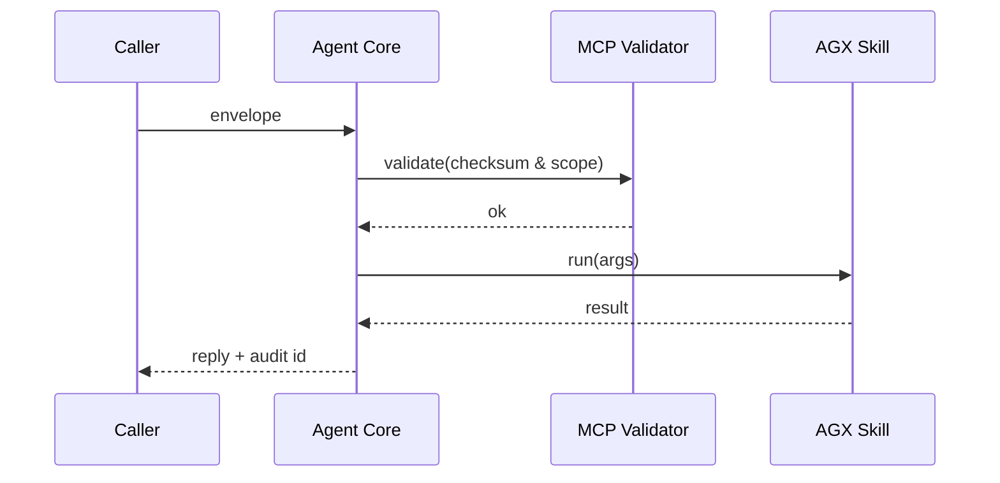

# Chapter 13: Model Context Protocol (HMS-MCP)

*(continuing from [Chapter&nbsp;12: AI Agent Framework (HMS-AGT / AGX)](12_ai_agent_framework__hms_agt___agx__.md))*

---

## 1. Why Do We Need MCP?

Imagine **three** AI clerks:

* **“Passport Helper”** at the State Department  
* **“Tax Advisor”** at the IRS  
* **“Student Loan Counselor”** at Education

A citizen asks:

> “I lost my passport, got a tax refund, and need a loan deferment—what forms do I file?”

Each clerk must:

1. Understand the *same* citizen narrative.  
2. Ask *only* for data it’s cleared to view.  
3. Return answers that other clerks (or auditors) can replay verbatim.

If everyone free-styles prompts, chaos follows—like pilots using different radio codes.

**Model Context Protocol (HMS-MCP)** is that shared “radio code.”  
It defines **one tiny envelope** that carries:

* the prompt,  
* any private arguments,  
* a security badge, and  
* a checksum for audit.

Think of MCP as the **NATO phonetic alphabet** for AI prompts across agencies.

---

## 2. Key Concepts (Plain-English Cheat-Sheet)

| Term | Friendly Description |
|------|----------------------|
| MCP Envelope | A JSON packet that wraps *everything* an agent needs. |
| Context | The human-readable prompt (“I lost my passport…”). |
| Arguments | Hidden facts: citizen ID, prior claims, etc. |
| Scope Token | A signed list of what the agent may touch (e.g., `calendar:read`, `payment:write`). |
| Checksum | A quick math fingerprint so auditors spot tampering. |
| Replay Log | A file storing every envelope exactly as seen by the model. |

---

## 3. Running Example – “One-Stop Help Desk”

Goal: hand the *exact same* citizen request to **three** agents and get harmonized answers.

### 3.1. Create an MCP Envelope

```python
# file: make_envelope.py
import mcp

envelope = mcp.build(
    context = "Citizen says: 'I lost my passport, got a tax refund, and need a loan deferment.'",
    args    = {"citizen_id": "C-9921", "dob": "1989-01-04"},
    scope   = ["passport:read", "tax:read", "loan:write"]
)

print(envelope)
```

Explanation  
1. `mcp.build()` returns a dict with four fields (context, args, scope, checksum).  
2. Fields over 2 KB are auto-hashed to keep packets small.

### 3.2. Hand It to Multiple Agents

```python
from hms_agt import Agent
from agents import passport_helper, tax_advisor, loan_counselor  # predefined

for ag in [passport_helper, tax_advisor, loan_counselor]:
    reply = ag.handle_mcp(envelope)          # <-- new method
    print(f"{ag.name}: {reply}")
```

Sample Output

```
passport_helper: Appointment booked at Rome consulate.
tax_advisor: Your refund was issued on 05-10; no action needed.
loan_counselor: Deferment request prepared, awaiting e-signature.
```

Notice: **one** packet → **three** consistent, audited answers.

---

## 4. What’s Inside an Envelope?

The packet is intentionally tiny—no surprise fields.

```jsonc
{
  "context": "Citizen says: 'I lost my passport…'",
  "args":    {"citizen_id":"C-9921","dob":"1989-01-04"},
  "scope":   ["passport:read","tax:read","loan:write"],
  "checksum":"7be9…a1c2"
}
```

* `context` and `args` may be individually encrypted when moving across agencies (handled by [HMS-A2A](07_inter_agency_data_exchange__hms_a2a__.md)).  
* `checksum` is `SHA-256(context+args+scope)` so any downstream tampering is obvious.

---

## 5. How Does `handle_mcp()` Work?

### 5.1. High-Level Flow



### 5.2. Minimal Validation Code (14 lines)

```python
# hms_mcp/validator.py
import hashlib, json

def validate(env):
    body = json.dumps(
        [env["context"], env["args"], env["scope"]],
        separators=(",",":")
    ).encode()
    if hashlib.sha256(body).hexdigest() != env["checksum"]:
        raise ValueError("Checksum mismatch")
    return True
```

Explanation  
• No 3rd-party libs; beginners can read every line.  
• Returns `True` or raises an error—agents refuse bad packets.

### 5.3. Agent Hook (≤ 20 lines)

```python
# hms_agt/mcp_mixins.py
from hms_mcp import validator, replay

class MCPMixin:
    def handle_mcp(self, env):
        validator.validate(env)
        replay.log(self, env)               # write to replay log
        self._apply_scope(env["scope"])     # limit skills
        return self.chat(env["context"])    # reuse plain chat
```

* `_apply_scope()` hides AGX skills not listed in `scope`; one-liner uses `set.intersection`.  
* `replay.log()` appends the full envelope to `mcp_replay.log` for FOIA review.

---

## 6. Under-the-Hood Walkthrough

1. **Build** – Caller uses `mcp.build()`.  
2. **Validate** – Each agent verifies checksum & scope.  
3. **Scope Enforcement** – Tools outside the token list vanish.  
4. **Process** – Agent answers with normal reasoning.  
5. **Replay** – Envelope + answer saved to an append-only log.

No lock-in: even if tomorrow’s LLM is different, the envelope stays the same.

---

## 7. FAQ

**Q1: Is MCP only for text prompts?**  
No—`context` can be an image hash or audio transcript; args may include file IDs in [HMS-DTA](09_central_data_repository__hms_dta__.md).

**Q2: Who signs the `scope` token?**  
[Governance Layer (HMS-GOV)](01_governance_layer__hms_gov__.md) issues JWT-style signatures; agents refuse unsigned scopes.

**Q3: Does MCP replace JSON-RPC or gRPC?**  
Different layer: MCP is *semantic* (prompt packaging) while RPC is *transport*. You can put MCP envelopes inside gRPC messages.

**Q4: How big can an envelope get?**  
Soft cap 16 KB; larger blobs must live in HMS-DTA with `args={"file_id":"XYZ"}`.

---

## 8. Mini Challenge 🚀

1. Build two envelopes: one with `scope=["tax:read"]`, another with `scope=["tax:read","payment:write"]`.  
2. Feed both to `tax_advisor`.  
3. Observe that only the second envelope lets the agent issue a refund via the Payment skill.  
4. Check `mcp_replay.log` to confirm both packets—and the denied tool call—are recorded.

---

## 9. What We Learned

• **HMS-MCP** is the universal *prompt passport*—every agent, every agency, one format.  
• It carries context, private args, security scope, and an audit checksum.  
• By validating scope and checksum, agents avoid overreach and make FOIA playback trivial.

Ready to keep those agents healthy—versioning, retiring, or re-training them?  
Jump ahead to [Chapter&nbsp;14: Agent Lifecycle Management (HMS-ACT)](14_agent_lifecycle_management__hms_act__.md).

---

Generated by [AI Codebase Knowledge Builder](https://github.com/The-Pocket/Tutorial-Codebase-Knowledge)