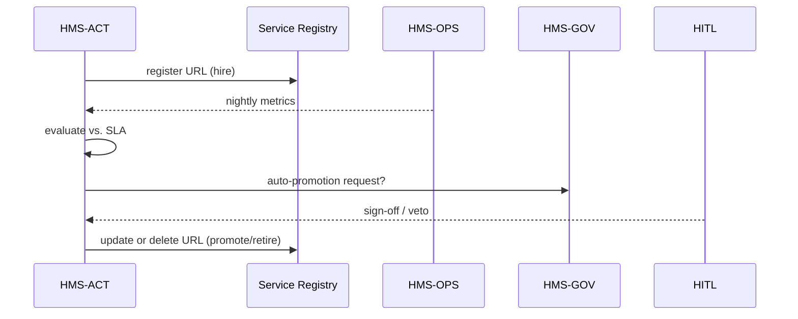

# Chapter 14: Agent Lifecycle Management (HMS-ACT)

*(continuing from [Chapter 13: Model Context Protocol (HMS-MCP)](13_model_context_protocol__hms_mcp__.md))*  

---

## 1. Why Do We Need HMS-ACT?

Imagine the **Passport Helper** agent we built in Chapter 12 suddenly starts timing-out after a new State-Department API change.  

Without guardrails we might:

* keep shipping a “broken employee” to citizens,  
* have no paper-trail proving *when* we last re-trained it,  
* or accidentally let an outdated agent keep its **payment** badge.

HMS-ACT is the **Human Resources office for AI agents**.  
It treats every agent like a real federal worker:

| Real HR | HMS-ACT Equivalent |
|---------|-------------------|
| Hire | Provision a new agent + badges |
| Probation Review | Collect performance metrics from [HMS-OPS](10_operational_monitoring___telemetry__hms_ops__.md) |
| Promotion | Upgrade to a newer model/skill pack |
| Mandatory Training | Schedule re-training or re-certification |
| Retirement | Decommission and archive for audits |

One system, one diary, no mystery agents roaming the network.

---

## 2. Key Concepts (Plain English)

| Concept | Friendly Description |
|---------|----------------------|
| Agent Record | A row in “HR” listing version, badges, hire date. |
| Provisioning | The *hire-agent* action: copies code, assigns domain badge, registers in the [Micro-Services Spine](05_micro_services_spine_.md). |
| Performance Log | Metrics & incidents pulled nightly from HMS-OPS. |
| Promotion | Swapping the binary (e.g., `v3.0.0 → v3.1.0`) **after** tests pass. |
| Certification Clock | A countdown until mandatory re-evaluation (e.g., every 90 days). |
| Decommission | Gracefully remove an agent: revoke badges, archive logs, notify [Governance Layer](01_governance_layer__hms_gov__.md). |

---

## 3. Five-Minute Walking Tour

We will:

1. **Hire** a brand-new **“FOIA Bot”** agent.  
2. Log one week of performance numbers.  
3. **Promote** it after good reviews.  
4. **Retire** it when the statute changes.

> All code blocks ≤ 20 lines—promise!

### 3.1. Install & Connect

```python
pip install hms-act
```

```python
# file: demo_act.py
from hms_act import ACT, AgentSpec
hr = ACT(endpoint="http://localhost:8800")
```

### 3.2. Hire (Provision) an Agent

```python
foia = AgentSpec(
    name="foia_bot",
    version="1.0.0",
    domain="National Archives",
    badges=["records:read"],
    cert_days=90                 # must be re-certified every 90 days
)
agent_id = hr.hire(foia)
print(agent_id)                 # --> "foia_bot#001"
```

*Explanation*  
• `hire()` stores the record, assigns a numeric suffix, and registers URL in the Spine.  
• Certification clock starts ticking today.

### 3.3. Log Performance (one week simulation)

```python
for day in range(7):
    hr.log_performance(agent_id,
        stats={"req": 200, "errors": 1},
        notes=f"Day {day} nominal")
```

*What happens?*  
HMS-ACT simply **pulls** these numbers from HMS-OPS in real deployments; here we fake it for clarity.

### 3.4. Promote the Agent

```python
hr.promote(
    agent_id,
    new_version="1.1.0",
    release_notes="Added PDF-A export"
)
```

The agent’s entry now shows `version=1.1.0`, while the old binary is archived.

### 3.5. Retire (Decommission)

```python
hr.retire(agent_id, reason="Superseded by FOIA Bot v2 rewrite")
```

Outputs:

```
Badges revoked, logs archived at /archive/foia_bot#001
```

---

## 4. What Happens Under the Hood?



Five players, one clear diary.

---

## 5. Inside HMS-ACT (Gentle Dive)

### 5.1. Registry Table (12 lines)

```python
# hms_act/registry.py
class Registry:
    def __init__(self):
        self.records = {}         # id -> dict

    def add(self, spec):
        idx = len(self.records)+1
        agent_id = f"{spec.name}#{idx:03}"
        self.records[agent_id] = {
            "spec": spec.__dict__, "status": "active",
            "hired": now(), "logs": []
        }
        return agent_id
```

### 5.2. Performance Evaluator (15 lines)

```python
# hms_act/evaluator.py
SLA = {"error_rate": 0.02}

def review(record):
    totals = sumlog(record["logs"])
    rate = totals["errors"] / max(totals["req"],1)
    if rate > SLA["error_rate"]:
        record["status"]="needs_remediation"
        notify_hitl(record)
    else:
        record["status"]="good"
```

*If the agent exceeds 2 % errors, HITL is notified for manual review.*

### 5.3. Certification Scheduler (18 lines)

```python
# hms_act/scheduler.py
import time
def tick(registry):
    while True:
        for aid, rec in registry.records.items():
            due = rec["hired"] + rec["spec"]["cert_days"]*86400
            if time.time() > due and rec["status"]=="active":
                rec["status"]="pending_cert"
                request_recetification(aid)
        time.sleep(86400)   # run daily
```

---

## 6. Beginner FAQ

**Q1: Do agents stop serving during promotion?**  
No—HMS-ACT registers the new version side-by-side, waits for health checks, then flips traffic just like a blue-green deploy.

**Q2: Who signs off promotions?**  
By default an **HITL reviewer** must approve unless the performance score is A+ for 30 days.

**Q3: Can I bulk-retire multiple agents?**  
Yes—`retire(filter="domain == 'Census Bureau'")` revokes all domain badges at once.

**Q4: Where do archived logs live?**  
HMS-ACT writes to an S3 bucket managed by [Central Data Repository (HMS-DTA)](09_central_data_repository__hms_dta__.md).

---

## 7. Mini Challenge (Optional)

1. Change `cert_days` to **1** for `foia_bot`.  
2. Run `scheduler.tick()` once.  
3. Observe that `status` becomes `pending_cert` and a recertification email stub appears.

---

## 8. What We Learned

• HMS-ACT is the **HR department** for AI agents: hire, evaluate, promote, retire.  
• It pulls real-world performance from OPS and enforces certification clocks.  
• Promotions and retirements are audited and subject to HITL veto, ensuring no rogue agents linger.

Next we’ll see how human reviewers jump in when an agent misbehaves—read on to [Chapter 15: Human-in-the-Loop Oversight (HITL)](15_human_in_the_loop_oversight__hitl__.md).

---

Generated by [AI Codebase Knowledge Builder](https://github.com/The-Pocket/Tutorial-Codebase-Knowledge)