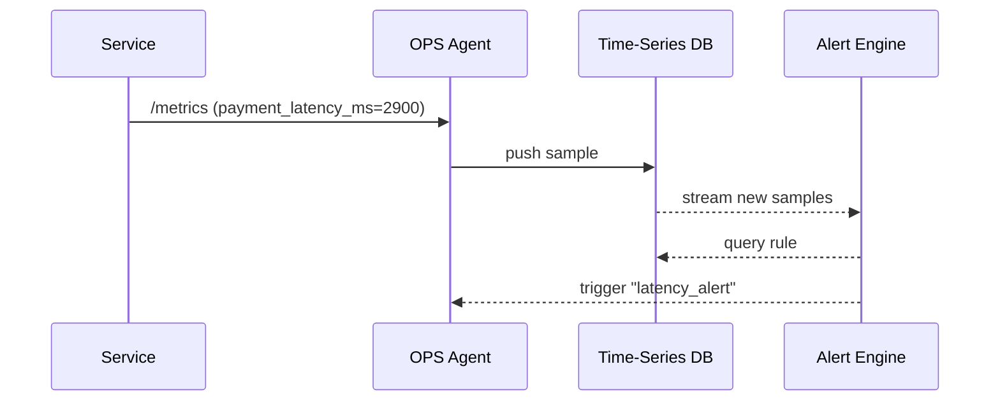

# Chapter 14: Observability & Metrics Stack (HMS-OPS)
*(continues from [External System Synchronization Bridge](13_external_system_synchronization_bridge_.md))*  

---

## 1. Why Do We Need “OPS” at All?

### A concrete story

8:03 a.m. on Election Day—citizens across the state are renewing driver’s licenses so they can vote.  
Suddenly the **payment step** takes **11 seconds** instead of the usual 800 ms.  
If nobody notices, social-media outrage will explode before lunchtime.

With **HMS-OPS** the Transportation Commissioner’s phone pings in under a minute:

```
🚨  Payment latency spiked to 11 s  (threshold 2 s)
    Probable source: Database connection pool exhausted
```

A single glance at the colorful dashboard shows:
* a red line on the **“ACH latency”** chart,  
* a yellow bar on **“Citizens waiting in queue,”** and  
* a green **“License printer health”** tile (so it’s not the hardware).

The on-call engineer restarts one service, latency drops, the graph turns green, and citizens never notice.

> HMS-OPS is the **fit-bit + smoke alarm** for every other chapter you just built.

---

## 2. Key Concepts (plain language)

| Term             | What it really means                        | Analogy                       |
|------------------|---------------------------------------------|-------------------------------|
| Telemetry        | Raw “pings” every few seconds (“I’m alive”).| Heartbeat monitor             |
| Metric           | A number tracked over time (e.g., 11 s).    | Thermometer reading           |
| Log Event        | One detailed message (“Payment #123 timed out”). | Diary entry                   |
| Dashboard Tile   | Visual widget showing a metric.             | Gauge on a car dashboard      |
| Alert Rule       | IF metric > X FOR Y seconds → notify.       | Smoke-detector threshold      |
| SLA              | Formal promise (“99 % payments <2 s”).      | Contract with citizens        |

Keep these six words in mind—everything else is plumbing.

---

## 3. Quick Start — Graph a Metric & Trigger an Alert (18 lines)

Below we:

1. Instrument the [Backend Service Layer](10_backend_service_layer__hms_svc__.md) with one decorator,  
2. Run a tiny **OPS Agent**, and  
3. Watch an alert fire when latency crosses 2 s.

```python
# svc_instrumented.py
from hms_ops import metric, OPSAgent
import time, random

@metric.timer("payment_latency_ms")           # ❶ decorator
def process_payment():
    time.sleep(random.uniform(0.5, 3.5))      # fake work

if __name__ == "__main__":
    agent = OPSAgent(port=8009).start()       # ❷ expose /metrics
    while True:
        process_payment()
```

Explanation  
❶ `@metric.timer` wraps the function; every call sends a timing value.  
❷ `OPSAgent` starts an HTTP endpoint (`/metrics`) that any collector can scrape.

---

### 3.1  Spin up the collector & dashboard

```bash
# terminal 1 – run service
python svc_instrumented.py
```

```bash
# terminal 2 – run mini stack (one command!)
hms-ops up
```

Open `http://localhost:9090` → you’ll see a live graph.  
Let the demo run a minute; once the latency > 2 s for 30 s you’ll receive:

```
📱 SMS: [HMS-OPS] ALERT – payment_latency_ms 2.9 s (>2 s)
```

Under 20 lines of code, zero config besides the decorator!

---

## 4. What Happens Under the Hood?



Only **four** moving parts, all contained in the starter Docker compose the `hms-ops up` command launched for you.

---

## 5. Under-the-Hood Code (super-simple)

### 5.1  The decorator (`hms_ops/metric.py`, 16 lines)

```python
import time, requests, os

def timer(name):
    def wrap(fn):
        def inner(*a, **kw):
            t0 = time.time()
            out = fn(*a, **kw)
            delta = (time.time() - t0) * 1000   # ms
            push(name, delta)
            return out
        return inner
    return wrap

def push(metric, value):
    endpoint = os.getenv("OPS_PUSH", "http://localhost:8009/metrics")
    requests.post(endpoint, json={metric: value}, timeout=0.2)
```

Beginners’ tour  
* Captures start/stop time.  
* `push()` is just an HTTP POST—no special client lib.  
* Timeout 0.2 s so your app never blocks.

### 5.2  Mini Alert Rule (YAML, 6 lines)

```yaml
# alerts/payment_latency.yaml
metric:   payment_latency_ms
when:     avg_over_30s > 2000   # ms
action:   sms:+15551234
message:  "Payment latency {{value}} ms (>2 s)"
```

Drop this file in `alerts/` → stack hot-reloads.

---

## 6. Out-of-the-Box Metrics Cheat-Sheet

| Exporter auto-installed in | Key numbers you get for free                    |
|---------------------------|--------------------------------------------------|
| HMS-ACH (payments)        | `ach_batch_size`, `ach_latency_ms`, `ach_flagged_total` |
| HMS-SVC (workers)         | `job_queue_depth`, `job_fail_total`              |
| HMS-A2A (envelopes)       | `a2a_transfer_ms`, `a2a_failed_total`            |
| HMS-ACT (activities)      | `activities_pending`, `activities_error_total`   |
| HMS-ESQ (legal checks)    | `esq_conflicts_total`, `esq_latency_ms`          |
| Citizen UI (front-end)    | `page_load_ms`, `citizen_satisfaction_score`     |

Every library you used in previous chapters already calls `metric.push()` behind the scenes.

---

## 7. Adding Your Own Metric in 30 Seconds

Want to track **how many refund PDFs** a worker generates?

```python
from hms_ops import metric

def generate_refund_pdf(data):
    # ... create file ...
    metric.increment("refund_pdf_total")   # one-liner
```

Open the dashboard → type `refund_pdf_total` → watch it climb.

---

## 8. Where HMS-OPS Hooks Into Other Layers

| Layer | What OPS watches | Example Alert |
|-------|------------------|---------------|
| [HMS-ACH](11_financial_clearinghouse_core__hms_ach__.md) | `ach_flagged_total` | “>5 suspicious payouts this hour.” |
| [HMS-SVC](10_backend_service_layer__hms_svc__.md) | `job_fail_total` | “Worker crash loop.” |
| [HMS-A2A](09_inter_agency_protocol__hms_a2a__.md) | `a2a_transfer_ms` | “Envelope transfer >5 s.” |
| [HMS-ACT](07_activity_orchestrator__hms_act__.md) | `activities_pending` | “Backlog >100 → page on-call.” |
| [Governance Layer](05_governance_layer___ai_values_framework_.md) | `vet_denied_total` | “Spike in blocked actions.” |

No additional code needed—each library ships its own exporter.

---

## 9. Frequently Asked Questions

**Q: Does OPS slow my app down?**  
A: The push call is **non-blocking** and times out after 200 ms; typical overhead < 1 %.

**Q: Do I need Prometheus or Grafana skills?**  
A: No. `hms-ops up` starts cut-down versions pre-wired for you. When you’re ready, point OPS-Agent at a full Prometheus/Grafana stack.

**Q: Can I send alerts to Slack or Teams?**  
A: Yes—just change `action:` in the YAML: `slack:#oncall` or `teams:webhook_url`.

**Q: How do I see logs, not just numbers?**  
A: Add `metric.log("message")`; OPS streams that to the same backend where you can search by service & timestamp.

**Q: What about citizen “happiness”?**  
A: The front-end sends a 1-to-5 satisfaction emoji on form completion → averaged into `citizen_satisfaction_score`.

---

## 10. Wrap-Up

In this chapter you:

• Saw how **HMS-OPS** turns raw pings into beautiful dashboards and life-saving alerts.  
• Instrumented a payment function with **one decorator**.  
• Learned the flow: service → OPS Agent → time-series DB → alert engine.  
• Added a custom metric and examined ready-made ones from other layers.

Next we’ll secure all this telemetry (plus every other secret) inside the  
[Secure Infrastructure Core (HMS-SYS)](15_secure_infrastructure_core__hms_sys__.md).

Happy graph-watching!

---

Generated by [AI Codebase Knowledge Builder](https://github.com/The-Pocket/Tutorial-Codebase-Knowledge)