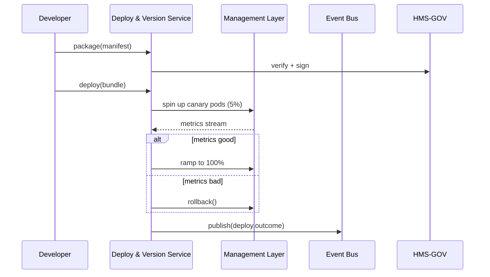

# Chapter 15: Deployment & Versioning Service  
*(File: `15_deployment___versioning_service_.md`)*  

[← Back to Chapter&nbsp;14: Compliance & Audit Ledger](14_compliance___audit_ledger_.md)

---

## 1. Why Do We Need a “Mission-Control” Release Service?

### Use-Case — “IRS Launches a New Tax-Bracket Calculator on April 15th”

1. At **02:00 a.m.** a new AI model (`tax_calc_v9.0`) is ready to go live.  
2. The agency **must** verify that the model:  
   • runs faster than the old one,  
   • produces identical results for 99.9 % of filings,  
   • never over-charges any taxpayer.  
3. If live metrics slip—even by 0.1 %—the system must **instantly roll back** to the previous model (`v8.7`) **without waking engineers**.

Manual deploy scripts and hope are not enough.  
The **Deployment & Versioning Service (DVS)** is our **NASA-style launch console** that:

* stamps every code, infra, and AI bundle with a tamper-proof version number,  
* performs a **canary roll-out** (only 5 % of traffic first),  
* watches real-time metrics, and  
* flips to a **backup version in seconds** if something looks wrong.

---

## 2. Key Concepts (Plain-English Cheat-Sheet)

| Term | Analogy | One-Line Description |
|------|---------|----------------------|
| Bundle | Rocket payload | ZIP/Container of code + config + model. |
| Manifest | Boarding pass | YAML file describing what’s inside the bundle. |
| Canary | Test pilot | Tiny % of users routed to the new bundle. |
| Rollback Switch | Big red lever | Instantly re-points traffic to the last good version. |
| Version Tag | Mission badge | `tax_calc_v9.0+20240605`—immutable & signed. |

Remember these five and you “speak DVS”.

---

## 3. Packing & Launching Your First Bundle (18 Lines)

```python
from dvs import package, deploy, status, rollback

# 1) Describe what's inside ---------------------------------
manifest = {
    "name": "tax_calc",
    "version": "9.0",
    "model": "s3://models/tax_v9.onnx",
    "code":  "registry.gov/tax_calc:9.0",
    "config": {"brackets": "2024"},
    "canary_pct": 5          # 5% traffic
}

# 2) Package & sign the bundle ------------------------------
bundle_id = package(manifest)      # returns "tax_calc_9.0_abc123"

# 3) Launch the canary --------------------------------------
deploy(bundle_id)

# 4) 10 min later: check health -----------------------------
print(status(bundle_id))   # => {"error_rate": 0.03%, "latency": 110ms}

# 5) If metrics spike, abort! -------------------------------
rollback(bundle_id)
```

Beginner takeaways  
1. **Three verbs:** `package`, `deploy`, `rollback`.  
2. Canary traffic is set in the manifest—no extra knobs.  
3. `status()` shows key metrics so you know whether to continue.

---

## 4. Step-By-Step Flight Path



Only **five participants**—easy to follow!

---

## 5. What Exactly Happens Inside?

### 5.1 Non-Code Walk-Through
1. `package()` zips the code, model, and config; writes a **Manifest** file.  
2. DVS asks the [Governance Layer](01_governance_layer__hms_gov__.md) to **sign** the bundle (verifies licenses, ethics flags, FedRAMP tags).  
3. `deploy()` tells the [Management Layer](07_management_layer__service_orchestration__.md) to launch **canary pods** and tag them with `version=9.0`.  
4. DVS subscribes to live KPIs (`tax_calc.*`) on the [Event Bus](11_event_bus___real_time_monitoring_.md).  
5. If `error_rate` or `latency` crosses thresholds, DVS calls `rollback()`—the Management Layer routes **all** traffic back to pods tagged `8.7`.  
6. Every action is written to the [Compliance & Audit Ledger](14_compliance___audit_ledger_.md) as a signed block.

---

## 6. Internal Implementation (Gentle Dive)

### 6.1 File Layout

```
dvs/
 ├─ core.py          # public API
 ├─ signer.py        # asks Governance for bundle signature
 ├─ ramp.py          # traffic % adjuster
 └─ store.py         # bundle manifests + states
```

### 6.2 `core.py` — 20 Lines

```python
import store, signer, ramp, event_bus

def package(manifest):
    bid = f"{manifest['name']}_{manifest['version']}_{_uid()}"
    signer.assert_ok(manifest)          # Governance approval
    store.save_manifest(bid, manifest)
    return bid

def deploy(bundle_id):
    m = store.get_manifest(bundle_id)
    ramp.start_canary(bundle_id, m["canary_pct"])
    event_bus.publish("deploy.start", {"id": bundle_id})

def status(bundle_id):
    return store.get_metrics(bundle_id)

def rollback(bundle_id):
    ramp.to_previous_version(bundle_id)
    event_bus.publish("deploy.rollback", {"id": bundle_id})

# helper ----------
import uuid
def _uid(): return uuid.uuid4().hex[:6]
```

Notes for beginners  
• `signer.assert_ok` refuses to package if Governance says “no”.  
• `ramp.start_canary` hides all Kubernetes or traffic-shifting details.

### 6.3 `ramp.py` — 18 Lines

```python
import mgmt_api, time, store

def start_canary(bid, pct):
    pods = mgmt_api.launch(bid, pct)        # talk to Management Layer
    store.track(bid, pods, pct)

def to_previous_version(bid):
    prev = store.previous_good(bid)
    mgmt_api.route_100_percent(prev)
    store.mark_failed(bid)

# Auto-ramp loop (runs in a thread)
def monitor():
    while True:
        for bid in store.active():
            m = store.get_metrics(bid)
            if m["error_rate"] < 0.1 and m["latency"] < 200:
                _increase(bid)
            elif m["error_rate"] > 1 or m["latency"] > 400:
                to_previous_version(bid)
        time.sleep(60)

def _increase(bid):
    pct = store.bump_pct(bid, +20)      # +20 % each step
    mgmt_api.adjust_traffic(bid, pct)
```

*You never see Kubernetes YAML—the helper `mgmt_api` uses the Management Layer’s `orchestrator` internally.*

### 6.4 `store.py` — 14 Lines

```python
_manifests = {}
_state = {}      # bid -> {"pct":5,"metrics":{}, "pods":[...]}

def save_manifest(bid, m): _manifests[bid] = m
def get_manifest(bid):     return _manifests[bid]

def track(bid, pods, pct):
    _state[bid] = {"pods": pods, "pct": pct, "metrics": {}}

def get_metrics(bid):      return _state[bid]["metrics"]
def update_metrics(bid, kpi): _state[bid]["metrics"] = kpi

def previous_good(bid):
    name = _manifests[bid]["name"]
    vers = _manifests[bid]["version"]
    # naive: pick highest version < current & marked good
    return max((b for b in _state if _manifests[b]["name"]==name
                and _manifests[b]["version"]<vers), default=None)

def bump_pct(bid, delta):
    _state[bid]["pct"] += delta
    return _state[bid]["pct"]

def mark_failed(bid): _state[bid]["failed"] = True
```

*All in-memory for teaching; production would use Postgres / S3.*

---

## 7. How DVS Plugs Into Other Layers

| Layer | Interaction |
|-------|-------------|
| [Governance Layer](01_governance_layer__hms_gov__.md) | Signs manifests; blocks unapproved bundles. |
| [Management Layer](07_management_layer__service_orchestration__.md) | Launches pods & shifts traffic on DVS commands. |
| [Event Bus & Real-Time Monitoring](11_event_bus___real_time_monitoring_.md) | Streams metrics that DVS watches; receives `deploy.*` events. |
| [Compliance & Audit Ledger](14_compliance___audit_ledger_.md) | Logs every package, deploy, and rollback block. |
| [Access & Authorization Matrix](03_access___authorization_matrix_.md) | Ensures only `role=release_admin` may call `deploy()` or `rollback()`. |

---

## 8. Beginner FAQ

**Q: How fast is a rollback?**  
A: Traffic switch happens in **<5 seconds**; pods of the old version are kept “warm” for 30 min.

**Q: Can I deploy only a config change, not new code?**  
A: Yes—bump the manifest’s `version` (e.g., `9.0.1`) and leave `code` unchanged.

**Q: What if two bundles have the same version number?**  
A: Governance’s signer rejects duplicates—version tags are **unique** and immutable.

**Q: Do I need to learn Helm/Kustomize?**  
A: Not to start. DVS’s helpers hide those details; learn them later if you want deeper control.

---

## 9. Quick Hands-On Checklist

☑ Create a **Manifest** → `package()` signs & stores it.  
☑ `deploy()` launches a **canary** through the Management Layer.  
☑ DVS auto-ramps or auto-rolls back based on live metrics.  
☑ Every step emits events and is chained into the Audit Ledger.  
☑ You touched zero Kubernetes YAML—mission control handled it.

---

## 10. Final Thoughts

The **Deployment & Versioning Service** is the last safety gate in the HMS-ACH architecture.  
It ensures that brilliant code and AI models—vetted by governance, improved by agents, and monitored in real time—reach citizens **safely, quickly, and reversibly**.

With DVS, your government services can ship updates **daily** and still keep the public’s trust, just like NASA swaps to a backup system without missing a beat.

🎉 **You’ve completed the HMS-ACH beginner tutorial!**  
Go forth and launch confidently.

---

Generated by [AI Codebase Knowledge Builder](https://github.com/The-Pocket/Tutorial-Codebase-Knowledge)