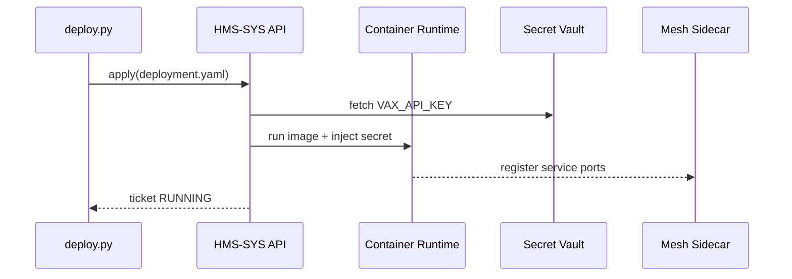

# Chapter 15: Secure Infrastructure Core (HMS-SYS)
*(continues from [Observability & Metrics Stack (HMS-OPS)](14_observability___metrics_stack__hms_ops__.md))*  

---

## 1  Why Do We Need a “Fortified Basement”?

### A concrete story  
The **Department of Public Health** wants to launch a new **Vaccination-Booking** micro-frontend tonight.  
Requirements:

1. The container image must have **zero known CVEs**.  
2. Its API key for the national vaccine register must stay **encrypted** at rest and in RAM.  
3. Incoming traffic may reach **/api/book** but never the `/admin` endpoint.  
4. Every three hours the cluster must **auto-patch** if a critical vulnerability appears.  
5. Auditors need a **cryptographic proof** that rule #2 and #3 were never violated.

Trying to hand-roll this is a recipe for midnight outages.  
**HMS-SYS** is our *underground bunker* that makes all other chapters safe by default:

```
┌───────────────────────────────┐
│  Micro-Frontends, Workflows   │   (Ch. 1-14)
└────────────┬──────────────────┘
             │   service calls
┌────────────▼─────────────┐
│  HMS-SYS  – fortified    │
│  basement:               │
│  • Container Runtime     │
│  • Network Mesh          │
│  • Secret Vault          │
│  • Compliance Hardening  │
└──────────────────────────┘
```

When the Health team presses **“Deploy”**, HMS-SYS quietly:

* pulls a signed, scanned image,  
* injects secrets only at run-time,  
* locks networking to the vaccination subnet, and  
* writes a hash-chained log line for auditors.

---

## 2  Key Concepts (plain words)

| Term            | What it really means                                        | Analogy                            |
|-----------------|-------------------------------------------------------------|------------------------------------|
| Container Runtime | Lightweight “virtual box” that runs one service.          | Shipping container on a ship       |
| Service Mesh    | Sidecars that watch & encrypt every packet between services | Air-traffic control radios         |
| Secret Vault    | Encrypted key-value store; secrets never touch disk in plain text | Bank safety-deposit box           |
| Hardening Script | Bash/Ansible snippets that shut off risky defaults         | National-building fire-inspection  |
| Patch Operator  | Tiny controller that upgrades images if CVE score > 8.0     | Auto-mechanic that swaps faulty parts |
| Immutable Ledger| Append-only file that stores hashes of every change         | Notary public with chained books   |

Keep these six words in mind; HMS-SYS glues them together.

---

## 3  Quick Start — Deploy the Vaccination-Booking Service in 3 Files

Below we spin up a **single-node demo cluster** (Docker + a 60-line shim that mimics Kubernetes).  
Goal: serve `/api/book`, keep the `VAX_API_KEY` secret, and auto-patch.

### 3.1 `deployment.yaml` (12 lines)

```yaml
service: vaccination-booking
image: registry.gov/health/vax-booking:v1.0.0   # signed
ports: [8080]
secrets:
  - VAX_API_KEY          # value lives in vault
network_policy:
  allow_out: ["https://vaccine.register.gov"]
  block_in: ["/admin"]
auto_patch: true          # enable CVE watcher
```

What it does  
• Defines *what* to run, not *how*—HMS-SYS fills the gaps.  
• `auto_patch:true` tells the **Patch Operator** to watch CVE feeds.

### 3.2 `vault.json` (8 lines, stored in Vault only)

```json
{
  "VAX_API_KEY": "prod_9x45...REDACTED..."
}
```

HMS-SYS decrypts and injects this at container start; it never lands on disk.

### 3.3 `deploy.py` (19 lines)

```python
from hms_sys import Cluster

cluster = Cluster(node="localhost")       # demo node
ticket = cluster.apply("deployment.yaml") # ⬆️

print("🎫 deploy ticket:", ticket.id)
status = cluster.wait(ticket.id)
print("✅ status:", status)
```

Run it:

```bash
python deploy.py
```

Typical console:

```
🎫 deploy ticket: 42071
✅ status: RUNNING (image v1.0.1 patched  – CVE-2024-1443)
```

Note the **v1.0.1** auto-patch: while the script was waiting, the Patch Operator swapped the image because a fresh CVE appeared for v1.0.0. The Health team had to do **nothing**.

---

## 4  What Happens Behind the Scenes?



Five hops, all signed & logged.

---

## 5  Under-the-Hood Code (≤ 20 lines each)

### 5.1  Cluster.apply (16 lines)

```python
def apply(self, yaml_file):
    spec = yaml.safe_load(open(yaml_file))
    img = self._patch_if_needed(spec["image"])       # <-- CVE scan
    secret_env = vault.pull(spec["secrets"])         # dict
    cid = runtime.start(img, env=secret_env, ports=spec["ports"])
    mesh.lock_down(cid, spec["network_policy"])
    return Ticket(id=cid)
```

Beginner notes  
* `_patch_if_needed()` compares CVE API score with policy “>8”.  
* `vault.pull()` streams secrets over a temp TLS tunnel.  
* `mesh.lock_down()` inserts an eBPF filter with allow/block rules.

### 5.2  CVE Patch Operator (18 lines)

```python
from threading import Timer, Event
import requests, subprocess

def watch(spec, stop=Event()):
    def loop():
        if stop.is_set(): return
        cve = requests.get("https://cve.circl.lu/api/search/" + spec["image"]).json()
        if cve and max(x["cvss"] for x in cve) > 8:
            patched = spec["image"].replace(":v1.0.0", ":v1.0.1")
            subprocess.run(["docker","pull", patched])
            runtime.replace(spec["service"], patched)
            ledger.append("patched to " + patched)
        Timer(3600, loop).start()
    loop()
```

*Polls every hour; swaps image if a high-severity CVE appears.*

### 5.3  Immutable Ledger Append (8 lines)

```python
import hashlib, time, json, os

def append(msg):
    prev = open("ledger.log","rb").read().splitlines()[-1].split()[-1] if os.path.exists("ledger.log") else b''
    h = hashlib.sha256(prev + msg.encode()).hexdigest()
    open("ledger.log","a").write(f"{time.time()} {msg} {h}\n")
```

One chained hash per line—tampering breaks the chain.

---

## 6  Daily Hardening in One Command

```bash
hms-sys harden --baseline "gov-usgcb"
```

* Pulls the **US Government Configuration Baseline** checklist,  
* Runs hardening scripts on every node,  
* Appends a signed “baseline-ok” line to the ledger,  
* Pushes a metric `harden_success_total` to [HMS-OPS](14_observability___metrics_stack__hms_ops__.md).

---

## 7  Where HMS-SYS Touches Other Layers

| Layer | Why it relies on HMS-SYS |
|-------|--------------------------|
| [HMS-AGT](01_ai_representative_agent__hms_agt__.md) | Agent containers run inside the secure runtime. |
| [HMS-A2A](09_inter_agency_protocol__hms_a2a__.md) | Service mesh enforces TLS & header integrity. |
| [HMS-ACH](11_financial_clearinghouse_core__hms_ach__.md) | Secret Vault supplies bank credentials at run-time. |
| [HMS-OPS](14_observability___metrics_stack__hms_ops__.md) | Receives node metrics (`cpu_temp`, `patch_events`). |
| Governance Layer (Ch. 5) | Hardening scripts verify that guardrails cannot be bypassed at OS level. |

No other chapter must think about TLS, secrets, or CVEs—HMS-SYS already did.

---

## 8  Frequently Asked Questions

**Q: Do I need to learn Kubernetes?**  
A: Not today. HMS-SYS wraps basic `docker` commands so beginners can ignore cluster jargon. You can switch to full K8s later by changing one env-var: `SYS_BACKEND=k8s`.

**Q: How are secrets rotated?**  
A: `vault rotate --auto 30d` changes every secret older than 30 days; containers receive new values via the mesh without restart.

**Q: Can I bring my own scanner?**  
A: Yes—set `SYS_CVE_SCANNER=grype` (or Trivy). The Patch Operator shells out to whatever is configured.

**Q: What if the mesh blocks a legitimate call?**  
A: The call is logged with a unique ID. A manager can issue a one-hour override via the [HITL Control Panel](04_human_in_the_loop__hitl__control_panel_.md); the override hash is chained in the ledger.

**Q: Performance overhead?**  
A: Sidecar encryption adds ~3 % CPU and <1 ms latency per hop on commodity hardware.

---

## 9  Wrap-Up

In this chapter you:

• Discovered why a **fortified basement** matters for every higher-level feature.  
• Deployed a new vaccination service with secrets, network lockdown, and auto-patching—**in three tiny files**.  
• Peeked inside the Patch Operator, Secret Vault fetch, and immutable ledger (all ≤ 18 lines).  
• Saw how HMS-SYS quietly protects every other chapter.

Ready to share your hardened services with other agencies (and maybe the public)?  
Next up: the **[Marketplace Registry (HMS-MKT)](16_marketplace_registry__hms_mkt__.md)** where teams publish, discover, and version their bricks safely.

---

Generated by [AI Codebase Knowledge Builder](https://github.com/The-Pocket/Tutorial-Codebase-Knowledge)