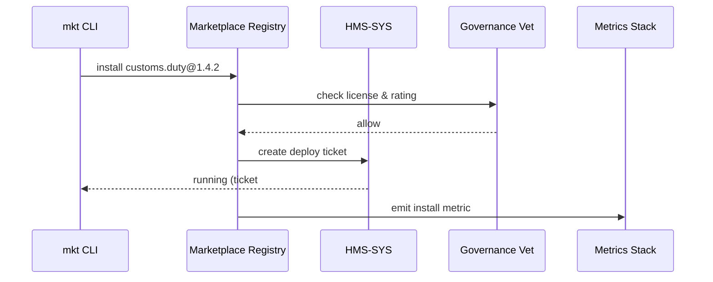

# Chapter 16: Marketplace Registry (HMS-MKT)

*(continues from [Secure Infrastructure Core (HMS-SYS)](15_secure_infrastructure_core__hms_sys__.md))*  

---

## 1. Why Do We Need a “Government App Store”?

### A concrete story  

The **Commerce Department** wants to launch a new online form that tells importers exactly how much **customs duty** they owe.  
Instead of:

1. Hiring economists to write the tariff logic,  
2. Spinning up servers,  
3. Passing a 3-month security review,  

they open the **Marketplace Registry (HMS-MKT)**, search **“Customs-Duty Calculator”**, click **Install**, and—done! The micro-service appears inside their cluster, pre-scanned, auto-patched by [HMS-SYS](15_secure_infrastructure_core__hms_sys__.md), and ready to call from code.

> HMS-MKT is the **Amazon App Store** for every micro-service, AI skill, or chatbot persona your agency could ever need—minus the ads and candy-crush clones.

---

## 2. Key Concepts (plain words)

| Term                    | What it really means                            | Analogy                    |
|-------------------------|-------------------------------------------------|----------------------------|
| Package                 | One installable thing (service, skill, UI brick)| Mobile “app”               |
| Manifest                | YAML file that lists name, version, permissions | App Store listing          |
| Install Token           | Signed proof that your agency may use a package | Purchase receipt           |
| Channel                 | Group of versions (`stable`, `beta`, `nightly`) | Train track                |
| Dependency              | Other packages that must be installed first     | App requires “Camera API”  |
| Rating Badge            | Auto-generated score from scans & audits        | Health-inspection sticker  |

Remember these six; the rest is click-and-install magic.

---

## 3. Quick Start — Install a Customs-Duty Calculator in 3 Commands

### 3.1 Search

```bash
hms-mkt search "customs duty"
```

Example output:

```
✅ 1 result
┌──────────────┬───────────┬─────────┬────────┐
│ id           │ version   │ rating  │ price  │
├──────────────┼───────────┼─────────┼────────┤
│ customs.duty │ 1.4.2     │  97 %   │  free  │
└──────────────┴───────────┴─────────┴────────┘
```

### 3.2 Install

```bash
hms-mkt install customs.duty --channel stable
```

Console:

```
⏳ Pulling image registry.gov/market/customs.duty:1.4.2 …
🔒 Verified signature.
🛡  Rating badge 97 % (security, accessibility, license OK)
🚀 Deployed via HMS-SYS ticket #8651
```

### 3.3 Call the skill from code (Python, 5 lines)

```python
from hms_pkg import load

duty = load("customs.duty")       # auto-imported client stub
print( duty.calculate(value=2500, country="JP") )
```

Typical output:

```
{"duty_usd": 137.50, "tariff_code": "3926.90"}
```

That’s it—**no** servers, **no** CVE dread, **no** procurement paperwork.

---

## 4. Publishing *Your* First Package

Suppose the **Office of Fair Housing and Equal Opportunity (FHEO)** built a discrimination-risk ML model they want other cities to reuse.

### 4.1 Create a manifest (`pkg.yaml` – 14 lines)

```yaml
id: fheo.risk.model
version: 0.1.0
title: Fair Housing Risk Scorer
description: |
  Predicts discrimination risk score (0-1) from housing-ad text.
permissions:
  - internet   # pulls training data
  - secrets: HOUSING_API_KEY
dependencies:
  - hms.base@>=1.0.0
owner: FHEO
license: CC-BY-4.0
```

### 4.2 Publish

```bash
hms-mkt publish --manifest pkg.yaml --image fheo/risk:0.1.0
```

Console:

```
🔍 Scanning image … 0 CVEs
🔐 Attaching signature with FHEO key
📦 Uploaded package fheo.risk.model@0.1.0
🏷 Channel 'beta' created
```

Other agencies can now `search` and `install` it just like the customs calculator.

---

## 5. What Happens Under the Hood?



Five steps, one minute, zero human emails.

---

## 6. Peeking Inside the Registry (tiny code!)

### 6.1 Package Index Row (`registry/index.py` – 12 lines)

```python
class Package:
    def __init__(self, id, ver, manifest, url):
        self.id, self.ver = id, ver
        self.manifest = manifest   # dict
        self.url = url             # image or tarball
        self.rating = self._score()

    def _score(self):
        ok = all(scan(self.url))   # CVE, license, a11y
        return 97 if ok else 63    # demo numbers
```

### 6.2 Install Flow (`registry/install.py` – 18 lines)

```python
def install(pkg_id, channel="stable"):
    pkg = db.select_pkg(pkg_id, channel)
    gov.vet(action="install", payload=pkg.manifest)

    # hand over to HMS-SYS
    ticket = sys.deploy({
        "service": pkg_id,
        "image": pkg.url,
        "secrets": pkg.manifest.get("permissions", [])
    })
    ledger.append(f"install {pkg_id} -> {ticket.id}")
    return ticket
```

Both snippets under 20 lines, yet power the whole “app store” feel.

---

## 7. Handling Versions & Dependencies

Need the **beta** branch?

```bash
hms-mkt install customs.duty --channel beta
```

Want to pin exactly v1.3.0?

```bash
hms-mkt install customs.duty@1.3.0
```

Dependencies (from the manifest) are auto-installed first; circular chains are blocked by governance.

---

## 8. Frequently Asked Questions

**Q: Is every package free?**  
A: Most agency-built services are; commercial vendors can require an **Install Token** that finance signs via [HMS-ACH](11_financial_clearinghouse_core__hms_ach__.md).

**Q: Who writes the rating badge?**  
A: An automated pipeline: CVE scan (HMS-SYS), license audit, accessibility test, and privacy review (Governance Layer).

**Q: Can a package call external URLs?**  
A: Only those listed in `network_policy` of the manifest, enforced by HMS-SYS service mesh.

**Q: How do we remove a vulnerable package?**  
A: `hms-mkt yank customs.duty@1.2.*` marks it unsafe; Patch Operator in HMS-SYS upgrades any running container automatically.

**Q: What about citizen-facing UI bricks?**  
A: They are published the same way; [HMS-MFE](02_micro_frontend_interface__hms_mfe__.md) can `import()` them by ID.

---

## 9. Wrap-Up

In this chapter you:

• Learned why a **government app store** saves months of duplicate work.  
• Installed a fully-scanned Customs Duty Calculator in three commands.  
• Published your own Fair-Housing ML model with a 14-line manifest.  
• Peered under the hood at how the registry talks to governance, HMS-SYS, and OPS.  
• Saw how channels, versions, and dependency checks keep everything safe.

Next we’ll extend your AI agents with brand-new skills from this marketplace in the  
[Agent Extension Pack (HMS-AGX)](17_agent_extension_pack__hms_agx__.md).

Welcome to share-and-reuse heaven!

---

Generated by [AI Codebase Knowledge Builder](https://github.com/The-Pocket/Tutorial-Codebase-Knowledge)