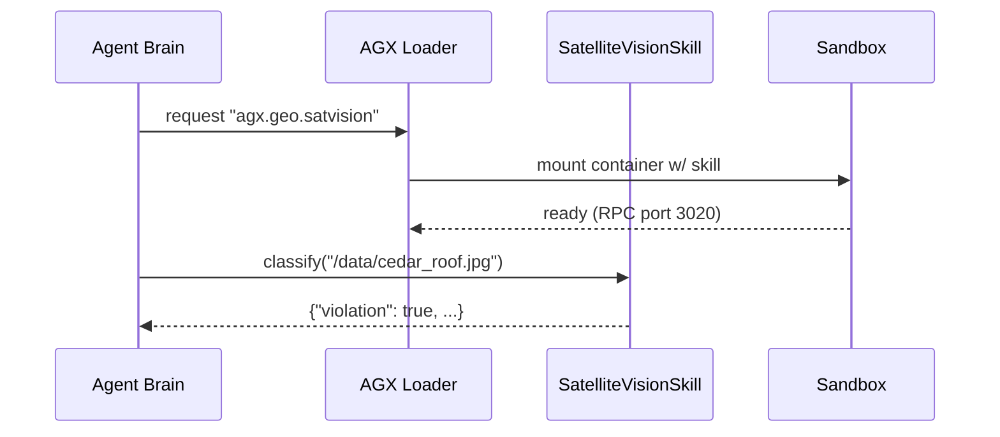

# Chapter 17: Agent Extension Pack (HMS-AGX)
*(continues from [Marketplace Registry (HMS-MKT)](16_marketplace_registry__hms_mkt__.md))*  

---

## 1  Why Do We Need “Super-Powers” for Agents?

### A concrete story  
The **City Building Safety Bureau** must stop illegal rooftop apartments.  
Traditionally that means:

1. Inspectors drive street-by-street.  
2. They climb stairs, take photos, file paperwork.  
3. Two weeks later a notice is mailed—*sometimes* to the wrong owner.

Instead, the bureau spins up **InspectionBot**—an [HMS-AGT](01_ai_representative_agent__hms_agt__.md) agent—that now owns a brand-new **SatelliteVisionSkill** from **HMS-AGX**:

```
Satellite image ▶ InspectionBot ▶ “Unpermitted penthouse detected at 421 Cedar.”
```

Nobody drives. Nobody climbs. Citizens get safer buildings faster.  

HMS-AGX is the **backpack full of gadgets** that any agent can grab:  
advanced NLP, geospatial math, OCR, image classification, speech-to-text, and more.

---

## 2  Key Concepts (plain words)

| Term              | What it really means                           | Analogy                    |
|-------------------|-----------------------------------------------|----------------------------|
| Skill             | One callable tool (e.g., `classify_image`).   | App on a phone             |
| Extension Pack    | Zip/tar of one or more skills + manifest.     | Power-up card deck         |
| Capability Tag    | Label like `geo`, `ocr`, `nlp`.               | App-store category         |
| Runtime Loader    | Tiny shim that imports & sandboxes the pack.  | USB sandbox                |
| Sandbox           | Limits CPU, memory, and network of a skill.   | Child-proof scissors       |
| License Tier      | `open`, `gov-internal`, or `paid`.            | Movie rating (G, PG, R)    |

If you learn these six, the rest is plug-and-play magic.

---

## 3  Quick Start — Detect Illegal Construction in 18 Lines

We will:

1. Install the **satellite-vision** pack from the marketplace.  
2. Load it into an agent.  
3. Ask the agent to scan a JPEG.

### 3.1 Install the pack

```bash
hms-mkt install agx.geo.satvision --channel stable
```

Console:

```
🛠  agx.geo.satvision@2.1.0  installed (rating 95 %)
```

### 3.2 Use the new skill

```python
# inspect.py
from hms_agt import Agent
from hms_agx import load_skill               # ❶ loader helper

sat = load_skill("agx.geo.satvision")        # ❷ returns skill obj

agent = Agent("InspectionBot",
              personality="Diligent inspector.",
              skills=[sat])                  # ❸ plug in

result = agent.run("""
Scan image at /data/cedar_roof.jpg.
If you see new construction lacking permit tags,
output JSON: {"violation": true, "evidence": "..."}   
""")

print(result)
```

Typical output:

```
{"violation": true, "evidence": "Detected fresh roofing and debris pile."}
```

Line-by-line  
❶ `load_skill` finds the pack and sandwiches it in a sandbox.  
❷ Returns an object whose public methods map to the skill’s API.  
❸ Drop it into `skills=[…]` just like the built-in `EmailSkill`.

---

## 4  What Happens Under the Hood?



1. Loader checks the pack signature & license.  
2. Spins a **tiny container** (50 MB).  
3. Exposes one local gRPC/HTTP port; the agent calls it as a Python method.  
4. All IO is logged to [HMS-OPS](14_observability___metrics_stack__hms_ops__.md) and vetted by Governance.

---

## 5  Inside the Pack — Minimal Code Tour

### 5.1 Manifest (`satvision/pack.yaml`, 12 lines)

```yaml
id: agx.geo.satvision
version: 2.1.0
capabilities: [geo, vision]
entrypoint: vision.py:SatelliteVisionSkill
model: s3://models/roofnet.onnx
license: gov-internal
```

The loader needs **only** these fields to do its job.

### 5.2 Skill class (`vision.py`, 18 lines)

```python
import cv2, numpy as np           # OpenCV, lightweight build
from roofnet import model         # tiny ONNX wrapper

class SatelliteVisionSkill:
    name = "SatelliteVisionSkill"

    def classify(self, path:str):
        img = cv2.imread(path)
        tiles = self._slice(img)          # ❶ small helper
        scores = [model.predict(t) for t in tiles]
        if max(scores) > 0.8:
            return {"violation": True,
                    "confidence": max(scores)}
        return {"violation": False}

    def _slice(self, img):                # ❷ <5 lines util
        h,w,_ = img.shape
        return [img[y:y+256,x:x+256]
                for y in range(0,h,256)
                for x in range(0,w,256)]
```

Explanation  
❶ `_slice` chops the big image into 256×256 tiles.  
❷ Each tile feeds a teeny ONNX model (`roofnet`) trained on roof images.  
*All ≤18 lines; real pack may be bigger but you don’t have to touch it.*

---

## 6  Writing Your Own Skill in 5 Steps

1. `git init myskill && cd myskill`  
2. Write `pack.yaml` with `id`, `version`, `entrypoint`.  
3. Code the class with methods—you decide names & args.  
4. `hms-mkt publish --manifest pack.yaml --image myskill:0.0.1`  
5. Done! Any agent can now `load_skill("myskill")`.

Tip: if your code needs external URLs, list them in `network_policy` so HMS-SYS mesh allows them.

---

## 7  Frequently Asked Questions

**Q: Do I need Docker installed?**  
A: No. `hms-agx` uses the same container runtime provided by [HMS-SYS](15_secure_infrastructure_core__hms_sys__.md).  

**Q: Can a skill access the internet?**  
A: Only if its manifest lists specific domains; otherwise the sandbox blocks outbound traffic.

**Q: How big can models be?**  
A: Up to 500 MB per pack by default. Larger packs require Governance approval.

**Q: What if two skills conflict on package versions?**  
A: Each skill runs in its own container, so no dependency hell.

**Q: Does every pack cost money?**  
A: Most agency-made packs are free; commercial packs may require an Install Token handled via [HMS-ACH](11_financial_clearinghouse_core__hms_ach__.md).

---

## 8  Wrap-Up

In this chapter you:

• Saw why **HMS-AGX** turns ordinary agents into policy superheroes.  
• Installed a satellite-vision pack in **one command**.  
• Added the skill to an agent with just **three lines of Python**.  
• Peeked at the manifest, class, and sandbox loader.  
• Learned how to publish your own skill for others.

Next we’ll explore **how the agent and skill share memory and prompts safely** using the  
[Model Context Protocol (HMS-MCP)](18_model_context_protocol__hms_mcp__.md).

Welcome to the era of plug-and-play government AI!

---

Generated by [AI Codebase Knowledge Builder](https://github.com/The-Pocket/Tutorial-Codebase-Knowledge)