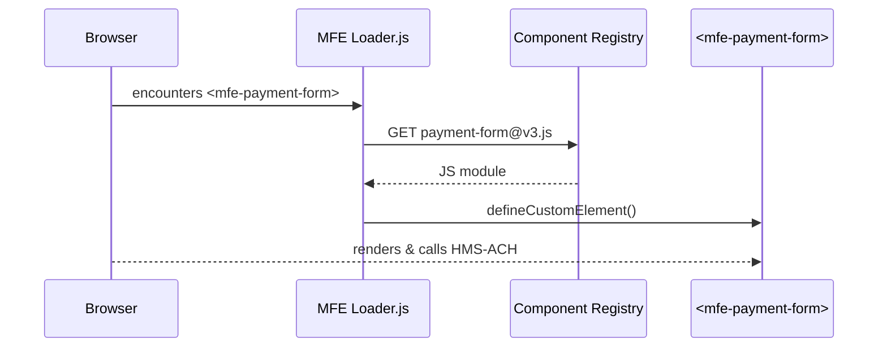

# Chapter 17: Frontend Micro-Frontend Library (HMS-MFE)

*(continuing from [Chapter&nbsp;16: Agent Marketplace (HMS-MKT)](16_agent_marketplace__hms_mkt__.md))*  

---

## 1. Why Do We Need HMS-MFE?

Imagine the Department of Energy’s **Office of Science** wants a public portal where researchers can:

1. **Log-in** with their federal PIV card,  
2. **Submit** a new grant application,  
3. **Pay** application fees online, and  
4. **Track** real-time review status.

If every agency rebuilt these screens from scratch, we would end up with:

* five different “Login” buttons,  
* four shades of **federal-blue**, and  
* countless **Section 508** accessibility violations.

HMS-MFE solves this by providing **pre-built, policy-compliant LEGO blocks**—a “Login Widget,” “Policy Table,” “Payment Form,” etc.—that any agency can snap together like HTML tags.

Result: teams ship polished portals **days** instead of **months**, while designers, lawyers, and accessibility testers sleep soundly.

---

## 2. Key Concepts (Plain English)

| Term                | Friendly Description |
|---------------------|----------------------|
| Micro-Frontend      | A self-contained UI block (HTML+JS+CSS) you can drop anywhere. |
| Component Registry  | The public shelf where all blocks live (similar to NPM, but internal). |
| Design Tokens       | One central file of fonts, colors, spacing—keeps every block on-brand. |
| Shadow DOM          | Invisible wall that stops one block’s CSS from breaking another. |
| Accessibility Pass  | Every component ships with baked-in ARIA labels & keyboard support. |
| Version Tag         | `login-widget@v2.4.1`—immutable after release (auditors love this). |

*Analogy:* Think of HMS-MFE as the **LEGO Store**; micro-frontends are the **bricks**.

---

## 3. Five-Minute Walking Tour  
*Goal: build a “Research Grants” mini-portal using only HMS-MFE blocks.*

### 3.1. Add One Script Tag

```html
<!-- index.html -->
<script src="https://cdn.hms.gov/mfe/v1/loader.js"></script>
```

The loader:

1. Downloads the **component registry** manifest.  
2. Lazy-loads any tag you reference later.  
3. Injects design tokens into a `<style>` block.

### 3.2. Compose Your Page (no build tools!)

```html
<body>
  <mfe-login agency="DOE"></mfe-login>

  <h1>Apply for a Research Grant</h1>

  <mfe-policy-table
      src="https://api.doe.gov/policies/open-science">
  </mfe-policy-table>

  <mfe-payment-form
      amount="10000"
      purpose="grant-application"
      onsuccess="handlePaid">
  </mfe-payment-form>
</body>

<script>
function handlePaid (e) {
  // fires after HMS-ACH confirms settlement
  alert("Payment received! Tracking ID: " + e.detail.tracking);
}
</script>
```

**What you wrote:**  
* 9 HTML lines*  
—Login, policy, and payment just appear.

**What happens:**  
• `mfe-login` calls the [Backend API Gateway](06_backend_api_gateway_.md) for OAuth/PIV.  
• `mfe-policy-table` fetches the latest rules codified by [HMS-CDF](02_legislative_codification_engine__hms_cdf__.md).  
• `mfe-payment-form` talks to [HMS-ACH](04_payment___clearinghouse_engine__hms_ach__.md).  

### 3.3. You’re Live!  
Open the file in any web-server (`python -m http.server`)—no bundler, no NPM install.

---

## 4. What Happens Behind the Curtain?



*Only the blocks you actually use are downloaded.*  
Shadow DOM ensures each block’s CSS is sandboxed.

---

## 5. Inside a Micro-Frontend (≤ 20 lines)

```javascript
// payment-form.js   (stripped to essentials)
class MFEPaymentForm extends HTMLElement {
  connectedCallback() {
    this.innerHTML = `
      <form aria-label="Payment">
        <input name="card" placeholder="Card #" required/>
        <button>Pay $${this.getAttribute('amount')/100}</button>
      </form>`;
    this.querySelector('form').onsubmit = (e) => {
      e.preventDefault();
      pay()                                   // 👉 see below
        .then(res => this.dispatchEvent(
          new CustomEvent('success', {detail: res})));
    };
  }
}
customElements.define('mfe-payment-form', MFEPaymentForm);
```

Explanation  
1. `connectedCallback()` fires when the tag hits the DOM.  
2. A tiny form renders with built-in ARIA label.  
3. `pay()` (next snippet) forwards data to HMS-ACH.

```javascript
// tiny helper (7 lines)
function pay() {
  return fetch('/api/pay', { method:'POST', body:'...' })
    .then(r => r.json())     // {tracking:"ACH123"}
}
```

All CSS lives inside the Shadow DOM, so your portal styles never collide.

---

## 6. Design Tokens in One File

```json
// tokens.json (excerpt, 10 lines)
{
  "color.primary"   : "#0050b3",
  "color.accent"    : "#ffd700",
  "font.family"     : "Source Sans Pro, Arial, sans-serif",
  "spacing.unit"    : "4px"
}
```

Every component reads tokens via:

```javascript
import tokens from '@hms/tokens';
elem.style.color = tokens['color.primary'];
```

Change the palette **once**; every portal across agencies updates overnight.

---

## 7. Accessibility—Already Done For You

All blocks pass:

* WCAG 2.1 AA color-contrast tests,  
* Keyboard navigation (`Tab`, `Enter`, `Esc`),  
* Screen-reader labels (`aria-label`, `role`).

When auditors run **axe-core**, zero critical errors appear.

---

## 8. Registering Your Own Block (Beginner Path)

```bash
npx create-mfe my-chart
cd my-chart
npm run build        # outputs my-chart@v1.js  (18 KB)
hms-mfe publish my-chart@v1.js \
       --badge "Section508" \
       --owner "DOE Office of Science"
```

Behind the scenes:

1. File uploads to the **Component Registry** (an S3 bucket).  
2. [Governance Layer](01_governance_layer__hms_gov__.md) signs the new version.  
3. `loader.js` discovers it within 10 minutes.

Now anyone can write `<my-chart></my-chart>`.

---

## 9. Frequently Asked Questions

**Q1: Do I need React or Angular?**  
No—blocks are native **Web Components** (works in all evergreen browsers).  
But you *can* author them in React/Vue and compile to Web Components.

**Q2: Can two blocks talk to each other?**  
Yes—emit/listen to **CustomEvents** (`element.dispatchEvent`) or share state via a tiny `window.mfeBus`.

**Q3: How big is a typical block?**  
Under 30 KB gzipped (policy table ~14 KB, payment form ~22 KB).

**Q4: How are versions chosen in production?**  
`loader.js` respects a `<meta mfe-version="payment-form@^3">` tag—pin or wildcard, your call.

**Q5: What about security?**  
Each block is CSP-sandboxed, signed by HMS-GOV, and runs with the browser’s regular same-origin rules. No inline `eval`, no surprise trackers.

---

## 10. Mini Challenge (Optional)

1. Create a **“Status Badge”** block that polls `/api/status/{id}` every 5 s and shows a green/yellow/red light.  
2. Publish it to the registry.  
3. Add `<status-badge ticket="GRANT-123"></status-badge>` under your payment form.  
4. Verify updates without reloading the page.

*(Hint: `setInterval` + `fetch` + Shadow DOM.)*

---

## 11. What We Learned

• HMS-MFE gives every agency a shelf of **LEGO-quality UI blocks**—login, policy table, payment, and more.  
• One script tag + plain HTML lets beginners build compliant portals in minutes.  
• Design tokens, accessibility, and versioning are handled once, then reused across government.

This is the **last** chapter in the HMS-ACH beginner tutorial—congratulations! You now know how data flows from **laws** → **AI agents** → **payments** → **citizen-facing portals** with governance and audit at every hop.

Happy building, and may your micro-frontends snap together perfectly!

---

Generated by [AI Codebase Knowledge Builder](https://github.com/The-Pocket/Tutorial-Codebase-Knowledge)