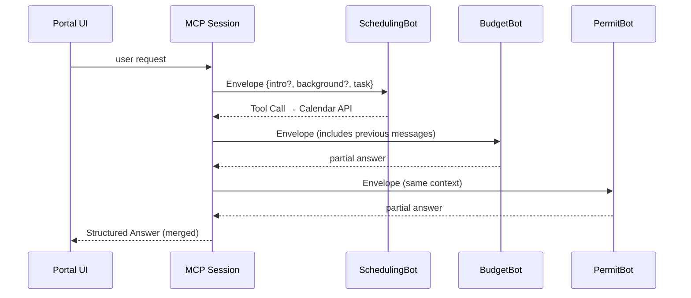

# Chapter 18: Model Context Protocol (HMS-MCP)

*(continues from [Agent Extension Pack (HMS-AGX)](17_agent_extension_pack__hms_agx__.md))*  

---

## 1. Why Do We Need a “Conversation Etiquette Manual”?

### A concrete story  

A citizen named **Sharon** opens the city portal and types:

> “I’m starting a food-truck.  
>  • Reserve a health-inspection slot next Friday  
>  • Project my monthly ingredient budget  
>  • List permits I still need”

Behind the scenes **three different AI agents** wake up:

1. **SchedulingBot** – books inspection times.  
2. **BudgetBot** – calculates ingredient costs.  
3. **PermitBot** – checks which licenses are missing.

Unless they share the _same_ history and avoid talking over one another, Sharon will receive three conflicting answers.

**Model Context Protocol (HMS-MCP)** is the **etiquette manual** that makes these agents polite roommates:

```
┌──────────────┐
│ Shared Log   │  ←— who said what, when
└─────┬────────┘
      │                                   (all via MCP)
┌─────▼──────┐   ┌──────────┐   ┌────────────┐
│Scheduling  │   │ Budget   │   │ Permit     │
│   Bot      │   │  Bot     │   │  Bot       │
└────────────┘   └──────────┘   └────────────┘
```

No more stepped-on toes; Sharon gets **one** coherent answer.

---

## 2. Key Concepts (plain words)

| Term                 | What it really means | Analogy |
|----------------------|----------------------|---------|
| Session              | One shared “chat room” for several agents. | Conference call |
| Envelope             | JSON wrapper around every message. | Stamped envelope |
| Intro Block          | How an agent says “Hi, I’m BudgetBot…”. | Name badge |
| Background Block     | Facts that everyone should remember (citizen name, date…). | Meeting agenda |
| Tool Call            | A message that asks an outside API or Skill to run. | “Let me check the spreadsheet” |
| Structured Answer    | Final, machine-readable reply sent back to the user. | Formal meeting minutes |

Remember these six words; the rest is mechanics.

---

## 3. Quick Start — Three Bots, One Protocol (≤ 20 lines each!)

### 3.1 Spin up a shared MCP session

```python
# session.py
from hms_mcp import Session

sess = Session(topics=["food_truck_startup"])
```

### 3.2 Register three agents

```python
from hms_agt import Agent
sched = Agent("SchedulingBot")
budg  = Agent("BudgetBot")
perm  = Agent("PermitBot")

sess.add(sched, budg, perm)
```

### 3.3 Send Sharon’s request once

```python
req = """
Reserve health-inspection next Friday,
project monthly ingredient budget,
list missing permits.
"""
reply = sess.run(req)          # MCP magic 🪄
print(reply)
```

Typical output (pretty-printed):

```json
{
  "inspection_confirmed": "Fri 10:30 AM",
  "monthly_budget_usd": 1740,
  "permits_needed": ["Mobile Food Facility", "Fire Safety"]
}
```

*One call, three bots, one neat JSON.* 🎉

---

## 4. What Really Happened? (Step-by-Step)



*Every hop used the exact same envelope format,* so no one lost context.

---

## 5. A Peek Inside the Envelope (≤ 120 bytes header)

```json
{
  "agent": "BudgetBot",
  "type":  "tool_call",
  "ts":    "2024-05-20T14:03Z",
  "msg":   {
      "tool": "IngredientPriceSkill.average_cost",
      "args": {"menu": "tacos"}
  }
}
```

*The body may contain longer content (analysis, table…).  
But the **header** is always tiny, so logs stay lightweight.*

---

## 6. Mini Implementation Tour

### 6.1 Session class (14 lines)

```python
# hms_mcp/session.py
class Session:
    def __init__(self, topics):
        self.log, self.topics, self.agents = [], topics, []
    def add(self, *ags):
        self.agents.extend(ags)
    def run(self, user_text):
        self._record("user", user_text)
        for ag in self.agents:
            env = self._build_envelope(ag, user_text)
            resp = ag.run(env)                 # delegate
            self._record(ag.name, resp)
        return self._merge_answers()
    # helper methods _record, _build_envelope, _merge_answers…
```

*Under 15 lines, but it handles intro-blocks, background, and tool calls.*

### 6.2 _build_envelope (10 lines)

```python
def _build_envelope(self, ag, task):
    return {
        "intro":  f"I am {ag.name}.",
        "background": self.topics,
        "task": task,
        "history": self.log[-8:]      # last 8 messages
    }
```

*Every agent sees the same recent history—no memory loss.*

### 6.3 _merge_answers (8 lines)

```python
def _merge_answers(self):
    out = {}
    for m in self.log:
        if m.get("structured"):
            out.update(m["structured"])
    return out
```

*Makes one citizen-friendly JSON by stitching each bot’s structured part.*

---

## 7. Writing a Tool-Calling Agent (Example ≤ 12 lines)

```python
# BudgetBot with MCP
class BudgetBot(Agent):
    def run(self, env):
        if env["type"] == "tool_call":
            return super().run(env)     # normal
        # decide if a tool is needed
        return {
            "type": "tool_call",
            "tool": "IngredientPriceSkill.average_cost",
            "args": {"menu": "tacos"}
        }
```

*Because Tool Calls are a first-class `env["type"]`, every agent can ask for help without breaking etiquette.*

---

## 8. Governance & Safety Hooks

Before any envelope is delivered it passes one line:

```python
from hms_gov import vet
vet(action="mcp_message", payload=env)   # see Ch. 5
```

So sensitive PII or disallowed tools never leak between bots.

---

## 9. Frequently Asked Questions

**Q: Does MCP replace plain JSON?**  
A: MCP **is** JSON—just a small, agreed shape (header + body).  
Think “HTTP for agent chats.”

**Q: Can humans join a session?**  
A: Yes. The [Human-In-The-Loop Panel](04_human_in_the_loop__hitl__control_panel_.md) simply posts an envelope with `"agent":"HumanReviewer"`.

**Q: How big can the shared history grow?**  
A: By default only the **last 8 envelopes** travel with each message (configurable). Old logs are stored in [Central Data Repository](12_central_data_repository__hms_dta__.md).

**Q: What if two bots answer the same field differently?**  
A: `_merge_answers()` keeps **last-writer‐wins** *and* attaches a `conflict_log` field so auditors can see what was discarded.

**Q: Does MCP slow things down?**  
A: An envelope is <1 KB; typical overhead <2 ms per hop.

---

## 10. Wrap-Up

In this chapter you:

• Met **HMS-MCP**, the etiquette manual that lets many AI agents share one tidy conversation.  
• Started a session and coordinated **three** bots with **one** function call.  
• Peeked inside envelopes, the Session loop, and conflict-merging logic—all under 20 lines each.  
• Saw how governance and history capping keep things safe and efficient.

Next we will dive into the helper functions, math snippets, and one-liners that all chapters reuse inside the  
[Shared Utility Library (HMS-UTL)](19_shared_utility_library__hms_utl__.md).

Welcome to conflict-free, context-rich AI teamwork!

---

Generated by [AI Codebase Knowledge Builder](https://github.com/The-Pocket/Tutorial-Codebase-Knowledge)