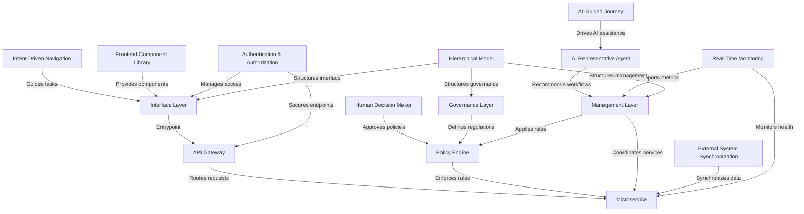

# Tutorial: HMS-ACH

HMS-ACH is the **core payment and banking backend** of the HMS ecosystem, designed to *manage public funds* and **orchestrate secure transactions** for citizen services, social benefits, and healthcare payments.  
It leverages **microservices** behind an **API Gateway**, enforces compliance with a **Policy Engine**, and integrates **AI Representative Agents** alongside **Human Decision Makers** for oversight.  
With built-in **Authentication & Authorization**, **Real-Time Monitoring**, and a clear **Hierarchical Model**, HMS-ACH ensures transparent, compliant, and resilient financial operations across government programs.

**Source Repository:** [None](None)

## Chapters

1. [Hierarchical Model
](01_hierarchical_model_.md)
2. [Governance Layer
](02_governance_layer_.md)
3. [Management Layer
](03_management_layer_.md)
4. [Interface Layer
](04_interface_layer_.md)
5. [Intent-Driven Navigation
](05_intent_driven_navigation_.md)
6. [Frontend Component Library
](06_frontend_component_library_.md)
7. [API Gateway
](07_api_gateway_.md)
8. [Authentication & Authorization
](08_authentication___authorization_.md)
9. [Microservice
](09_microservice_.md)
10. [Policy Engine
](10_policy_engine_.md)
11. [Human Decision Maker
](11_human_decision_maker_.md)
12. [External System Synchronization
](12_external_system_synchronization_.md)
13. [AI Representative Agent
](13_ai_representative_agent_.md)
14. [AI-Guided Journey
](14_ai_guided_journey_.md)
15. [Real-Time Monitoring
](15_real_time_monitoring_.md)

---

Generated by [AI Codebase Knowledge Builder](https://github.com/The-Pocket/Tutorial-Codebase-Knowledge)