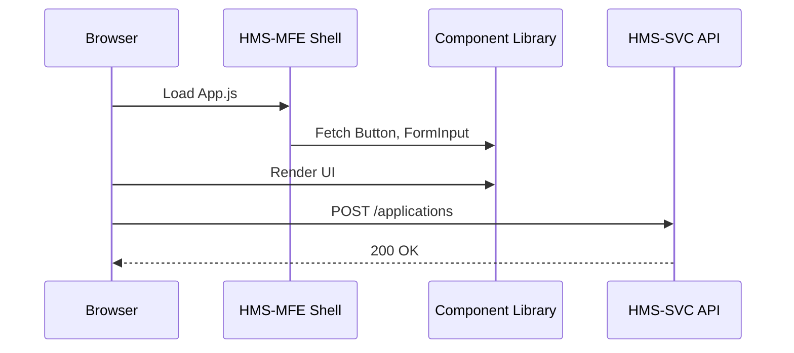

# Chapter 1: Frontend Interfaces (HMS-MFE / HMS-GOV)

Welcome to HMS-ACT! In this chapter, we’ll explore how citizens, field officers, managers, and policymakers actually **see** and **interact** with the system through our two frontends: **HMS-MFE** and **HMS-GOV**. Think of these as windows—the citizen portal and the control room.

---

## Why Frontend Interfaces Matter

Imagine a federal benefit application:

1. A **citizen** fills out a form online.
2. A **field officer** checks and approves the submission on a tablet.
3. A **manager** updates policy settings in a secure dashboard.

Without clear, consistent interfaces, everyone gets lost. HMS-MFE serves citizens & field officers. HMS-GOV serves managers & policymakers. Both share a **component library** so buttons, forms, and menus look and behave the same.

---

## Key Concepts

1. **HMS-MFE (Micro Frontend Experience)**  
   - Public portal (citizens)  
   - Field officer tablet app  

2. **HMS-GOV (Government Control Room)**  
   - Manager dashboard  
   - Policy-making tools  

3. **Shared Component Library**  
   - Buttons, form inputs, navigation bars  
   - Ensures consistent look & feel  

---

## Example Use Case: Benefit Form Workflow

Goal: Let a citizen submit a benefit application, then have a field officer review it.

### Step 1: Citizen Portal (HMS-MFE)

```jsx
// File: frontend/hms-mfe/App.js
import React from 'react';
import { FormInput, Button } from '@hms-ui';

export default function App() {
  return (
    <div>
      <h1>Benefit Application</h1>
      <FormInput label="Full Name" name="fullName" />
      <FormInput label="SSN" name="ssn" />
      <Button onClick={() => alert('Submitted!')}>Submit</Button>
    </div>
  );
}
```
> This minimal React app uses `@hms-ui` components. When the citizen clicks **Submit**, it would call an API.

### Step 2: Field Officer View (Also HMS-MFE)

```jsx
// File: frontend/hms-mfe/OfficerReview.js
import React, { useEffect, useState } from 'react';
import { Table, Button } from '@hms-ui';

function OfficerReview() {
  const [apps, setApps] = useState([]);
  useEffect(() => {
    fetch('/api/applications').then(r => r.json()).then(setApps);
  }, []);
  return (
    <Table data={apps}>
      <Button onClick={() => alert('Approved')}>Approve</Button>
    </Table>
  );
}
```
> The officer sees a table of submissions and can approve each one.

### Step 3: Manager Dashboard (HMS-GOV)

```jsx
// File: frontend/hms-gov/App.js
import React from 'react';
import { NavBar, ToggleSwitch } from '@hms-ui';

export default function GovApp() {
  return (
    <div>
      <NavBar title="Policy Control" />
      <h2>Enable Fast-Track Reviews?</h2>
      <ToggleSwitch label="Fast-Track" />
    </div>
  );
}
```
> Managers toggle policy flags that affect how forms flow in HMS-MFE.

---

## What Happens Under the Hood?

Here’s the high-level flow when a citizen clicks **Submit**:



1. **Browser** loads the MFE shell.  
2. Shell pulls shared **Component Library** (styles & logic).  
3. Browser renders form.  
4. On submit, browser calls the **HMS-SVC** backend.  

---

## Inside the Component Library

Think of `@hms-ui` as our “stamp set.” Every button shares the same shape and color.

```jsx
// File: ui-library/Button.js
import './Button.css'; // shared styles
export function Button({ children, onClick }) {
  return <button className="hms-btn" onClick={onClick}>{children}</button>;
}
```
> Simple: we import shared CSS, wrap a standard `<button>`, and export it.

---

## Putting It All Together

- **HMS-MFE** and **HMS-GOV** each have their own `App.js`, but both import from `@hms-ui`.  
- This ensures a **unified experience**—citizens and managers aren’t confused by different colors or layouts.  
- Under the hood, a tiny build pipeline bundles each frontend with the shared library.

---

## Conclusion

In this chapter, you saw how HMS-MFE and HMS-GOV act as the **windows** into our system. You learned:

- The roles of each frontend  
- How they share a **component library**  
- A simple sequence of what happens when you click **Submit**  

Next, we’ll learn how users navigate with **intents** instead of URLs, making our apps even more intuitive.

[Next Chapter: Intent-driven Navigation](02_intent_driven_navigation_.md)

---

Generated by [AI Codebase Knowledge Builder](https://github.com/The-Pocket/Tutorial-Codebase-Knowledge)