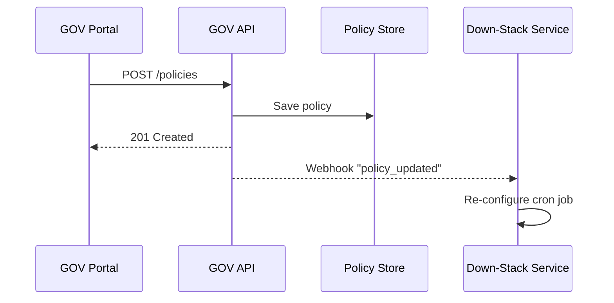
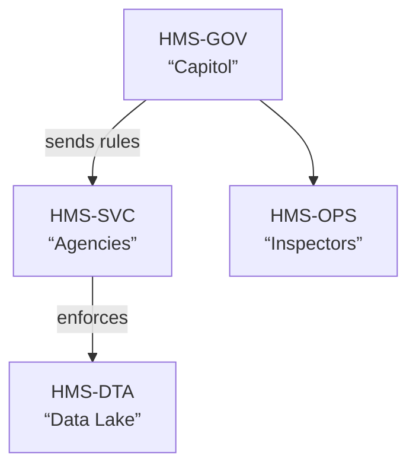

# Chapter 1: Governance Layer (HMS-GOV)


Welcome to HMS-ACT!  
Before we write a single line of code, we must agree on **the rules of the game**.  
HMS-GOV is that rulebook. In government terms, think of it as the _Capitol Building_ of our platform: elected officials (product owners), committees (program managers), and inspectors general (security teams) all meet here to pass policies that every other service must follow.

---

## 1. Why Do We Need HMS-GOV?

### A Quick Story  
Imagine the Office of Public and Indian Housing (PIH) wants to launch a new “Apply for Affordable Housing” web form. At the same time, the U.S. Capitol Police need a dashboard that tracks equipment requests. Both projects should:

1. Store data in a compliant way.  
2. Reuse standard agency themes & logos.  
3. Log every change for auditors.

Without a common governance layer, each team would reinvent these rules (or forget them). HMS-GOV lets PIH, Capitol Police, and future agencies click into a single portal and pick from _pre-approved_ policies—no phone calls to legal, no e-mails bouncing around.

---

## 2. Key Concepts (Plain English)

| Term | What It Means | Quick Analogy |
|------|---------------|---------------|
| Policy | A JSON or YAML document that defines a rule (e.g., “All data must be encrypted at rest”). | A bill passed by Congress. |
| Dashboard | A web screen that shows live metrics like “How many policies are enforced?” | The Congressional Budget Office charts. |
| Lever | A toggle you can flip (“ON: Log every login” / “OFF: Silent mode”). | A voting button on the House floor. |
| Audit Log | Time-stamped record of who changed what. | The Congressional Record. |
| Policy Bundle | A folder of related policies (e.g., “Federal Data Strategy 2024”). | A multi-page omnibus bill. |

---

## 3. A First Walk-Through

### Use Case: Publish a “Standard Data Retention” Policy

Goal: Every HMS service must delete logs older than 3 years unless marked as a legal hold.

Steps you (a program manager) take:

1. Log into HMS-GOV portal.  
2. Click “Create Policy”.  
3. Fill a simple form:  
   • Name: “Data Retention v1”  
   • Scope: `logs.*`  
   • Rule: `delete_after_days: 1095`  
4. Press **Publish** → A green badge shows “Active”.  
5. Down-stack services (e.g., data lake, micro-services) auto-fetch the rule and adjust their cron jobs.

That’s it! No database scripts, no ticket juggling.

---

## 4. Using HMS-GOV in Code

You can interact with HMS-GOV via a tiny REST wrapper or the SDK.  
Below is a minimal Python example that activates our retention policy.

```python
# file: enable_retention.py
import hms_gov_sdk as gov   # imagine this lightweight helper

# 1. Authenticate (token from SSO)
client = gov.Client(token="AGENCY_ACCESS_TOKEN")

# 2. Draft policy in plain dict
policy = {
    "name": "Data Retention v1",
    "scope": "logs.*",
    "delete_after_days": 1095
}

# 3. Publish
resp = client.publish_policy(policy)

print("Policy ID:", resp["id"])
```

Explanation:  
1. We import a fictitious `hms_gov_sdk`.  
2. Provide our SSO token (think Homeland Security PIV card).  
3. Describe the policy as a Python `dict`.  
4. `publish_policy` sends it to HMS-GOV. If successful, we get back a unique ID.

---

## 5. What Happens Under the Hood?

Even beginners benefit from a mental picture of the flow.



1. Portal calls the GOV API.  
2. API writes to the Policy Store.  
3. API replies to the portal.  
4. A webhook notifies every subscribing service (`logs-svc`, `audit-svc`, etc.).  
5. Each service reloads its config, staying in sync.

---

## 6. A Peek at the Core Files

_Note: real repository is larger; we shrink to essentials._

```
hms-gov/
├── api/
│   └── policies.py
├── models/
│   └── policy.py
└── hooks/
    └── dispatcher.py
```

### `models/policy.py` (simplified)

```python
# 12 lines total
from dataclasses import dataclass
@dataclass
class Policy:
    id: str
    name: str
    scope: str           # e.g., "logs.*"
    delete_after_days: int
    created_at: float
```

This dataclass mirrors the JSON we sent earlier.

### `api/policies.py`

```python
# 18 lines total
from flask import Blueprint, request, jsonify
from models.policy import Policy
from hooks.dispatcher import broadcast

bp = Blueprint("policies", __name__)

@bp.post("/policies")
def create():
    body = request.get_json()
    pol = Policy(
        id=generate_id(),
        name=body["name"],
        scope=body["scope"],
        delete_after_days=body["delete_after_days"],
        created_at=time.time()
    )
    save_to_db(pol)           # <--- pretend ORM call
    broadcast("policy_updated", pol)  # notify subscribers
    return jsonify({"id": pol.id}), 201
```

Line-by-line:

1. Receive JSON.  
2. Build a `Policy` object.  
3. Save it.  
4. Broadcast an event to any service that registered interest.

---

## 7. Relationship to Other Layers

HMS-GOV doesn’t live in a vacuum.  
When you publish a policy, these siblings will react:

• Codified rules may feed the [Codified Democracy Foundation Engine (HMS-CDF)](02_codified_democracy_foundation_engine__hms_cdf__.md) for deliberative workflows.  
• Services enforce policies via the [Backend Service Core (HMS-SVC)](06_backend_service_core__hms_svc__.md).  
• User dashboards are rendered through the [Micro-Frontend Interface Library (HMS-MFE)](07_micro_frontend_interface_library__hms_mfe__.md).

(We will explore each in later chapters.)

---

## 8. Extra Visual: Policy Hierarchy



Read left-to-right: GOV issues rules ➜ services obey ➜ monitors verify.

---

## 9. Try It Yourself

1. Clone the repo (placeholder for now).  
2. Run `docker compose up gov`.  
3. Visit `http://localhost:8080/` – you’ll see the neat “Create Policy” wizard.  
4. Publish one small rule.  
5. Tail logs of `logs-svc` → notice it reconfigures automatically.

---

## 10. Recap & What’s Next

We learned:

✓ HMS-GOV is the rule-making hub.  
✓ Policies are plain documents, activated with one call.  
✓ Down-stack services auto-adapt, so teams remain compliant effortlessly.

In the next chapter, we’ll see how these rules can be debated, version-controlled, and even vetoed in software using the **Codified Democracy Foundation Engine**. Ready to play digital Congress? Head over to [Codified Democracy Foundation Engine (HMS-CDF)](02_codified_democracy_foundation_engine__hms_cdf__.md).

---

Generated by [AI Codebase Knowledge Builder](https://github.com/The-Pocket/Tutorial-Codebase-Knowledge)