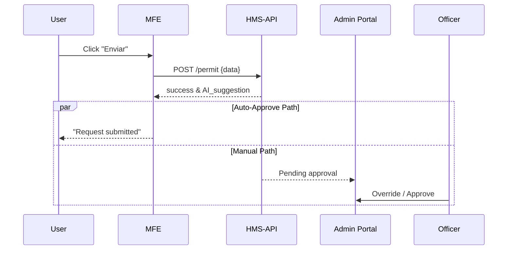

# Chapter 1: Interface Layer (HMS-MFE / User & Admin Portals)

Welcome to HMS-ACT!  
Before we worry about AI agents, policy engines, or micro-services, we need a **front door** where real people can click, tap, and type.  
That front door is called the **Interface Layer**, and it comes in two flavors:

1. **HMS-MFE** (Micro-Front Ends) – the public-facing “kiosks” that citizens, soldiers, or economists use.  
2. **Admin Portal** – the secure desk where officials review, approve, or override AI suggestions.

Think of it as a multilingual DMV counter that looks the same whether you’re filing a tax form at the IRS or requesting a permit from the EPA.

---

## 1. Why Do We Need an Interface Layer?

Imagine a U.S. veteran stationed in Germany who wants to:

1. Update a benefits claim (Department of Veterans Affairs).  
2. Request travel clearance (U.S. European Command).  
3. Ask for election-related absentee ballot info (Election Assistance Commission).

Today, each agency might have a completely different website, login process, and “Submit” button.  
Users get confused, agencies pay triple for design work, and accessibility fixes must be repeated everywhere.

The Interface Layer solves this by sharing **React/Vue components** across every agency.  
One “Submit Claim” button to rule them all!

---

## 2. Key Concepts (in Plain English)

| Concept | What it Means | Super-Simple Analogy |
|---------|---------------|----------------------|
| Micro-Front End (MFE) | A tiny, reusable web app fragment (e.g., a date picker). | LEGO block you can snap onto any set. |
| Design System | Color, font, and layout guidelines enforced in code. | Government style guide baked into crayons. |
| Admin Portal | Internal dashboard for officials. | TSA “supervisor lane” to re-check IDs. |
| Multilingual Support | UI text files in many languages. | Airport signs switching English/German/Spanish. |
| Accessibility (A11y) | Built-in keyboard & screen-reader support. | Ramps and Braille labels for the web. |

---

## 3. A Mini Walk-Through

### Use Case

“Submit a Permit Request” to the EPA in Spanish.

1. User visits permit.epa.gov – built with HMS-MFE.  
2. They switch language to Español.  
3. Fill the form → click the **Enviar** button (shared component).  
4. HMS-MFE calls the backend API.  
5. An AI assistant suggests “auto-approve”.  
6. EPA official opens the Admin Portal, sees the suggestion, and clicks **Override**.

### Tiny Code Example (React)

```jsx
// SubmitButton.jsx
import { useTranslation } from 'react-i18next';

export default function SubmitButton({ onClick, intent }) {
  const { t } = useTranslation();
  return (
    <button className="hms-btn" onClick={() => onClick(intent)}>
      {t('submit')}
    </button>
  );
}
```

Explanation:  
• `useTranslation()` grabs the right language string (Spanish shows “Enviar”).  
• `intent` tells downstream services what the user wants (e.g., `PERMIT_REQUEST`).  
• The look & feel comes from `.hms-btn` in the shared design system.

### Admin Override Component

```vue
<!-- OverrideToggle.vue -->
<template>
  <label>
    <input type="checkbox" v-model="override" /> Override AI suggestion
  </label>
</template>

<script>
export default {
  props: ['value'],
  computed: {
    override: {
      get() { return this.value; },
      set(v) { this.$emit('input', v); }
    }
  }
}
</script>
```

Explanation:  
A simple Vue component that allows an official to flip a decision from auto-approve to manual review.

---

## 4. What Happens Under the Hood?

Below is a high-level sequence for “Submit Permit”:



Key Points:

1. The MFE never talks straight to databases; it calls **HMS-API** (covered in [Management Layer](03_management_layer__hms_svc___hms_api__.md)).  
2. AI suggestions come from **HMS-A2A** (see [AI Representative Agent](04_ai_representative_agent__hms_a2a__.md)).  
3. Officials can override thanks to the **HITL Override** layer (explained in [Human-in-the-Loop (HITL) Override](05_human_in_the_loop__hitl__override_.md)).

---

## 5. Inside the Repository

Folder snapshot:

```
interface-layer/
├─ design-system/
│  └─ colors.css
├─ mfe/
│  ├─ SubmitButton.jsx
│  └─ PermitForm.jsx
└─ admin-portal/
   └─ OverrideToggle.vue
```

Example internal wiring (`PermitForm.jsx` condensed):

```jsx
import SubmitButton from './SubmitButton';
import { postPermit } from '../api/service';

function PermitForm() {
  const handleSubmit = async () => {
    await postPermit(/* form data */);
  };
  return <SubmitButton onClick={handleSubmit} intent="PERMIT_REQUEST" />;
}
```

Explanation:  
• `postPermit` is a thin wrapper around `fetch()` that hits `/permit`.  
• Any agency can reuse this component by changing only the `intent` prop.

---

## 6. Hands-On: Try It Yourself

1. Clone the repo:  
   `git clone https://github.com/example/hms-act`  
2. Run the MFE demo:  
   `cd interface-layer/mfe && npm install && npm start`  
3. Open `http://localhost:3000?lang=es` – you should see Spanish UI.  
4. Toggle screen-reader mode with `Ctrl+Alt+A11y` (built into the design system).  
5. Open another terminal for the Admin Portal:  
   `cd interface-layer/admin-portal && npm install && npm run dev`  
6. Submit a form in the MFE and watch it appear in the Admin dashboard.

---

## 7. Common Questions

Q: “Can I use Angular instead of React/Vue?”  
A: Yes! The Interface Layer adheres to Web Components specs, so any framework that outputs a `<custom-element>` works.

Q: “How do we add a new language?”  
A: Drop a JSON file into `i18n/` like `fr.json`, then reference keys (`submit`, `cancel`, etc.). The design system auto-loads it.

Q: “Is this secure?”  
A: The Interface Layer never stores secrets in the browser; authentication tokens are managed by the Security Guardrails (see [Security & Privacy Guardrails](08_security___privacy_guardrails_.md)).

---

## 8. What You Learned

• The Interface Layer is the shared, reusable UI for all agencies.  
• HMS-MFE serves citizens; the Admin Portal serves officials.  
• Components are framework-agnostic and multilingual.  
• AI can suggest actions, but humans can always override.  
• Consistency lowers training costs and speeds up development.

Ready to see how rules and policies govern these interactions?  
Continue to [Governance Layer (HMS-GOV)](02_governance_layer__hms_gov__.md).

---

Generated by [AI Codebase Knowledge Builder](https://github.com/The-Pocket/Tutorial-Codebase-Knowledge)