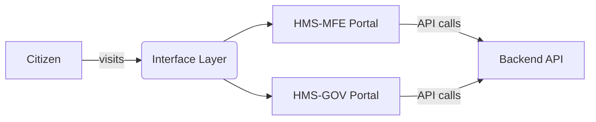
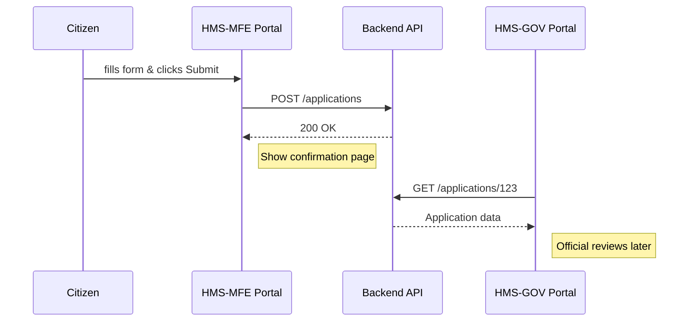

# Chapter 1: Interface Layer

Welcome to the first chapter! In this section, we introduce the **Interface Layer**—the “front door” where citizens and officials interact with HMS-ACT. You’ll learn why it exists, how it’s organized, and see simple examples of its components.

---

## Why an Interface Layer?

Imagine you’re a citizen who wants to apply for a building permit online. You go to a public website that’s:

- **Clear** and **accessible**  
- Guides you step-by-step  
- Lets you save progress and come back  

Meanwhile, a government official uses a **secure intranet** to review your application, see attachments, and make a decision.

The **Interface Layer** is the shared umbrella for these portals and their building blocks. It solves problems like:

- Consistent look-and-feel across public and admin portals  
- Shared UI components (buttons, form fields, date pickers)  
- Easy navigation and accessibility support (for screen readers, keyboard users)  

In short, it’s the glue that makes citizen journeys and internal workflows smooth and predictable.

---

## Central Use Case: Applying for a Permit

1. **Citizen Portal (HMS-MFE)**  
   - User fills in permit details, uploads documents.  
2. **Backend API** (talked about in [Backend API / API Gateway](04_backend_api___api_gateway_.md))  
   - Validates and stores the data.  
3. **Admin Portal (HMS-GOV)**  
   - Officials review, add comments, approve or reject.

We’ll focus on step 1 and 3 here—the user-facing portals.

---

## Key Concepts

1. **Citizen Portal (HMS-MFE)**  
   A React/Angular/Vue app that talks to APIs and shows forms.  
2. **Admin Dashboard (HMS-GOV)**  
   A secure app with extra controls (user roles, audit logs, data grids).  
3. **UI Library & Components**  
   Reusable buttons, inputs, modals, date pickers.  
4. **Navigation & Routing**  
   Defines how “Apply for Permit” → “Review Status” → “Submit” flows.  
5. **Accessibility & Theming**  
   High contrast mode, ARIA labels, keyboard navigation.

---

## High-Level Flow



> The Interface Layer groups both portals and shares common UI assets.

---

## Sequence Walkthrough

Let’s see what happens when a citizen clicks **“Submit Application”**:



---

## Simple Code Example: A Permit Form Component

Below is a minimalist React component using our shared UI library.

```jsx
// src/components/PermitForm.jsx
import { TextInput, Button } from '@hms-ui'; // shared UI components

function PermitForm({ onSubmit }) {
  return (
    <form onSubmit={onSubmit}>
      <TextInput name="projectName" label="Project Name" required />
      <TextInput name="address" label="Project Address" required />
      <Button type="submit">Submit Application</Button>
    </form>
  );
}

export default PermitForm;
```

This form:

- Uses `@hms-ui` for consistent styling  
- Declares fields with labels for accessibility  
- Triggers `onSubmit`, which calls the Backend API  

---

## Under the Hood: What’s in the Interface Layer?

Folder structure (simplified):

```
/interface-layer
  /ui-library        # shared buttons, inputs, modals
  /routes            # navigation config
  index.js           # bootstraps the portals
```

1. **ui-library/**  
   - Holds React/Vue components with built-in ARIA attributes.  
2. **routes/**  
   - Defines `"/apply"` → `PermitForm`, `"/status"` → `StatusPage`.  
3. **index.js**  
   - Decides whether to launch HMS-MFE or HMS-GOV based on user role.

---

## Internal Sequence (Light)

1. **Boot**: `index.js` loads theme and UI-library.  
2. **Router**: User clicks link → router dispatches to component.  
3. **Render**: Component pulls in shared controls.  
4. **Events**: On submit, calls a helper that talks to [Backend API](04_backend_api___api_gateway_.md).

---

## Internal Code Snippet: Route Configuration

```js
// interface-layer/routes/index.js
import PermitForm from '../components/PermitForm';
import StatusPage from '../components/StatusPage';

export const routes = [
  { path: '/apply', component: PermitForm },
  { path: '/status', component: StatusPage }
];
```

> The router reads this array to map URLs to UI components.

---

## Accessibility & Theming

Our UI library ensures:

- All buttons have `aria-label` by default.  
- Color palettes meet WCAG contrast ratios.  
- Keyboard focus styles are consistent.

Analogy: It’s like having a pre-set toolkit when building a public service kiosk—you don’t reinvent the wheel each time.

---

## Conclusion

In this chapter, you discovered:

- What the Interface Layer is and why it matters  
- How the citizen and admin portals fit under it  
- The shared UI library, routing, and accessibility features  
- A basic code example and folder layout  

Up next, we’ll dive deeper into the **Citizen Portal & Frontend Modules (HMS-MFE)** and build our first feature step by step.

[Next Chapter: User Portal & Frontend Modules (HMS-MFE)](02_user_portal___frontend_modules__hms_mfe__.md)

---

Generated by [AI Codebase Knowledge Builder](https://github.com/The-Pocket/Tutorial-Codebase-Knowledge)