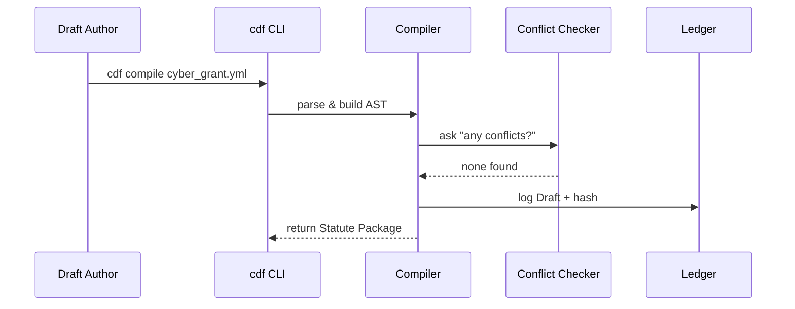

# Chapter 2: Codified Democracy Foundation Engine (HMS-CDF)


_(If you just joined, consider skimming  
[Governance Layer (HMS-GOV)](01_governance_layer__hms_gov__.md) first – it explains **how rules get proposed**. Now we’ll see **how they become real, enforceable law**.)_

---

## 1. Why Do We Need HMS-CDF?

**Use-case – “Digital Budget Bill”**

The U.S. Department of Homeland Security (DHS) wants a new cyber-grant program.  
Today the journey is slow:

1. Staff draft a 200-page PDF bill.  
2. Lawyers compare it against thousands of existing statutes.  
3. Congress edits, votes, and finally publishes a Public Law.  
4. Agencies translate legal text into code, APIs, and databases.

HMS-CDF compresses Steps 1-4 into minutes.  
Think of it as a **Rust-powered factory line** that:

1. Accepts a machine-readable **policy draft** (like a YAML file).  
2. Automatically checks for conflicts with the current U.S. Code.  
3. Translates the draft into executable artifacts (schemas, API specs, DB migrations).  
4. Publishes a signed “official statute” for every downstream system.

_Result: DHS can iterate grant rules at “AI speed” while keeping Congressional rigor._

---

## 2. Key Concepts (Plain English)

| Term | What It Means | Analogy |
|------|---------------|---------|
| Draft | A YAML/JSON file describing a proposed law. | The first print of a bill. |
| Compiler | Rust code that converts a Draft into executable artifacts. | The bill clerk turning text into house calendars. |
| Conflict Checker | A module that rejects overlapping or contradictory rules. | The Parliamentarian saying “Out of order!”. |
| Statute Package | A signed ZIP file containing the final law + artifacts. | A Public Law slip. |
| Ledger | An append-only log of every Draft → Statute transition. | The Congressional Record. |

---

## 3. First Walk-Through: Passing a “3-Year Cyber-Grant” Rule

1. Policy owner writes `cyber_grant.yml`  
2. `cdf compile` turns it into code, runs conflicts.  
3. `cdf publish` signs and stores a **Statute Package**.  
4. Other layers (e.g., [Backend Service Core](06_backend_service_core__hms_svc__.md)) auto-pull and deploy.

### 3.1 Minimal Draft

```yaml
# file: cyber_grant.yml
id: CYBER-GRANT-2024
title: "State Cybersecurity Grant"
funding_cap: 100000000  # USD
expires: "2027-09-30"
```

That’s all a beginner needs!

---

## 4. Using HMS-CDF in Code (Rust CLI)

Below is a **19-line** Rust example that compiles the draft and checks conflicts.

```rust
// file: main.rs  (simplified)
use cdf::{Compiler, ConflictError};  // pretend crate

fn main() {
    let draft = "cyber_grant.yml";
    match Compiler::new().compile(draft) {
        Ok(pkg) => {
            println!("✅ Compiled! Hash: {}", pkg.hash());
        }
        Err(ConflictError { msg, clashes }) => {
            eprintln!("❌ Conflict: {msg}");
            for law in clashes { eprintln!(" - {}", law); }
        }
        Err(e) => eprintln!("Unexpected error: {e}"),
    }
}
```

Explanation (beginner-friendly):

1. `Compiler::new()` builds the engine.  
2. `compile()` reads the YAML, validates types, and runs the conflict checker.  
3. On success we get a `pkg` object (the Statute Package).  
4. On conflict we print the clashing statute IDs.

_No Rust experience? Just note: one command either prints a green check or tells you why the bill fails._

---

## 5. What Happens Under the Hood?



Five simple actors keep things clear for beginners.

---

## 6. Inside the Source Tree (Bird’s-Eye)

```
hms-cdf/
├── cli/         # binary crate
│   └── main.rs
├── core/
│   ├── compiler.rs
│   ├── checker.rs
│   └── ledger.rs
└── specs/       # generated artifacts live here
```

### 6.1 Conflict Checker (excerpt – 14 lines)

```rust
// file: checker.rs
pub fn conflicts(draft: &Ast, laws: &[Law]) -> Vec<String> {
    let mut hits = vec![];
    for law in laws {
        if draft.id == law.id { hits.push(law.id.clone()); }
        if draft.expires <= law.effective_until { hits.push(law.id.clone()); }
    }
    hits
}
```

Explanation:

1. Loop through existing laws.  
2. Flag same IDs or overlapping expiry dates.  
3. Return a simple list of clashes.

---

## 7. Relationship to Other Layers

• Drafts often begin life as **Policies** defined in  
  [HMS-GOV](01_governance_layer__hms_gov__.md).  
• Once published, Statute Packages are executed by runtime services inside  
  [HMS-SVC](06_backend_service_core__hms_svc__.md) and coordinated by  
  [Action Orchestrator (HMS-ACT)](03_action_orchestrator__hms_act__.md).  
• Compliance is later audited by  
  [Compliance & Legal Reasoner (HMS-ESQ)](10_compliance___legal_reasoner__hms_esq__.md).

---

## 8. Try It Yourself (5-Minute Lab)

```bash
git clone https://github.com/hms-example/hms-cdf
cd hms-cdf
cargo run -- compile examples/cyber_grant.yml
cargo run -- publish target/statute/CYBER-GRANT-2024.zip
```

You should see:

```
✅ Compiled! Hash: 0x9ab…​
📢 Published! Statute #102 inserted into ledger.
```

Now open `ledger.log` to view the automatic entry.

---

## 9. Recap & What’s Next

You learned:

✓ HMS-CDF converts plain text drafts into living, executable law.  
✓ Conflict checking prevents contradictory rules.  
✓ A single Rust CLI command can publish a statute in seconds.

Next we’ll see **how those published statutes trigger real-world actions** across multiple systems using the orchestration layer.  
Move on to [Action Orchestrator (HMS-ACT)](03_action_orchestrator__hms_act__.md).

---

Generated by [AI Codebase Knowledge Builder](https://github.com/The-Pocket/Tutorial-Codebase-Knowledge)