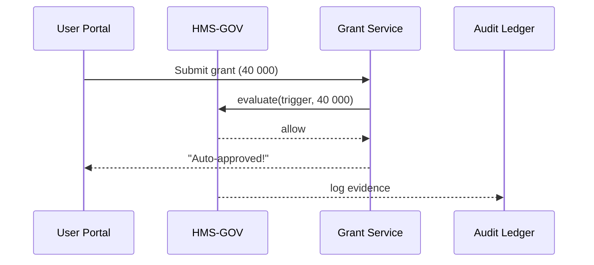

# Chapter 2: Governance Layer (HMS-GOV)


[← Back to Chapter 1: Interface Layer](01_interface_layer__hms_mfe___user___admin_portals__.md)

---

## 0. Why Do We Need a Governance Layer?

Imagine the Employment & Training Administration (ETA) wants to launch an AI tool that **auto-approves job-training grants under \$50 000**.  
Great—until someone realizes the proposal must follow:

* The AI in Government Act  
* HIPAA (because some applicants list medical accommodations)  
* Internal “no single-click approval above \$50 000” policy  

Without a central “City Hall,” every dev team would bolt rules into its own codebase. That turns updates into a paperwork nightmare.

**HMS-GOV is that City Hall.**  
Admins define, publish, and audit rules in one place, and every microservice or AI agent must obey.

---

## 1. Key Concepts in Plain English

| Term | Friendly Explanation |
|------|----------------------|
| Policy | A written rule (e.g., “No auto-approve > \$50 k”). |
| Control | A switch that turns a policy into a yes/no decision (“auto-approve = false”). |
| Compliance Pack | A bundle of policies tied to a law (e.g., HIPAA pack). |
| Evidence Log | Tamper-proof record proving a policy fired. |
| Single Pane of Glass | One dashboard that shows status across all agencies. |

Analogy: Think of a **Policy** as a city ordinance, a **Control** as the traffic light enforcing it, and an **Evidence Log** as the red-light camera footage.

---

## 2. Walk-Through: “Grant Under \$50 k” Policy

### 2.1 Admin Creates a Policy

HMS-GOV offers a low-code editor. The admin picks a template and fills three fields:

```yaml
# File: eta_grant_policy.yaml
name: "ETA-Grant-Limit"
description: "Block auto-approval for grants ≥ 50000"
trigger: "GRANT_SUBMISSION"
condition: "grant.amount >= 50000"
action: "require_manual_review"
severity: "high"
```

Explanation (4 lines, we promise!):

1. `trigger` — event name sent from front end (`GRANT_SUBMISSION`).  
2. `condition` — simple Boolean check.  
3. `action` — what to do when the condition is true.  
4. `severity` — helps dashboards color-code alerts.  

### 2.2 Publish

One click on **Publish** pushes the policy to a versioned store. No backend code touched.

---

## 3. How Services Consume the Policy

Every microservice that might approve grants calls HMS-GOV first:

```python
# service/grant_decider.py  (12 lines)
def can_auto_approve(grant):
    policy_req = {
        "trigger": "GRANT_SUBMISSION",
        "payload": grant
    }
    # Send JSON to HMS-GOV
    resp = http.post("https://gov.hms/policy/evaluate", json=policy_req)
    return resp.json()["decision"] == "allow"
```

Explanation:

* The service knows nothing about HIPAA or budget limits.  
* `evaluate` returns `allow` or `require_manual_review`.  
* Centralized rules, decentralized execution.

---

## 4. What Happens Under the Hood?



Key points:

1. HMS-GOV is the decision brain.  
2. Every decision is copied to the [Audit & Compliance Ledger](14_audit___compliance_ledger_.md).  
3. If the amount were \$60 000, HMS-GOV would reply `require_manual_review`, and the [Human-in-the-Loop Override](05_human_in_the_loop__hitl__override_.md) would kick in.

---

## 5. Inside the Repository

```
governance-layer/
├─ policies/
│  └─ eta_grant_policy.yaml
├─ engine/
│  └─ evaluator.js
└─ admin-portal/
   └─ PolicyEditor.vue
```

Mini peek at the evaluator:

```javascript
// engine/evaluator.js  (18 lines)
import vm from 'vm';
export function evaluate(trigger, payload) {
  const policies = loadPolicies(trigger);       // read YAML files
  for (const p of policies) {
    const pass = vm.runInNewContext(p.condition, { grant: payload });
    if (pass) return { decision: p.action, id: p.name };
  }
  return { decision: 'allow' };
}
```

Explanation:

* `vm.runInNewContext` safely evaluates the condition.  
* First matching policy stops the loop (“first-hit wins”).  
* Result sent back to caller and to the ledger for audit.

---

## 6. Hands-On: Try It Yourself

1. Clone: `git clone https://github.com/example/hms-act`  
2. Boot HMS-GOV:  
   ```
   cd governance-layer
   npm install && npm start
   ```  
3. Add the YAML above to `policies/`.  
4. In another terminal, run the tiny demo service:  
   ```
   python demo/grant_test.py 40000   # should auto-approve
   python demo/grant_test.py 60000   # should require manual review
   ```  
5. Open `http://localhost:4000/admin` → **Dashboard** shows both decisions, color-coded by severity.

---

## 7. Common Questions

Q: “Do I need to write YAML?”  
A: No. The Admin UI lets you build rules with dropdowns. YAML is just the export.

Q: “What if laws change?”  
A: Upload a new Compliance Pack. HMS-GOV re-evaluates active policies and flags conflicts.

Q: “Is this secure?”  
A: Policies are signed and versioned. Evaluations run in a sandbox, and all calls require the tokens handled by the [Security & Privacy Guardrails](08_security___privacy_guardrails_.md).

---

## 8. What You Learned

• HMS-GOV turns legal mandates into machine-enforceable policies.  
• Services ask HMS-GOV “Can I do this?” and receive a single-word answer.  
• Every decision is logged for auditors.  
• Policies can be edited without redeploying code.

Ready to see how services actually **call** HMS-GOV and other backends? Head to  
[Chapter 3: Management Layer (HMS-SVC / HMS-API)](03_management_layer__hms_svc___hms_api__.md).

---

Generated by [AI Codebase Knowledge Builder](https://github.com/The-Pocket/Tutorial-Codebase-Knowledge)