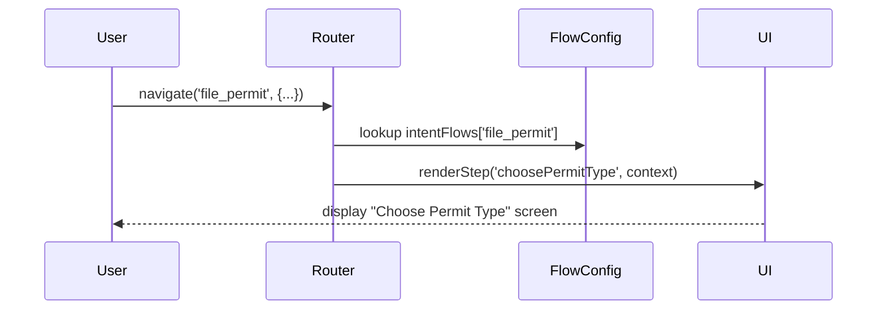

# Chapter 2: Intent-driven Navigation

In [Chapter 1: Frontend Interfaces (HMS-MFE / HMS-GOV)](01_frontend_interfaces__hms_mfe___hms_gov__.md) we saw **where** users interact with our system. Now we’ll learn **how** they get there: by telling HMS-ACT “What do you want to do?”—just like a GPS asks “Where are we headed?”

---

## Why Intent-driven Navigation?

Imagine a city planner logging in to file a new building permit:

1. They don’t want to hunt through menus.
2. They simply state their goal: **“File a building permit.”**
3. HMS-ACT then guides them step by step, **from selecting permit type to final submission**, without extra clicks.

This is the power of Intent-driven Navigation:
- Users express their **intent** (their goal).
- The system looks up a **predefined flow** of steps.
- It smoothly carries them through, reducing confusion.

---

## Key Concepts

1. **Intent**  
   A name for a user’s goal, e.g. `file_permit` or `analyze_budget`.

2. **Flow Definition**  
   A list of ordered steps that accomplish an intent.  

3. **Intent Router**  
   The “GPS engine” that:
   - Reads the intent.
   - Loads the matching flow.
   - Starts the first step.

4. **Step Components**  
   Reusable screens or tasks (forms, uploads, summary pages).

5. **Context**  
   Data passed between steps (e.g., `applicantId`, `permitType`).

---

## Defining an Intent Flow

Below is a simple flow configuration for two intents. Each intent key maps to an array of steps:

```javascript
// File: src/navigation/intentConfig.js
export const intentFlows = {
  file_permit: [
    { step: 'choosePermitType' },
    { step: 'enterDetails' },
    { step: 'uploadDocs' },
    { step: 'reviewAndSubmit' }
  ],
  analyze_budget: [
    { step: 'selectPeriod' },
    { step: 'uploadSpreadsheet' },
    { step: 'viewResults' }
  ]
};
```
> Here we say: for `file_permit`, show four screens in order.

---

## Using the Intent Router

This tiny class looks up the flow and kicks off the first step:

```javascript
// File: src/navigation/IntentRouter.js
import { intentFlows } from './intentConfig';

class IntentRouter {
  navigate(intent, context = {}) {
    const flow = intentFlows[intent];
    if (!flow) throw new Error('Unknown intent: ' + intent);
    this.currentFlow = flow;
    this.currentIndex = 0;
    this.runStep(context);
  }

  runStep(context) {
    const { step } = this.currentFlow[this.currentIndex];
    UI.renderStep(step, context);
  }
}

export const router = new IntentRouter();
```
> `navigate('file_permit', { applicantId: 'A123' })` starts the permit flow.

---

## Example: Filing a Permit

In a React component you could call:

```javascript
// In a button click handler
import { router } from '../navigation/IntentRouter';

function onStart() {
  router.navigate('file_permit', { applicantId: 'A123' });
}
```
> The system now renders the **choosePermitType** screen first, passing along `applicantId`.

---

## What Happens Under the Hood?



1. **User** calls `navigate`.  
2. **Router** reads the flow from **FlowConfig**.  
3. Router tells **UI** which step to show.  
4. **UI** renders the screen.

---

## Inside a Step Component

Each step is just a UI component that, when complete, calls the next step. For example:

```javascript
// File: src/steps/ChoosePermitType.js
export function ChoosePermitType({ context }) {
  const onSelect = (type) => {
    context.permitType = type;
    router.currentIndex++;
    router.runStep(context);
  };

  return (
    <div>
      <h1>Select Permit Type</h1>
      <button onClick={() => onSelect('building')}>Building</button>
      <button onClick={() => onSelect('electrical')}>Electrical</button>
    </div>
  );
}
```
> Once the user picks a type, we save it in `context` and move to `enterDetails`.

---

## Why This Helps

- New features (intents) are just new entries in `intentConfig.js`.  
- Flows guide users by **their goal**, not by menu structure.  
- Government scenarios—budget reports, permits, benefit renewals—become simple “tell us your intent” experiences.

---

## Conclusion

In this chapter you learned how HMS-ACT replaces menus and routes with **Intent-driven Navigation**:
- Define **intents** and **flows**.  
- Use an **Intent Router** to guide users step by step.  
- Build each **step component** to define form screens or tasks.

Up next: see how **Specialized AI Agents (HMS-A2A)** can further assist each step.  
[Next Chapter: Specialized AI Agents (HMS-A2A)](03_specialized_ai_agents__hms_a2a__.md)

---

Generated by [AI Codebase Knowledge Builder](https://github.com/The-Pocket/Tutorial-Codebase-Knowledge)