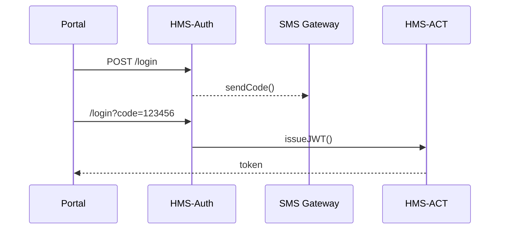

# Chapter 2: Role & Identity Management (Accounts & Authorization)

*(a continuation of [Chapter 1: Interface Layer (HMS-MFE & Portals)](01_interface_layer__hms_mfe___portals__.md))*

---

## 1. A 60-Second Story ‑ “The Digital Badge”

Jamal is a contract inspector for the **Bureau of Labor Statistics**.  
Tomorrow he must review bakery-safety forms submitted by Maria (our baker from Chapter 1). Before he can even *see* her application:

1. Jamal requests a temporary “Inspector” badge.  
2. The system verifies his contract, sends a **one-time code** to his phone, and issues a digital badge good for 30 days.  
3. When Jamal finishes the contract, the badge auto-expires—no messy password sharing.

Role & Identity Management is the backstage **pass office** that makes Jamal’s day possible.

---

## 2. Why Do We Need an Identity Layer?

Government systems juggle **citizens, career staff, contractors, bots, and even AI agents**.  
Without a strong identity service we would have:

* Password spreadsheets (yikes 😱)  
* Ex-employees left with lingering access  
* Citizens forced to create a new account on every .gov site  

Role & Identity Management gives every actor a **single badge** and enforces the rule of **least privilege**.

---

## 3. Key Concepts in Plain English

| Term | Friendly Explanation |
|------|----------------------|
| **Badge / Token** | A time-limited digital pass—think of a QR code—but invisible, tucked inside HTTPS headers. |
| **Identity** | The person, bot, or agency service that owns the badge. |
| **Role** | A job hat: *citizen*, *inspector*, *program-manager*, *AI-agent*, etc. |
| **Permission** | A precise action a role can take, e.g., `permit:approve`. |
| **SSO (Single Sign-On)** | One login works across many portals. |
| **MFA (Multi-Factor Auth)** | “Something you know + something you have” (e.g., password + phone code). |
| **Delegation** | Temporarily lending a role to someone else—without sharing passwords. |
| **Audit Log** | A tamper-proof diary of “who did what, when, where”. |

Analogy:  
Your **Identity** is *who you are*.  
A **Role** is the *hat* you wear.  
A **Permission** is the *door* that hat unlocks.

---

## 4. Getting Your First Badge (Hands-On)

Below we’ll register a citizen, log in, and fetch a token—*all in fewer than 20 lines*.

```javascript
// demo/registerAndLogin.js
import { AuthClient } from '@hms-auth/client';

const auth = new AuthClient({ baseURL: 'https://auth.hms.gov' });

async function run() {
  await auth.register({           // 1️⃣ create an account
    email: 'maria@cookies.com',
    password: 'Sup3rSecret!'
  });
  
  const token = await auth.login({ // 2️⃣ get badge
    email: 'maria@cookies.com',
    password: 'Sup3rSecret!',
    mfaCode: '123456'              // Pretend SMS code
  });
  
  console.log('🎉 Badge:', token); // 3️⃣ ready for API calls
}

run();
```

What happens?

1. `register` stores Maria’s identity.  
2. `login` checks password **and** MFA code.  
3. Server replies with a JWT token (our badge) valid for 1 hour.

---

### 4.1 Using the Badge in a Portal

Remember the `withRoleGuard` wrapper from Chapter 1? Here it is in action:

```javascript
// kiosk/InspectorDashboard.js
import { withRoleGuard } from '@hms-auth/react';
import { TaskQueue } from '@hms-mfe/bricks';

export default withRoleGuard('inspector', () => (
  <TaskQueue filter="pending" />
));
```

If Maria (a *citizen*) tries to load this route, `withRoleGuard` blocks it and shows a polite “Access Denied” page.

---

## 5. Delegation in 5 Lines

A departing Program Manager (PM) wants to hand over approval rights to Sasha for two weeks:

```javascript
await auth.delegateRole({
  to: 'sasha@agency.gov',
  role: 'program-manager',
  expiresAt: '2024-12-31T23:59:59Z'
});
```

The system issues Sasha a *shadow badge* that auto-revokes on New Year’s Eve.

---

## 6. Under the Hood – A Tiny Tour



Highlights:

1. HMS-Auth is stateless; all access is encoded in the **JWT**.  
2. HMS-ACT signs the token with a private key.  
3. Every downstream service (e.g., [HMS-SVC & HMS-API](10_backend_service_apis__hms_svc___hms_api__.md)) verifies it with the public key.  
4. Every request writes an entry to the **Audit Log** in [HMS-ESQ](11_security___compliance_engine__hms_esq__.md).

---

### 6.1 Token Verification Middleware (Super-Mini)

```javascript
// middleware/verifyToken.js
import jwt from 'jsonwebtoken';

export function verifyToken(req, res, next) {
  const token = req.headers.authorization?.split(' ')[1];
  try {
    req.user = jwt.verify(token, process.env.PUBLIC_KEY);
    next();          // badge is valid 🎫
  } catch {
    res.status(401).send('Invalid or expired badge');
  }
}
```

Every backend route simply attaches this middleware—*no* database lookup required.

---

## 7. Directory Peek

```
hms-auth/
 ├─ client/            // tiny JS SDK
 ├─ server/
 │   ├─ routes/
 │   ├─ mfa/
 │   └─ delegation/
 ├─ audit-log/         // append-only
 └─ README.md
```

---

## 8. How It Fits Into HMS-ACT

* Portals from [Chapter 1](01_interface_layer__hms_mfe___portals__.md) call HMS-Auth for badges.  
* AI bots you’ll meet in [AI Representative Agent (HMS-AGT)](03_ai_representative_agent__hms_agt__.md) get *bot* roles—same flow, zero special casing.  
* Governance rules in [HMS-SYS → HMS-GOV](06_governance_layer__hms_sys___hms_gov__.md) define role hierarchies (“Inspector inherits from Employee”).  
* Compliance engine ([HMS-ESQ](11_security___compliance_engine__hms_esq__.md)) watches audit logs for anomalies.

---

## 9. Recap

You learned how HMS-ACT:

1. Issues, verifies, revokes, and delegates **badges**.  
2. Uses **roles** and **permissions** to enforce least privilege.  
3. Glues seamlessly into portals and backend services with tiny helpers.

Ready to see how an **AI Agent** can log in with its own badge and help citizens 24/7?  
Continue to [Chapter 3: AI Representative Agent (HMS-AGT)](03_ai_representative_agent__hms_agt__.md).

---

Generated by [AI Codebase Knowledge Builder](https://github.com/The-Pocket/Tutorial-Codebase-Knowledge)