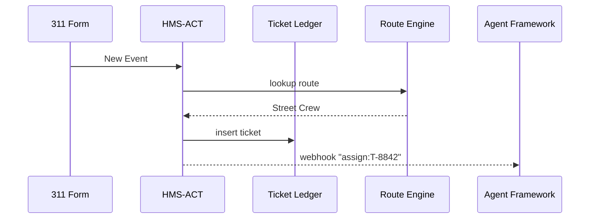

# Chapter 3: Action Orchestrator (HMS-ACT)

*(If you skipped ahead, you may want to glance at  
[Codified Democracy Foundation Engine (HMS-CDF)](02_codified_democracy_foundation_engine__hms_cdf__.md) to see how rules become “official.” Now we’ll watch those rules come alive.)*

---

## 1. Why Do We Need HMS-ACT?

### Quick Story – “Fix My Street”

1. A citizen snaps a photo of a pothole and submits the 311 form.  
2. The photo lands in our platform. What now?  
   • Who should fill the hole?  
   • Should we warn public-works about traffic cones?  
   • Does the repair qualify for emergency funds?  

Without a **traffic cop** the request bounces around inboxes.  
HMS-ACT is that cop. It:

1. Reads the event (“pothole reported”).  
2. Applies the current **statutes** published by [HMS-CDF](02_codified_democracy_foundation_engine__hms_cdf__.md).  
3. Assigns the next **agent** (crew, bot, or human) to act.  
4. Logs every hop for auditors.

Result: citizens see progress bars instead of government silence.

---

## 2. Key Concepts (Plain English)

| Word | What It Actually Means | Everyday Analogy |
|------|------------------------|------------------|
| Event | Something that happened (“Form Submitted”). | Phone rings at 311. |
| Action | A task that must be done (“Dispatch crew”). | Customer service ticket. |
| Route | The rule that maps events → next action. | 311 operator’s decision tree. |
| Ticket Ledger | Database of who did what & when. | Call-center log. |
| State Machine | Allowed status changes. | “Open → In-Progress → Closed”. |

Keep these five words handy—90 % of HMS-ACT is just combining them.

---

## 3. First Walk-Through  
### Use Case: Auto-Routing a Pothole Report

We will:

1. POST a “pothole” event.  
2. Watch HMS-ACT create a ticket.  
3. See it assign the “Street Crew” agent.  

> All code blocks are ≤ 20 lines and use a pretend `hms_act_sdk`.

```python
# file: create_event.py
from hms_act_sdk import ActClient

client = ActClient(token="AGENCY_PIV_TOKEN")

event = {
    "type": "POTHOLE_REPORTED",
    "payload": {
        "street": "1600 Pennsylvania Ave NW",
        "photo_url": "https://pics.gov/pothole1.jpg",
        "urgency": "medium"
    }
}

ticket = client.raise_event(event)
print("🆕 Ticket ID:", ticket["id"])
```

Explanation (for beginners):

1. Authenticate with your agency badge/token.  
2. Describe the event in a plain dictionary.  
3. `raise_event` sends it to HMS-ACT.  
4. We get back a `ticket["id"]` like `T-8842`.

What *happens* (no extra code):

* A route says “POTHOLE_REPORTED → assign Street Crew.”  
* HMS-ACT writes the ledger:  
  `T-8842, status=OPEN, assigned_to=street-crew`.  
* A webhook notifies the [Agent Framework](04_agent_framework__hms_agt___hms_agx__.md).

That’s it—your first orchestration!

---

## 4. Under the Hood – 5-Step Flow



Simple: receive → decide → record → notify.

---

## 5. How Routes Are Defined

Routes are plain YAML so non-coders can edit them.

```yaml
# file: pothole_route.yml
when: POTHOLE_REPORTED
if: payload.urgency != "low"
then:
  assign: street-crew
  sla_hours: 48
```

Saving this file and running `act import pothole_route.yml` registers it.  
Behind the scenes HMS-ACT stores a compiled version in its DB.

---

## 6. Inside the Source Tree (Bird’s-Eye)

```
hms-act/
├── api/          # REST endpoints
│   └── events.py
├── core/
│   ├── router.py
│   ├── ledger.py
│   └── state.py
└── cli/          # act import, act list
```

### 6.1 Minimal Router (10 lines)

```python
# core/router.py
def pick_route(event, routes):
    for r in routes:
        if r["when"] == event["type"]:
            if eval_condition(r.get("if"), event):
                return r
    return None
```

Beginners’ takeaway: the router just loops until a rule matches.

### 6.2 Writing to the Ledger (15 lines)

```python
# core/ledger.py
from time import time

def insert(ticket, db):
    record = {
        "id": ticket["id"],
        "event": ticket["event"],
        "assigned_to": ticket["assignee"],
        "status": "OPEN",
        "created_at": time()
    }
    db["tickets"].insert_one(record)
    return record
```

No fancy magic—just save the facts for auditors.

---

## 7. Relationship to Other Layers

• **Statute compliance**: Routes can call the compiled laws produced by  
  [HMS-CDF](02_codified_democracy_foundation_engine__hms_cdf__.md) to check legality.  

• **Agent execution**: The actual work (send truck, email, AI summarization) is done by  
  [Agent Framework (HMS-AGT / HMS-AGX)](04_agent_framework__hms_agt___hms_agx__.md).  

• **Monitoring**: Every status change bubbles into  
  [Activity & Operations Monitoring (HMS-OPS)](12_activity___operations_monitoring__hms_ops___hms_oms__.md).

---

## 8. Try It Yourself (5-Minute Lab)

```bash
git clone https://github.com/hms-example/hms-act
cd hms-act
docker compose up act
# import the demo route
docker exec hms-act-cli act import examples/pothole_route.yml
# simulate a report
python examples/create_event.py
```

Check logs; you’ll see “Ticket T-8842 assigned to street-crew”.

---

## 9. Recap & What’s Next

You learned:

✓ HMS-ACT receives events, chooses the next actor, and records history.  
✓ Routes are simple YAML—non-technical staff can tweak workflows.  
✓ Every hop is transparent for audits and dashboards.

Ready to see how the “Street Crew” (human or bot) actually *does* the work?  
Jump to [Agent Framework (HMS-AGT / HMS-AGX)](04_agent_framework__hms_agt___hms_agx__.md).

---

Generated by [AI Codebase Knowledge Builder](https://github.com/The-Pocket/Tutorial-Codebase-Knowledge)