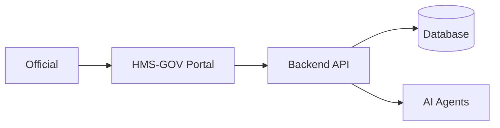
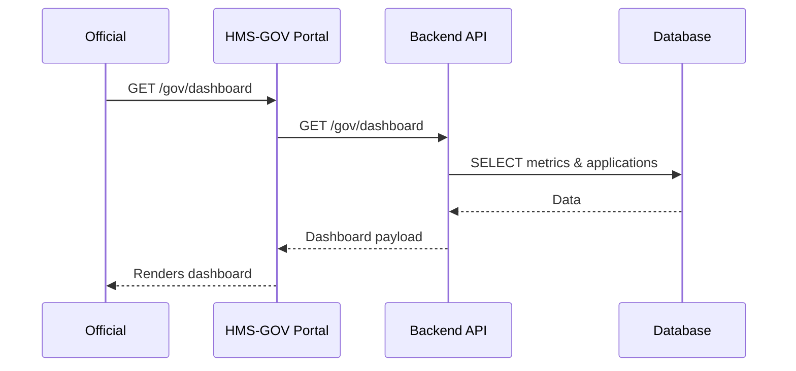

# Chapter 3: Admin/Gov Portal (HMS-GOV)

Welcome back! In [Chapter 2: User Portal & Frontend Modules (HMS-MFE)](02_user_portal___frontend_modules__hms_mfe__.md) we built the citizen-facing side. Now we’ll turn our attention to the **Admin/Gov Portal**—the secure intranet where agency officials make decisions.

---

## Why an Admin/Gov Portal?

Imagine Jane, a manager at the Farm Service Agency (FSA). Every day she needs to:

- See how many disaster-relief applications are pending  
- Track average processing time (a KPI)  
- Review and approve or reject individual cases  
- Adjust funding thresholds before rolling out new policy rules  

All of this happens in a locked-down web app. That’s **HMS-GOV**: the control room for government decision-makers.

---

## Central Use Case: Reviewing Relief Applications

1. Jane logs in securely with two-factor authentication.  
2. She lands on a **dashboard** showing total pending apps, average review time, and funding usage.  
3. She clicks an application row, views details, and sees an AI-generated recommendation.  
4. She clicks **Approve**, optionally tweaks a funding parameter, and submits.  
5. The system logs the audit trail and pushes the update to production policy.  

We’ll walk through each piece in this chapter.

---

## Key Concepts

1. **Secure Auth & Roles**  
   Only authorized officials see this portal.  
2. **Dashboards & KPIs**  
   High-level metrics: counts, charts, trend lines.  
3. **Review Interface**  
   Data grids and detail views for each application.  
4. **Decision-Support Tools**  
   Charts, AI recommendations, parameter sliders.  
5. **Policy Deployment Console**  
   Adjust thresholds or rules before “go live.”

---

## Building a Simple Dashboard

Below is a minimal React dashboard page using our shared UI library (`@hms-ui`).

```jsx
// src/pages/Dashboard.jsx
import { KPICard, Chart, DataGrid } from '@hms-ui';

function Dashboard({ data }) {
  return (
    <div>
      <KPICard label="Pending Apps" value={data.pendingCount} />
      <Chart type="bar" data={data.processingTimes} />
      <DataGrid
        rows={data.applications}
        columns={['ID', 'Applicant', 'Status']}
      />
    </div>
  );
}

export default Dashboard;
```

Explanation:
- `KPICard` shows a single number with label.  
- `Chart` renders a bar chart of processing times.  
- `DataGrid` lists applications; clicking a row takes you to the review page.

---

## High-Level Flow



1. Official opens the portal.  
2. Portal calls backend to fetch metrics and lists.  
3. Backend may query the database or ask an AI agent for recommendations.  
4. Results return and the portal renders dashboards and tables.

---

## Step-by-Step Sequence



---

## Internal Structure & Routes

Folder layout:

```
/hms-gov
  /pages         # Dashboard.jsx, ReviewPage.jsx
  /components    # ApprovalButton.jsx, KPICard.jsx, ParameterSlider.jsx
  /routes        # govRoutes.js
  index.jsx      # bootstraps the Gov Portal
```

Route configuration:

```js
// src/routes/govRoutes.js
import Dashboard from '../pages/Dashboard';
import ReviewPage from '../pages/ReviewPage';

export const govRoutes = [
  { path: '/gov/dashboard', component: Dashboard },
  { path: '/gov/applications/:id', component: ReviewPage },
];
```

Explanation:
- `/gov/dashboard` shows metrics and lists.  
- `/gov/applications/:id` loads a detail view where an official can approve or reject.

---

## Approval Button & Audit Log

A tiny component for approving an application:

```jsx
// src/components/ApprovalButton.jsx
import { Button } from '@hms-ui';

function ApprovalButton({ appId, onApproved }) {
  const handleClick = () => {
    fetch(`/gov/applications/${appId}/approve`, { method: 'POST' })
      .then(() => onApproved());
  };
  return <Button onClick={handleClick}>Approve</Button>;
}

export default ApprovalButton;
```

Explanation:
- Sends a `POST` to approve the application.  
- On success, calls a callback to refresh data and logs the action for audit.

---

## Analogies & Wrap-Up

Think of **HMS-GOV** as the secure operations center in a government agency’s headquarters. It’s where all the levers are pulled—dashboards light up, data grids pop open, and policies get tuned before they’re set in stone.

In this chapter you learned:
- Why we need a secure Admin/Gov portal  
- Core UI pieces: KPI cards, charts, data grids, and approval buttons  
- How data flows from official → portal → API → database/AI  
- The folder and route setup for HMS-GOV  

Next up, we’ll dive into how these requests actually get handled by our APIs.

[Next Chapter: Backend API / API Gateway](04_backend_api___api_gateway_.md)

---

Generated by [AI Codebase Knowledge Builder](https://github.com/The-Pocket/Tutorial-Codebase-Knowledge)