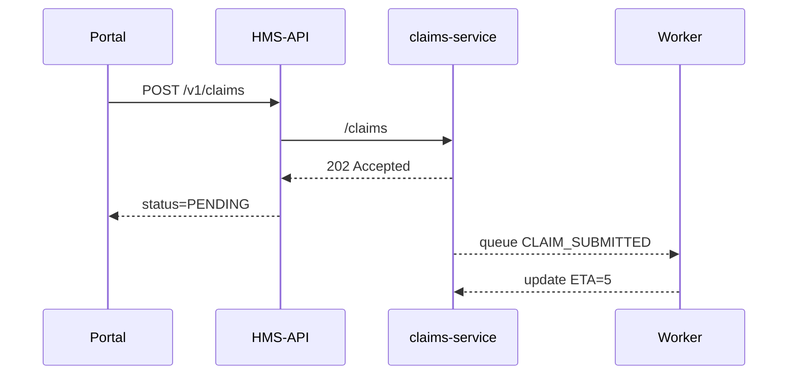

# Chapter 3: Management Layer (HMS-SVC / HMS-API)

[← Back to Chapter 2: Governance Layer](02_governance_layer__hms_gov__.md)

---

## 0. Why Do We Need a Management Layer?

Picture this:  
Maria, a retired Marine, opens the **Veterans Affairs Claims Portal** (built in [Chapter 1: Interface Layer](01_interface_layer__hms_mfe___user___admin_portals__.md)).  
She wants to speed-up her disability claim. An AI assistant proposes a faster workflow, but someone (or **something**) still has to:

* Store her new documents  
* Kick off an analytics job that predicts processing time  
* Expose a stable API so the mobile app works tomorrow **and** next year  

That “someone” is the **Management Layer**—the quiet public-works department of HMS-ACT.

---

## 1. What Exactly Lives Here?

| Concept | Plain-English Role | Everyday Analogy |
|---------|--------------------|------------------|
| HMS-SVC | A single micro-utility (e.g., `claims-service`). | Water plant on one street. |
| HMS-API | The front desk that routes requests to the right service. | 311 phone operator. |
| Data Store | The database a service owns. | Utility’s private water tank. |
| Job Runner | Background worker for heavy tasks (PDF to text). | Night-shift crew. |
| Service Level Objective (SLO) | Promised performance (e.g., 99.9 % uptime). | “Garbage collected every Monday.” |

---

## 2. Walk-Through Use Case: “Accelerate VA Claim”

We will build the tiniest slice of Maria’s journey:

1. Interface Layer sends `POST /v1/claims`.
2. HMS-API routes the call to `claims-service`.
3. `claims-service`:
   * Saves claim in Postgres.
   * Publishes a **queue message** (`CLAIM_SUBMITTED`).
4. A worker picks up the message, runs ML prediction, and stores ETA back in the DB.
5. HMS-API returns `202 Accepted` plus a tracking link.

---

### 2.1 Minimal API Contract

```http
POST /v1/claims
Content-Type: application/json

{
  "veteranId": "123-45-6789",
  "files": ["xray.pdf", "form-21-526EZ.pdf"]
}
```

Returns:

```json
{
  "claimId": "abc123",
  "status": "PENDING",
  "predictedDays": 5
}
```

---

### 2.2 Beginner-Friendly Service Stub (Node  < 20 lines)

```js
// claims-service/index.js
import express from "express";
import { db, queue } from "./deps.js";          // pretend helpers

const app = express();
app.use(express.json());

app.post("/claims", async (req, res) => {
  const claim = { ...req.body, status: "PENDING" };
  const { rows } = await db.query(
    "INSERT INTO claims(data) VALUES($1) RETURNING id", [claim]
  );
  queue.publish("CLAIM_SUBMITTED", { id: rows[0].id });
  res.status(202).json({ claimId: rows[0].id, status: "PENDING" });
});

app.listen(9001, () => console.log("claims-service up"));
```

Explanation (4 bullets):
1. Saves incoming JSON to Postgres.  
2. Publishes `CLAIM_SUBMITTED` to a queue (RabbitMQ, SQS, etc.).  
3. Never runs heavy ML here—keeps the endpoint snappy.  
4. Listens on port 9001; HMS-API will proxy calls.

---

### 2.3 Tiny Worker (Python  < 15 lines)

```python
# worker/predict_eta.py
from queue_lib import consume, publish
from db_lib import update_eta, fetch_claim

def predict_days(claim):
    return 5    # pretend ML

for msg in consume("CLAIM_SUBMITTED"):
    claim = fetch_claim(msg["id"])
    eta = predict_days(claim)
    update_eta(claim["id"], eta)
    publish("ETA_READY", {"id": claim["id"], "eta": eta})
```

Explanation:  
• Listens for `CLAIM_SUBMITTED`, computes an ETA “offline,” updates DB, then notifies whoever cares.

---

## 3. Under the Hood



Key Takeaways:
1. HMS-API is the only doorway the outside world sees.  
2. Services talk through **queues**, not HTTP, for heavy jobs.  
3. No service shares its database—each has one clear owner.

---

## 4. Connecting to Other Layers

* Before inserting the claim, `claims-service` asks [HMS-GOV](02_governance_layer__hms_gov__.md) → “Is this allowed?”  
* The ETA result may trigger the [AI Representative Agent](04_ai_representative_agent__hms_a2a__.md) to suggest fast-track approval.  
* If the AI autopilot goes too far, the [Human-in-the-Loop Override](05_human_in_the_loop__hitl__override_.md) lets an officer step in.

---

## 5. Inside the Repository

```
management-layer/
├─ hms-api/
│  └─ gateway.js
├─ services/
│  └─ claims-service/
│     ├─ index.js
│     └─ deps.js
└─ workers/
   └─ predict_eta.py
```

### 5.1 The Smallest Possible API Gateway (gateway.js  < 20 lines)

```js
import express from "express";
import proxy from "express-http-proxy";

const app = express();
app.use("/v1/claims", proxy("http://claims-service:9001"));
app.listen(8080, () => console.log("HMS-API at :8080"));
```

Explanation:  
• For now, a single line of `proxy()` forwards traffic.  
• Later chapters add auth, rate-limits, and versioning.

---

## 6. How to Run the Demo (5-Minute Lab)

```bash
git clone https://github.com/example/hms-act
cd management-layer

# 1. Start Postgres & RabbitMQ via docker-compose (provided)
docker compose up -d

# 2. Boot the service & gateway
node services/claims-service/index.js
node hms-api/gateway.js

# 3. Fire a test request
curl -X POST localhost:8080/v1/claims \
     -H "Content-Type: application/json" \
     -d '{"veteranId":"123-45-6789","files":["xray.pdf"]}'
# => {"claimId":"abc123","status":"PENDING"}
```

Optional: open a second terminal and run `python workers/predict_eta.py`; within seconds the claim row will show `predictedDays = 5`.

---

## 7. Common Questions

**Q: Where do migrations live?**  
A: Each service keeps its own `/migrations` folder. Launch scripts run them at startup.

**Q: How do we version APIs?**  
A: Prefix paths (`/v1/claims`) and keep HMS-API backward-compatible. Deprecations are announced via the [Intent-Driven Journey Engine](06_intent_driven_journey_engine_.md).

**Q: What if a service crashes?**  
A: Health probes feed metrics to the [Autonomous Accountability Engine](15_autonomous_accountability_engine_.md) and must uphold 99.9 % SLO.

---

## 8. What You Learned

• The Management Layer hosts micro-utilities (services) and a simple API gateway.  
• Each service owns its data and delegates heavy work to background jobs.  
• HMS-API gives the public one stable door, shielding internal churn.  
• Policies (from Chapter 2) and AI suggestions (next chapters) plug in seamlessly.

Ready to meet the AI sidekick that can read those queue messages and propose actions? Jump to  
[Chapter 4: AI Representative Agent (HMS-A2A)](04_ai_representative_agent__hms_a2a__.md).

---

Generated by [AI Codebase Knowledge Builder](https://github.com/The-Pocket/Tutorial-Codebase-Knowledge)