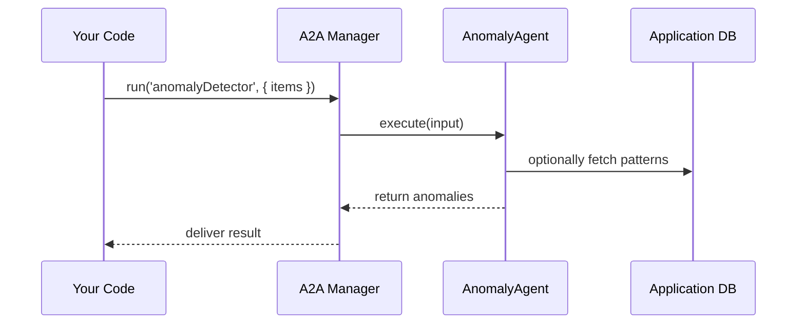

# Chapter 3: Specialized AI Agents (HMS-A2A)

In [Chapter 2: Intent-driven Navigation](02_intent_driven_navigation_.md), we saw how users tell HMS-ACT **what** they want to do. Now, imagine that at **each step** of a flow, an expert bot quietly lends a hand—spotting suspicious patterns, recommending policy tweaks, or suggesting where to send extra resources. These are our **Specialized AI Agents**, or **HMS-A2A**.

---

## Why Specialized AI Agents?

Think of a city’s public-works department:

- A **building inspector** looks for structural issues.
- A **policy analyst** reviews code changes.
- A **fleet manager** allocates vehicles where they’re needed.

In HMS-ACT, each of these experts becomes an AI Agent:

- An **Anomaly Detector** flags odd benefit applications.
- A **Policy Advisor** suggests rule updates for faster reviews.
- A **Resource Allocator** assigns field officers to high-need areas.

By plugging in these agents at the right points, administrators get automated, expert‐level recommendations—saving time, reducing errors, and optimizing workflows.

---

## Key Concepts

1. **Agent Interface**  
   A simple contract every agent follows:
   - `run(input) → output`

2. **Agent Manager**  
   A central registry that:
   - Holds all agent instances.
   - Lets you look up and invoke any agent by name.

3. **Agent Types**  
   - `anomalyDetector`  
   - `policyAdvisor`  
   - `resourceAllocator`

4. **Input & Output**  
   - Structured JSON data (e.g., list of applications).  
   - Results like flagged items or suggested policy updates.

---

## Using an AI Agent

Here’s how a developer calls the **Anomaly Detector** to scan benefit applications:

```javascript
// File: src/a2a/usageExample.js
import { AgentManager } from 'hms-a2a'; 

async function findAnomalies(applications) {
  // Look up the agent by name
  const agent = AgentManager.get('anomalyDetector');
  
  // Run it with input data
  const anomalies = await agent.run({ items: applications });
  console.log('Anomalies:', anomalies);
}

// Example input: an array of citizen applications
findAnomalies([
  { id: 'A1', amount: 500 },
  { id: 'A2', amount: 20000 }  // flagged as anomaly
]);
```

Explanation:
- We fetch the `anomalyDetector` from **AgentManager**.
- We pass in an object with `items` (our applications).
- The agent returns a filtered list of suspicious cases.

---

## What Happens Under the Hood?

Below is a simplified flow when you call `agent.run(...)`:



1. **Your Code** asks **Agent Manager** to run an agent.  
2. **Manager** finds the agent instance.  
3. **Agent** does its work (e.g., checks DB or in-memory data).  
4. **Agent** returns findings to **Manager**, which forwards them back.

---

## Inside the Implementation

Let’s peek at the minimal code that makes this work.

### 1. AgentManager: Register & Retrieve

```javascript
// File: src/a2a/AgentManager.js
const registry = new Map();

export class AgentManager {
  static register(name, AgentClass) {
    registry.set(name, new AgentClass());
  }
  static get(name) {
    return registry.get(name);
  }
}
```
> We keep a `Map` of name→agent instance.

### 2. BaseAgent: Common Logic

```javascript
// File: src/a2a/BaseAgent.js
export class BaseAgent {
  async run(input) {
    console.log(`[Agent] Running with`, input);
    return this.execute(input);
  }
  async execute(input) {
    throw new Error('execute() not implemented');
  }
}
```
> All agents extend `BaseAgent` so they share logging or error handling.

### 3. AnomalyDetector: A Simple Agent

```javascript
// File: src/a2a/agents/AnomalyDetector.js
import { BaseAgent } from '../BaseAgent';

export class AnomalyDetector extends BaseAgent {
  async execute({ items }) {
    // Flag any item over $10,000
    return items.filter(i => i.amount > 10000);
  }
}
```
> Our toy logic: anything above 10K is suspicious.

### 4. Register Agents at Startup

```javascript
// File: src/a2a/index.js
import { AgentManager } from './AgentManager';
import { AnomalyDetector } from './agents/AnomalyDetector';
import { PolicyAdvisor }   from './agents/PolicyAdvisor';
import { ResourceAllocator } from './agents/ResourceAllocator';

// Register each agent under a key
AgentManager.register('anomalyDetector', AnomalyDetector);
AgentManager.register('policyAdvisor',   PolicyAdvisor);
AgentManager.register('resourceAllocator', ResourceAllocator);
```
> On system boot, we register all our expert bots.

---

## Putting It in a Workflow

You might plug an agent into an intent flow defined in [Chapter 2: Intent-driven Navigation](02_intent_driven_navigation_.md). For example, right after collecting form data:

```javascript
// In your step component
const anomalies = await AgentManager.get('anomalyDetector')
                                  .run({ items: context.submissions });
if (anomalies.length) {
  UI.showAlert('Possible fraud detected');
}
router.next(context);
```

Here, the agent helps a field officer by flagging odd cases **before** they approve.

---

## Conclusion

In this chapter you learned how HMS-A2A brings in **specialized AI Agents**—our “expert inspectors”—to automate tasks like anomaly detection, policy recommendation, and resource allocation. You saw:

- The **Agent Interface** and how to call `run(input)`.  
- The **Agent Manager** for registration and lookup.  
- A peek under the hood at `BaseAgent` and a simple `AnomalyDetector`.  

Next, we’ll explore how humans and these agents team up in the **Hybrid Human-AI Decision Loop**.  
[Next Chapter: Hybrid Human-AI Decision Loop](04_hybrid_human_ai_decision_loop_.md)

---

Generated by [AI Codebase Knowledge Builder](https://github.com/The-Pocket/Tutorial-Codebase-Knowledge)