# Chapter 4: AI Representative Agent (HMS-A2A)

[← Back to Chapter 3: Management Layer](03_management_layer__hms_svc___hms_api__.md)

---

## 0. Why Do We Need an AI Representative Agent?

Imagine a Category-4 hurricane just hit Florida.  
FEMA must **shift \$10 million** from its “Preparedness” pot to an emergency “Housing” program—*yesterday*.  

Today that takes days of PDFs, signatures, and phone calls.  
With **HMS-A2A** we get an “always-on policy analyst” that:

1. Digests fresh data (weather alerts, budget ledgers, call-center complaints).  
2. Drafts a new process: “Move \$10 M → Housing; waive the 7-day waiting rule.” 
3. Attaches a plain-English rationale and cites governing laws.  
4. Forwards the suggestion to humans or auto-deploys—depending on trust settings in [HMS-GOV](02_governance_layer__hms_gov__.md).  

Result: hours instead of days, with a full audit trail.

---

## 1. Key Concepts in Plain English

| Concept | Friendly Explanation | Analogy |
|---------|----------------------|---------|
| Ingestion Streams | Live feeds the agent reads (logs, news, law updates). | Newspaper pile on the analyst’s desk. |
| Suggestion Draft | Machine-generated “memo” that proposes a new or updated process. | Internal policy brief. |
| Trust Tier | Level at which humans still sign off. | Security clearance badge. |
| Rationale Bundle | Citations & reasoning shipped with every suggestion. | Footnotes plus bibliography. |
| A2A API | Endpoint to fetch or submit suggestions. | Analyst’s inbox/outbox. |

---

## 2. Quick Start—Use It in 10 Lines

Below is the tiniest client to **ask** HMS-A2A for suggestions related to “FEMA_FUNDS”.

```python
# get_suggestion.py
import requests, json
resp = requests.post(
    "https://a2a.hms/api/v1/suggest",
    json={"intent": "FEMA_FUNDS", "amount": 10_000_000}
)
print(json.dumps(resp.json(), indent=2))
```

Possible output (trimmed):

```json
{
  "suggestionId": "sug-789",
  "action": "REALLOCATE_FUNDS",
  "details": {
    "from": "Preparedness",
    "to": "Housing",
    "amount": 10000000
  },
  "trustTier": "REQUIRES_HUMAN_SIGNOFF",
  "rationale": [
    "42 U.S.C. §5170b (Emergency Support Functions)",
    "Historical precedence: Hurricane Ida 2021"
  ]
}
```

Explanation – 5 bullets:  
1. You send an **intent** plus context.  
2. A2A returns a structured proposal.  
3. `trustTier` tells [HITL Override](05_human_in_the_loop__hitl__override_.md) what to do next.  
4. `rationale` is ready for auditors.  
5. `suggestionId` lets you accept/reject later.

---

## 3. Step-By-Step Walk-Through (What Really Happens)

```mermaid
sequenceDiagram
    participant SVC as FEMA Service
    participant A2A as HMS-A2A
    participant GOV as HMS-GOV
    participant HITL as HITL Portal
    SVC->>A2A: POST /suggest (intent, data)
    A2A->>GOV: Validate against policies
    GOV-->>A2A: OK / constraints
    A2A-->>HITL: Suggestion + rationale
    Note over HITL: Human clicks Accept 🚀 or Reject ✋
```



Key points:  
• A2A never bypasses policies—HMS-GOV is the gatekeeper.  
• If `trustTier = AUTO`, A2A may deploy straight to the [Backend Policy Deployment Pipeline](10_backend_policy_deployment_pipeline_.md).  
• Every message is copied to the [Audit & Compliance Ledger](14_audit___compliance_ledger_.md).

---

## 4. Inside the Agent—Tiny Tour of the Code

Folder map:

```
ai-representative-agent/
├─ ingestors/
│  └─ fema_budget_ingestor.py
├─ brain/
│  ├─ generator.py
│  └─ validator.py
└─ api/
   └─ app.py
```

### 4.1 Ingestor (reads raw data) – 12 lines

```python
# ingestors/fema_budget_ingestor.py
def fetch_latest():
    # pretend we hit a FEMA CSV endpoint
    return {"Preparedness": 55_000_000, "Housing": 2_000_000}

def to_fact_stream(balances):
    return [{"type": "BALANCE", "bucket": k, "value": v}
            for k, v in balances.items()]
```

Explanation:  
1. Pulls a CSV (mocked).  
2. Emits uniform “fact” objects the brain can consume.

### 4.2 Generator (LLM wrapper) – 15 lines

```python
# brain/generator.py
from openai import ChatCompletion

def draft(intent, context):
    prompt = f"""
    You are a federal policy analyst.
    Intent: {intent}
    Context: {context}
    Create a JSON suggestion with action, details, and rationale.
    """
    rsp = ChatCompletion.create(model="gpt-4o-mini", messages=[{"role":"user","content":prompt}])
    return rsp.choices[0].message.content   # already JSON
```

Explanation:  
• Simple LLM call; template keeps response machine-readable.

### 4.3 Validator – 14 lines

```python
# brain/validator.py
import json, requests

def check_against_gov(sugg_json):
    payload = {
      "trigger": "A2A_SUGGESTION",
      "payload": sugg_json
    }
    resp = requests.post("https://gov.hms/policy/evaluate", json=payload)
    return resp.json()["decision"] == "allow"
```

Explanation:  
• Asks HMS-GOV if the suggestion violates any rule.  
• Returns True/False.

### 4.4 API Layer – 19 lines

```python
# api/app.py
from flask import Flask, request, jsonify
from brain import generator, validator

app = Flask(__name__)

@app.post("/api/v1/suggest")
def suggest():
    body = request.json
    draft = generator.draft(body["intent"], body)
    sug = json.loads(draft)
    sug["trustTier"] = "AUTO" if validator.check_against_gov(sug) else "REQUIRES_HUMAN_SIGNOFF"
    # emit to queue, log ledger (omitted)
    return jsonify(sug)

if __name__ == "__main__":
    app.run(port=7000)
```

Explanation:  
1. Receives an intent.  
2. Uses Generator → JSON draft.  
3. Validator sets `trustTier`.  
4. Returns the enriched suggestion.

---

## 5. Configuring Trust Tiers (1-Minute YAML)

```yaml
# config/trust_tiers.yaml
AUTO:
  max_funds: 2000000          # suggestions ≤ $2 M deploy automatically
REQUIRES_HUMAN_SIGNOFF:
  max_funds: 50000000         # > $2 M needs a person
BLOCK:
  prohibited_buckets: ["Nuclear_Safety"]
```

Update the numbers → restart A2A → rules change instantly.

---

## 6. Hands-On Demo (5 Commands)

```bash
git clone https://github.com/example/hms-act
cd ai-representative-agent
pip install -r requirements.txt
python api/app.py          # boots on :7000
curl -X POST localhost:7000/api/v1/suggest \
     -H "Content-Type: application/json" \
     -d '{"intent":"FEMA_FUNDS","amount":1000000}'
```

You should get a JSON suggestion with either `AUTO` or `REQUIRES_HUMAN_SIGNOFF` based on the YAML above.

---

## 7. Frequently Asked Questions

**Q: What if the AI goes rogue?**  
A: Any high-impact suggestion is routed to [Chapter 5: Human-in-the-Loop Override](05_human_in_the_loop__hitl__override_.md) before deployment.

**Q: Is the rationale human-readable?**  
A: Yes. It includes natural-language explanations plus direct law citations.

**Q: How are mistakes corrected?**  
A: Reject the suggestion in the HITL Portal; the rejection plus reason feeds back into the agent’s learning dataset.

**Q: Do we need OpenAI?**  
A: No. The `generator` is pluggable—swap in open-source LLMs like Llama 3.

---

## 8. What You Learned

• HMS-A2A is the tireless policy analyst embedded in the platform.  
• It turns raw facts into machine-readable **suggestion drafts**.  
• Every draft carries a transparent rationale and passes through HMS-GOV.  
• Trust tiers decide if humans must review.  
• All activity is logged for auditors.

Ready to see how humans can *accept* or *veto* these AI drafts?  
Head over to [Chapter 5: Human-in-the-Loop (HITL) Override](05_human_in_the_loop__hitl__override_.md).

---

Generated by [AI Codebase Knowledge Builder](https://github.com/The-Pocket/Tutorial-Codebase-Knowledge)