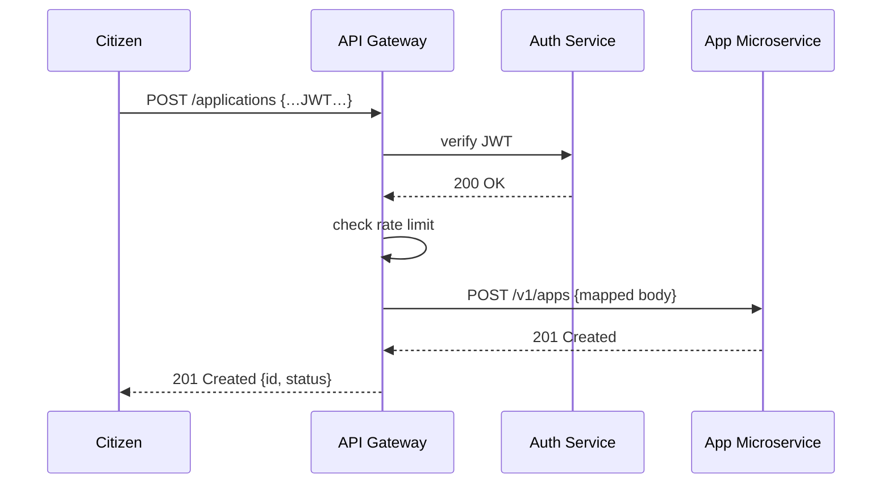

# Chapter 4: Backend API / API Gateway

In the last chapter, you saw how HMS-GOV’s portals call APIs to review and approve applications. Now, let’s pull back one layer and meet the **Backend API / API Gateway**—the central “reception desk” for all programmatic traffic.

---

## Why an API Gateway?

Imagine every request from HMS-MFE, HMS-GOV, or even external partners like data.gov comes into one front desk. The **API Gateway**:

- Verifies **who** you are (authentication & authorization)  
- Ensures you don’t overload the system (rate limiting)  
- Forwards you to the right back-end team (routing to microservices)  
- Tweaks messages to fit each service (payload transformations)  
- Presents a stable, consistent contract to all clients  

This is just like data.gov: a single API to dozens of datasets, with security rules and usage quotas enforced at the front door.

---

## Central Use Case: Submitting a Permit Application

1. **Citizen Portal (HMS-MFE)** calls `POST /applications` on the Gateway  
2. Gateway checks the JWT token with **Auth Service**  
3. Gateway ensures the client hasn’t hit its rate limit  
4. Gateway transforms the request shape if needed  
5. Gateway proxies the call to the **Applications Microservice**  
6. Microservice responds; Gateway returns the final payload  



---

## Key Concepts

1. **Unified Entry Point**  
   All clients—REST, GraphQL or gRPC—talk to one API Gateway.

2. **Authentication & Authorization**  
   Gatekeeper middleware checks tokens and scopes.

3. **Rate Limiting**  
   Protect microservices by capping requests per minute.

4. **Routing**  
   Maps public paths (e.g. `/applications`) to internal services (`http://apps-svc/v1`).

5. **Payload Transformation**  
   Shape requests or responses to match each microservice’s contract.

6. **Consistent API Contract**  
   Clients see one versioned API (e.g. `/v1/...`), even when back-ends evolve.

---

## Simple Gateway Example (Node.js + Express)

Below is a minimalist Express-based gateway that handles auth, rate limits, and routing:

```js
// backend-api/index.js
import express from 'express';
import { proxy } from 'http-proxy-middleware';
import { checkAuth } from './middleware/auth.js';
import { rateLimit } from './middleware/rateLimit.js';

const app = express();
app.use(express.json());
app.use(checkAuth);      // 1. Authentication
app.use(rateLimit);      // 2. Rate limiting

// 3. Route /applications to the Applications microservice
app.use('/applications',
  proxy({ target: 'http://apps-svc/v1', changeOrigin: true })
);

app.listen(4000, () => console.log('API Gateway listening on 4000'));
```

Explanation:
- `checkAuth` looks for and validates a JWT token  
- `rateLimit` caps requests by IP or client ID  
- `http-proxy-middleware` forwards matching paths  

---

## Authentication Middleware

```js
// backend-api/middleware/auth.js
import jwt from 'jsonwebtoken';

export function checkAuth(req, res, next) {
  const token = req.headers.authorization?.split(' ')[1];
  try {
    req.user = jwt.verify(token, process.env.JWT_SECRET);
    next();
  } catch {
    res.status(401).json({ error: 'Invalid token' });
  }
}
```

Here:
- We extract the JWT from `Authorization` header  
- Use `jwt.verify()` to decode and confirm the user’s identity  

---

## Rate Limiting Middleware

```js
// backend-api/middleware/rateLimit.js
import rate from 'express-rate-limit';

export const rateLimit = rate({
  windowMs: 60_000,       // 1 minute
  max: 100,               // limit each IP to 100 requests / window
  message: 'Too many requests, slow down.'
});
```

This simple limiter protects your back-end microservices from traffic spikes.

---

## Supporting GraphQL & gRPC

You can mount GraphQL or gRPC handlers at different paths, all under the same gateway:

```js
// add to backend-api/index.js
import { graphqlHTTP } from 'express-graphql';
import schema from './graphql/schema.js';

app.use('/graphql', graphqlHTTP({
  schema,
  graphiql: true,
}));

// (For gRPC, you’d set up a separate port and server instance here)
```

Clients calling `/graphql` hit your GraphQL schema, while REST calls to `/applications` go to microservices.

---

## Under the Hood: File Structure

```
/backend-api
  index.js
  /middleware
    auth.js
    rateLimit.js
  /graphql
    schema.js       # your GraphQL typeDefs & resolvers
```

1. **index.js**  
   Bootstraps Express, loads middleware, and defines routes.

2. **middleware/**  
   Encapsulates cross-cutting concerns (auth, throttling, logging).

3. **graphql/**  
   Holds schema and resolvers if you expose GraphQL.

---

## Conclusion

In this chapter you learned how the **API Gateway**:

- Centralizes security (auth & rate-limit)  
- Routes requests cleanly to microservices  
- Transforms payloads for a consistent external contract  
- Supports REST, GraphQL, and gRPC under one roof  

Up next, we’ll look under the hood of our infrastructure—networks, containers, and cloud services in **[Chapter 5: Core Infrastructure (HMS-SYS)](05_core_infrastructure__hms_sys__.md)**.

---

Generated by [AI Codebase Knowledge Builder](https://github.com/The-Pocket/Tutorial-Codebase-Knowledge)