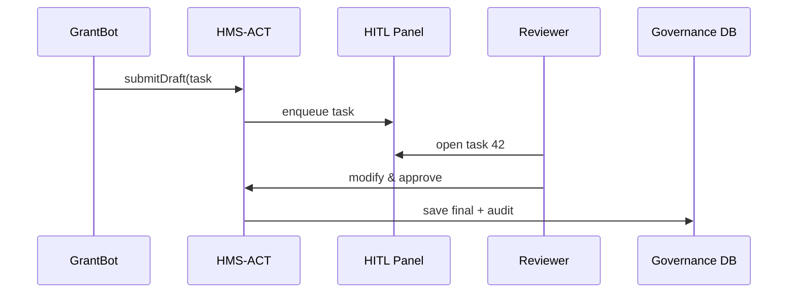

# Chapter 5: Human-in-the-Loop (HITL) Control Panel

*(continuation of [Agent Interaction Protocol (HMS-MCP)](04_agent_interaction_protocol__hms_mcp__.md))*  

---

## 1. Why Put a Human Back in the Loop?

### 60-Second Story — “The $10 Million Typo”  
An AI **GrantBot** at the Department of the Interior auto-drafts a funding letter:  

> “We propose \$10,000,000 for trail restoration in Zion National Park.”  

The real amount should be **\$1,000,000**.  
Before the letter goes to Congress, **Alex**, a budget officer, opens the **HITL Control Panel**, spots the AI’s typo in the *Diff View*, clicks “Modify,” fixes the number, and documents the change in 30 seconds.

Disaster averted.  
That’s the entire point of the HITL panel: **accountability**.

---

## 2. Key Concepts (Plain English)

| Term | Friendly Explanation |
|------|----------------------|
| Task Queue | Inbox of “AI proposals waiting for eyes.” |
| Diff View | Side-by-side *before vs. after* comparison. |
| Risk Score | 0–100 meter forecasting legal/financial fallout. |
| Autonomy Slider | Sets how bold the AI can be (Level 0–5 from Chapter 3). |
| Decision Buttons | **Accept**, **Modify**, **Reject**—just like a Senate vote. |
| Provenance Graph | Breadcrumb map showing every data source & tool used. |

Analogy:  
Think of the panel as a **Senate committee room**. Bills (AI drafts) enter, senators (officials) debate via diff notes and risk charts, then vote.

---

## 3. Quick-Start: Opening a Review Task

Below is a tiny React-ish component that mounts the HITL panel inside any portal.

```javascript
// GrantReview.js  (18 lines)
import { useTask } from '@hms-hitl/client';
import { DiffViewer, RiskMeter, DecisionBar } from '@hms-mfe/bricks';

export default function GrantReview({ taskId }) {
  const { draft, original, risk, decide } = useTask(taskId); // hook loads data

  return (
    <>
      <h1>Grant Proposal Review</h1>
      <RiskMeter score={risk} />          {/* 0-100 gauge */}
      <DiffViewer before={original} after={draft} />
      <DecisionBar onDecide={decide} />   {/* Accept / Modify / Reject */}
    </>
  );
}
```

What happens?  
1. `useTask` fetches the **draft** (from **GrantBot**) and the **original** request.  
2. Components visualize risk & diffs.  
3. `DecisionBar` tells the backend what Alex decided.

---

### 3.1 Sample Output (high-level)

* **Risk Meter:** *35 — Medium*  
* **Diff:** RED `10,000,000` ➜ GREEN `1,000,000`  
* Buttons: `[Accept] [Modify] [Reject]`

---

## 4. Behind the Curtain — Life of a Draft



Five actors, easy to trace.

---

## 5. Internal Implementation (Gentle Peek)

### 5.1 Task Schema (8 lines)

```json
{
  "id": "42",
  "draft": "We propose $10,000,000 …",
  "original": "We propose $1,000,000 …",
  "risk": 35,
  "provenance": ["getBudgetLine", "llmDraft"],
  "status": "pending"
}
```

Stored in a **“tasks”** table inside HMS-ACT.

### 5.2 Simple Decision Endpoint (12 lines)

```javascript
// routes/decide.js
app.post('/tasks/:id/decision', verifyToken, async (req, res) => {
  const { id } = req.params;
  const { action, patch } = req.body; // action=accept|modify|reject
  const task = await db.tasks.find(id);

  if (action === 'modify') task.draft = patch;
  task.status = action;
  await db.tasks.save(task);

  audit(req.user, action, id);        // Chapter 11 will log this
  res.send({ ok: true });
});
```

Every click writes to the **audit log** watched by [Security & Compliance Engine (HMS-ESQ)](11_security___compliance_engine__hms_esq__.md).

---

## 6. Calculating the Risk Score (11 lines)

```javascript
// risk/calc.js
export function calcRisk({ amount, lawRefs }) {
  let score = 0;
  if (amount > 5_000_000) score += 20;         // money factor
  if (lawRefs.includes('Unclear Statute')) score += 40;
  return Math.min(score, 100);
}
```

Keep it transparent so non-tech staff can audit the math.

---

## 7. Provenance Graph Mini-Component

```javascript
// Provenance.js  (14 lines)
import Graph from '@hms-mfe/graph';

export default function Provenance({ nodes }) {
  return (
    <>
      <h2>How This Draft Was Made</h2>
      <Graph nodes={nodes} />
    </>
  );
}
```

Shows a clickable flowchart: *citizen form → getBudgetLine → LLM draft*.

---

## 8. Setting the Autonomy Slider

Officials can tune the AI’s boldness directly in the panel:

```javascript
// AutonomySetting.js
<Slider
  label="Autonomy Level"
  min={0} max={5}
  value={level}
  onChange={lvl => api.setAutonomy(agentId, lvl)}
/>
```

Implemented via the **/agents/:id/autonomy** endpoint; values align with Chapter 3’s table.

---

## 9. Directory Peek

```
hms-hitl/
 ├─ client/          // React hooks
 ├─ server/
 │   ├─ routes/
 │   ├─ risk/
 │   └─ diff/
 ├─ bricks/          // DiffViewer, RiskMeter, DecisionBar
 └─ README.md
```

Everything is a micro-frontend brick, reusable across agencies (recall Chapter 1).

---

## 10. Putting It All Together — 3-Step Checklist

1. **Agent Submits Draft**  
   ```js
   await mcpSend({ header:{…type:'draft'}, body:{taskId, draft} });
   ```
2. **HITL Panel Surfaces Task** automatically via `useTaskQueue()`.  
3. **Official Decides** with one click; HMS-ACT finalizes and notifies the citizen.

---

## 11. Recap & What’s Next

In this chapter you learned:  
✓ Why humans must oversee AI proposals.  
✓ Core parts of the HITL panel—Task Queue, Diff View, Risk Meter, Decision Buttons.  
✓ How to embed and extend the panel with <20-line code snippets.  
✓ The step-by-step flow from AI draft to audited human decision.

Next we’ll see how these human + AI decisions feed into agency-wide rules and hierarchies in the **governance brain**:  
[Governance Layer (HMS-SYS → HMS-GOV)](06_governance_layer__hms_sys___hms_gov__.md)

---

Generated by [AI Codebase Knowledge Builder](https://github.com/The-Pocket/Tutorial-Codebase-Knowledge)