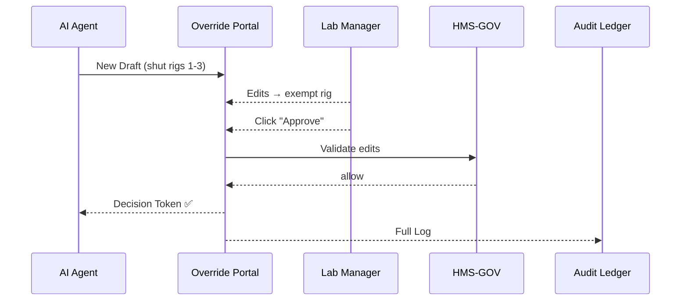

# Chapter 5: Human-in-the-Loop (HITL) Override

[← Back to Chapter 4: AI Representative Agent (HMS-A2A)](04_ai_representative_agent__hms_a2a__.md)

---

## 0. Why Do We Need a “Big Red Button”?

Picture this:

Oak Ridge National Laboratory (ORNL) runs an AI-driven energy-allocation tool.  
Last night the tool (powered by [HMS-A2A](04_ai_representative_agent__hms_a2a__.md)) drafted a policy to **shut down three low-priority test rigs between 2 a.m. – 6 a.m.** to free electricity for an emergency grid-share request from FEMA.

Sounds smart—until a lab manager remembers that rig #2 stores temperature-sensitive samples; a cold shutdown could destroy \$3 million in material.

Enter **Human-in-the-Loop (HITL) Override**—the emergency brake that lets a designated official:

1. Inspect the AI’s assumptions.  
2. Tweak parameters (e.g., “Skip rig #2 only”).  
3. Approve or block the release.  

The entire interaction—including any delay—is logged for oversight bodies like the GAO.

---

## 1. Key Concepts (in Plain English)

| Term | What It Means | Easy Analogy |
|------|---------------|--------------|
| Override Portal | Web screen where officials review AI drafts. | Air-traffic controller console. |
| Decision Token | Signed yes/no response sent back to services. | Boarding pass stamped “CLEARED” or “DENIED.” |
| Time-to-Live (TTL) | How long the AI must wait for a human answer before auto-aborting. | Sand timer on a chess clock. |
| Evidence Log | Tamper-proof record of the whole back-and-forth. | Black box in an airplane. |

---

## 2. Walk-Through: Saving the ORNL Samples

### 2.1 Flow at a Glance



Key take-aways  
• AI **never** applies changes until it receives a valid Decision Token.  
• Edited parameters go back through [HMS-GOV](02_governance_layer__hms_gov__.md) for policy checks.  
• The Audit Ledger gets a complete story for future investigations.

---

## 3. Using HITL Override (5-Minute Demo)

### 3.1 AI Submits a Draft

```bash
curl -X POST https://a2a.hms/api/v1/suggest \
     -d '{"intent":"POWER_SHIFT","targets":["rig1","rig2","rig3"]}'
```

The response now includes `trustTier: "REQUIRES_HUMAN_SIGNOFF"`  
and is automatically queued to HITL.

### 3.2 Fetch Pending Items (Portal or CLI)

```bash
curl https://hitl.hms/api/v1/pending
```

Sample output:

```json
[
  {
    "suggestionId": "sug-42",
    "action": "POWER_SHIFT",
    "details": { "targets": ["rig1","rig2","rig3"], "window":"02:00-06:00" },
    "rationale": ["ORNL energy budget 2024-Q2"],
    "ttlSeconds": 3600
  }
]
```

### 3.3 Approve with Tweaks (only rigs 1 & 3)

```bash
curl -X POST https://hitl.hms/api/v1/decision \
     -H "Content-Type: application/json" \
     -d '{
           "suggestionId":"sug-42",
           "decision":"APPROVE",
           "amendments": { "targets":["rig1","rig3"] },
           "comment":"Protect temp-sensitive samples on rig2"
         }'
```

On success you’ll see:

```json
{ "status":"RECORDED", "token":"tok-987", "effectiveDetails":{...} }
```

Explanation (3 bullets)  
1. `amendments` lets the manager tweak inputs safely.  
2. `token` is cryptographically signed—A2A must present it to proceed.  
3. Any future auditor can replay the exact state using the token ID.

---

## 4. Internals—How Does HITL Work?

### 4.1 Folder Tour

```
hitl-override/
├─ api/
│  └─ app.py
├─ ui/
│  └─ ReviewPanel.vue
├─ core/
│  ├─ store.py         # in-memory DB for demo
│  └─ signer.py        # creates Decision Tokens
```

### 4.2 Core Logic (super-tiny!)

```python
# core/signer.py  (≤15 lines)
import hmac, hashlib, time, json
SECRET = b"super-secret-key"   # env var in real life

def sign(decision):
    blob = json.dumps(decision, sort_keys=True).encode()
    sig  = hmac.new(SECRET, blob, hashlib.sha256).hexdigest()
    return { **decision, "signature": sig, "timestamp": int(time.time()) }
```
Explanation  
• Packs the human decision, adds an HMAC signature so A2A & auditors can verify authenticity.

```python
# api/app.py  (≤20 lines)
from flask import Flask, request, jsonify
from core import store, signer, gov_client   # pretend modules

app = Flask(__name__)

@app.get("/api/v1/pending")
def list_pending():
    return jsonify(store.all())

@app.post("/api/v1/decision")
def decide():
    body = request.json
    # 1- Check TTL
    if store.expired(body["suggestionId"]):
        return jsonify({"error":"TTL expired"}), 410
    # 2- Validate amendments with HMS-GOV
    if not gov_client.ok(body["amendments"]):
        return jsonify({"error":"Policy violation"}), 400
    # 3- Sign and forward
    token = signer.sign(body)
    store.mark_resolved(body["suggestionId"], token)
    return jsonify({"status":"RECORDED","token":token["signature"]})
```
Explanation (4 bullets)  
1. Ensures the request arrived on time.  
2. Calls HMS-GOV to double-check edits.  
3. Generates a signed Decision Token.  
4. Saves everything in the (demo) store and responds.

---

## 5. How HITL Knows Who Can Override

HITL uses the **Role-Based Access & Entitlement Matrix** (see [Chapter 7](07_role_based_access___entitlement_matrix_.md)).  
Example rule snippet:

```yaml
roles:
  Lab_Manager:
    canOverride:
      - POWER_SHIFT
      - FUND_REALLOCATION
  Research_Assistant:
    canView: [POWER_SHIFT]
```

Assigning a user the `Lab_Manager` role automatically grants access to the Override Portal for those actions.

---

## 6. Hands-On Lab in 4 Commands

```bash
# 1. Clone & install
git clone https://github.com/example/hms-act
cd hitl-override && pip install -r requirements.txt

# 2. Start HITL API
python api/app.py     # runs on :7500

# 3. Simulate an AI draft
curl -X POST localhost:7500/_demo/create-draft

# 4. Approve it
curl localhost:7500/api/v1/pending | jq
# copy suggestionId and POST /decision as shown earlier
```

Within seconds you’ll see the decision token echoed in the console—proof that the override is on record.

---

## 7. Frequently Asked Questions

**Q: What if no one responds before TTL?**  
A: The draft auto-fails with status `EXPIRED`. A2A will log the failure and optionally create a new, smaller-scope suggestion.

**Q: Can we force two-person approval?**  
A: Yes. HITL supports “multi-sig” mode. Add `requiredApprovers: 2` in the suggestion metadata; the portal will wait for two unique Decision Tokens.

**Q: Does this slow us down?**  
A: Statistics in the [Autonomous Accountability Engine](15_autonomous_accountability_engine_.md) track average HITL delay. Agencies can brag: “98 % of overrides handled in < 30 min.”

**Q: Is GAO really satisfied with logs?**  
A: Logs include the signed decision, exact payloads, timestamps, and policy checks—enough to pass most federal audit standards.

---

## 8. What You Learned

• HITL Override is the safeguard that keeps AI recommendations under human control.  
• Officials can inspect, tweak, approve, or deny—everything is time-boxed and logged.  
• A signed Decision Token is the single source of truth for downstream systems.  
• Role-based rules decide *who* may pull the brake.  

Ready to see how these decisions feed into end-to-end citizen journeys?  
Continue to [Chapter 6: Intent-Driven Journey Engine](06_intent_driven_journey_engine_.md).

---

Generated by [AI Codebase Knowledge Builder](https://github.com/The-Pocket/Tutorial-Codebase-Knowledge)