# Chapter 5: Model Context Protocol (HMS-MCP)

*(Just joined? You may want to skim  
[Agent Framework (HMS-AGT / HMS-AGX)](04_agent_framework__hms_agt___hms_agx__.md) to see who *uses* the protocol we are about to unpack.)*

---

## 1. Why Do We Need MCP?

### Story – “Book My Capitol Tour”

1. A citizen fills out the “Visit the U.S. Capitol” form and clicks **Submit**.  
2. HMS-ACT opens Ticket **T-2001** and assigns the “Tour Scheduler” agent.  
3. The agent must:
   • Check background-check eligibility.  
   • Reserve a time slot in the **Capitol Visitor Center** calendar API.  
   • Email a confirmation in plain language.

Each hop involves **different languages**:

* The form speaks JSON.  
* The scheduling API expects GraphQL.  
* The email service wants Markdown.  
* A human auditor wants a searchable log.

**HMS-MCP** is our “State Department protocol manual.”  
It wraps every message with **context, permissions, and tooling hints** so that every service—human, AI, or API—talks the same diplomatic language.

---

## 2. Key Concepts (Plain English)

| Word            | What It Really Means                                   | Analogy                           |
|-----------------|---------------------------------------------------------|-----------------------------------|
| Envelope        | The outer JSON jacket that travels with every message.  | A diplomatic pouch.               |
| Context         | Who, what, why, and when.                               | The cover letter inside the pouch |
| Permission Set  | What the receiver is allowed to do (read, write, call). | An entry visa stamped in passport |
| Tool Hints      | Shortcuts telling an agent which API or skill to use.   | “Use gate A; translator waiting.” |
| Trace-ID        | Unique ID that ties every hop together for auditors.    | A FedEx tracking number.          |

If you remember these five words, you already know 80 % of MCP.

---

## 3. A First Walk-Through  
### Use Case: Reserve a Capitol Tour Slot

Below is the entire life-cycle, *start to finish*, in three micro-snippets.

#### 3.1 User Front-End — wrap the request

```python
# file: create_envelope.py
from hms_mcp import Envelope

form_payload = {"name": "Alex", "date": "2025-04-12", "party": 4}

env = Envelope.build(
    actor="citizen",
    intent="CAPITOL_TOUR_REQUEST",
    payload=form_payload,
    tool_hints=["calendar.reserve"],
    permissions=["calendar.reserve:visitor-center"]
)

print(env.to_json())
```

Explanation  
1. `Envelope.build` collects the *who / what / why*.  
2. We add a tool hint so the scheduler knows to call the calendar API.  
3. The resulting JSON automatically includes a `trace_id`.

*Output (abridged):*

```json
{
  "trace_id": "87e0…",
  "context": { "actor": "citizen", "intent": "CAPITOL_TOUR_REQUEST" },
  "permissions": ["calendar.reserve:visitor-center"],
  "tool_hints": ["calendar.reserve"],
  "payload": { "name": "Alex", "date": "2025-04-12", "party": 4 }
}
```

#### 3.2 Agent Side — unpack, act, re-wrap

```python
# file: scheduler_agent.py  (excerpt)
from hms_mcp import Envelope, mcp_call

def on_ticket(raw_env):
    env = Envelope.parse(raw_env)      # verify signature & perms
    slot = mcp_call("calendar.reserve", {
        "date": env.payload["date"],
        "count": env.payload["party"]
    })
    reply = env.reply(
        payload={"slot_id": slot["id"], "status": "CONFIRMED"},
        tool_hints=[],
        permissions=[]
    )
    return reply.to_json()
```

Explanation  
1. `Envelope.parse` checks authenticity and reads context.  
2. `mcp_call` uses the tool hint to hit the proper API.  
3. The agent returns a *new* envelope with status `CONFIRMED`.  
   The same `trace_id` persists so auditors can chain events.

#### 3.3 Email Service — human-readable output

```python
# file: email_bridge.py
from hms_mcp import Envelope

def send_confirmation(raw_env):
    env = Envelope.parse(raw_env)
    msg = f"""
    Hi {env.payload['name']},

    Your Capitol tour on {env.payload['date']} is confirmed.
    Reservation #: {env.payload['slot_id']}

    -- U.S. Capitol Visitor Center
    """
    email_api.send(to=env.context["actor_email"], body=msg)
```

Explanation  
The bridge trusts the envelope, grabs only the safe payload, and emails the citizen.

That’s it—a full round trip in < 60 lines of code total!

---

## 4. What Happens Under the Hood?

```mermaid
sequenceDiagram
    participant UI  as Front-End
    participant GTE as MCP Gateway
    participant AGT as Tour Scheduler
    participant CAL as Calendar API
    participant LOG as Audit Log
    UI->>GTE: Envelope (trace 87e0…)
    GTE->>AGT: forward + auth check
    AGT->>CAL: reserve slot
    CAL-->>AGT: slot ID
    AGT-->>GTE: reply envelope
    GTE->>LOG: write hop (trace 87e0…)
```



Five actors, one shared `trace_id`, zero surprises.

---

## 5. Peek Inside the Source Tree

```
hms-mcp/
├── core/
│   ├── envelope.py
│   ├── gateway.py
│   └── signer.py
└── examples/
    └── capitol_tour.py
```

### 5.1 `envelope.py` (super-small excerpt)

```python
import uuid, time, json, jwt

class Envelope:
    def __init__(self, trace_id, context, permissions, tool_hints, payload):
        self.trace_id = trace_id
        self.context = context
        self.permissions = permissions
        self.tool_hints = tool_hints
        self.payload = payload

    @classmethod
    def build(cls, **kw):
        kw["trace_id"] = str(uuid.uuid4())
        kw["context"]["ts"] = time.time()
        return cls(**kw)

    def to_json(self):
        return jwt.encode(self.__dict__, get_secret(), algorithm="HS256")
```

Takeaway:  
`build` auto-generates `trace_id` + timestamp; `to_json` signs everything with JWT so no one can tamper with it en route.

### 5.2 `gateway.py` (routing logic – 9 lines)

```python
def route(raw_env):
    env = Envelope.parse(raw_env)
    target = pick_agent(env.tool_hints)
    send_to_agent(target, env)
    log_hop(env.trace_id, target)
```

The gateway:

1. Parses & verifies signatures.  
2. Chooses the next actor based on `tool_hints`.  
3. Logs the hop—this is how program managers ensure every step is traceable.

---

## 6. Using MCP Everywhere

Where do the envelopes travel?

• **HMS-ACT** embeds an envelope when it creates a ticket.  
• **HMS-AGT / AGX** require envelopes to enter the sandbox (so agents never see more data than allowed).  
• **HMS-SVC** (next chapter) reads envelopes to decide if a DB call is legal.  
• **HMS-OPS** streams trace IDs for dashboards.  
• **HITL Control** can pause an envelope mid-flight for human review.

In short: *every* layer speaks MCP.

---

## 7. Try It Yourself (5-Minute Lab)

```bash
git clone https://github.com/hms-example/hms-mcp
cd hms-mcp/examples
python capitol_tour.py   # builds, routes, replies
```

You should see logs like:

```
[Gateway] ↪ trace 87e0… → tour-scheduler
[Scheduler] 📅 reserved slot #4521
[Gateway] ↪ trace 87e0… → email-service
[Audit] ✔ recorded hop trace 87e0…
```

Voilà—MCP in action!

---

## 8. Recap & What’s Next

You learned:

✓ An **Envelope** is a signed JSON wrapper that carries context, permissions, tool hints, and a trace ID.  
✓ Agents, APIs, and even humans unwrap the same format, eliminating translation headaches.  
✓ Every hop is logged, so program managers sleep well at night.

Ready to see how envelopes hit real databases and micro-services?  
Jump to [Backend Service Core (HMS-SVC)](06_backend_service_core__hms_svc__.md).

---

---

Generated by [AI Codebase Knowledge Builder](https://github.com/The-Pocket/Tutorial-Codebase-Knowledge)