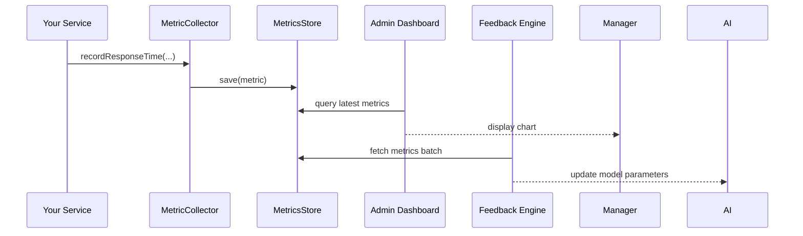

# Chapter 5: Real-Time Monitoring & Feedback

In [Chapter 4: Hybrid Human-AI Decision Loop](04_hybrid_human_ai_decision_loop_.md) we saw how AI proposals and human reviews combine into decisions. Now, we’ll add a “citywide dashboard” that **tracks** what’s happening **right now**, and **feeds** insights back into our AI models so everything gets better, continuously.

---

## Why Real-Time Monitoring & Feedback?

Imagine you run a federal citizen-services call center. You want to know:

- How fast agents answer calls (response time).
- How satisfied callers feel (satisfaction score).

Without live monitoring, you only learn about problems days later. With a dashboard, you can spot slowdowns instantly—then tweak your AI routing or staffing rules so things improve **on the fly**. That’s the power of **Real-Time Monitoring & Feedback**.

---

## Key Concepts

1. **Metrics**  
   What we measure (e.g., `responseTime`, `satisfactionScore`).

2. **Metric Collector**  
   A little service that **records** each metric event.

3. **Metrics Store**  
   Where we **save** collected metrics (in-memory, time-series DB, etc.).

4. **Dashboard**  
   A live view (charts, tables) for managers or operators.

5. **Feedback Engine**  
   A component that **ingests** these metrics and **adjusts** AI models or policies.

---

## Using Real-Time Monitoring

### Step 1: Record Metrics

Below is a minimal `MetricCollector`. Whenever an API call finishes or a user rates a service, we call these methods.

```javascript
// File: src/monitoring/MetricCollector.js
import { MetricsStore } from './MetricsStore';

export class MetricCollector {
  recordResponseTime(endpoint, ms) {
    MetricsStore.save({ type: 'responseTime', endpoint, value: ms, timestamp: Date.now() });
  }
  recordSatisfaction(userId, score) {
    MetricsStore.save({ type: 'satisfactionScore', userId, value: score, timestamp: Date.now() });
  }
}
```
> Here we wrap raw data into simple objects and send them to `MetricsStore`.

### Step 2: In Your Service

```javascript
// In your API handler
import { MetricCollector } from './monitoring/MetricCollector';

const collector = new MetricCollector();

async function submitApplication(req, res) {
  const start = Date.now();
  // ... handle submission logic ...
  const elapsed = Date.now() - start;
  collector.recordResponseTime('submitApplication', elapsed);

  res.send({ status: 'ok' });
}

// After the citizen finishes feedback form:
collector.recordSatisfaction(req.user.id, req.body.score);
```
> Each time you finish work or get feedback, you call the collector.

### Step 3: View the Dashboard

On the dashboard side, you fetch recent metrics and plot them:

```javascript
// File: src/dashboard/Dashboard.js
import React, { useEffect, useState } from 'react';
export function Dashboard() {
  const [metrics, setMetrics] = useState([]);
  useEffect(() => {
    // Poll the metrics store every 5 seconds
    setInterval(async () => {
      const data = await fetch('/api/metrics/latest').then(r => r.json());
      setMetrics(data);
    }, 5000);
  }, []);
  return (
    <div>
      <h1>Live Metrics</h1>
      {/* Render charts or tables here */}
      <pre>{JSON.stringify(metrics, null, 2)}</pre>
    </div>
  );
}
```
> Managers see **real-time** numbers without refreshing the app.

---

## What Happens Under the Hood?



1. **App** logs a metric.  
2. **Collector** saves it to **Store**.  
3. **Dashboard** polls **Store** and displays live data.  
4. **Feedback Engine** also pulls from **Store**, analyzes trends, and tweaks the AI model from [Chapter 3: Specialized AI Agents (HMS-A2A)](03_specialized_ai_agents__hms_a2a__.md).

---

## Inside the Implementation

### MetricsStore: Simple In-Memory Store

```javascript
// File: src/monitoring/MetricsStore.js
const data = [];

export class MetricsStore {
  static save(metric) {
    data.push(metric);
  }
  static getLatest(limit = 50) {
    return data.slice(-limit);
  }
}
```
> In production you’d swap this for a time-series database (Prometheus, InfluxDB).

### FeedbackProcessor: Adjust AI Based on Metrics

```javascript
// File: src/monitoring/FeedbackProcessor.js
import { AgentManager } from 'hms-a2a';

export class FeedbackProcessor {
  async analyzeAndFeedback() {
    const metrics = MetricsStore.getLatest(500);
    // e.g., if avg responseTime > 200ms, tell AI to prioritize faster routes
    const avg = metrics
      .filter(m => m.type === 'responseTime')
      .reduce((sum, m) => sum + m.value, 0) / metrics.length;
    if (avg > 200) {
      const advisor = AgentManager.get('resourceAllocator');
      await advisor.run({ tweak: 'fasterRouting' });
    }
  }
}
```
> This “engine” runs periodically (cron or serverless) and nudges the AI system.

---

## Conclusion

You now have a **live dashboard** tracking important metrics, plus a **feedback loop** that automatically tunes AI models in [Chapter 3: Specialized AI Agents (HMS-A2A)](03_specialized_ai_agents__hms_a2a__.md). With this, your system behaves like a smart city grid—monitoring traffic and energy in real time, then optimizing instantly.

Next up, we’ll see how to expose these insights and controls in the user-facing layers: [Chapter 6: Interface Layer](06_interface_layer_.md).

---

Generated by [AI Codebase Knowledge Builder](https://github.com/The-Pocket/Tutorial-Codebase-Knowledge)