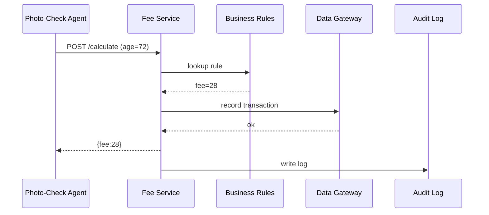

# Chapter 6: Backend Service Core (HMS-SVC)

*(Coming from [Model Context Protocol (HMS-MCP)](05_model_context_protocol__hms_mcp__.md)? Great! You already know how every message in our platform travels inside a signed “envelope.” Now we’ll see **who actually opens that envelope and does the heavy lifting.**)*

---

## 1. Why Do We Need HMS-SVC?

### Story – “Renew My Driver’s License Online”

1. Ana logs in to `renew-license.gov`.
2. She uploads a new photo and pays the renewal fee.
3. A few seconds later she receives:  
   “✔ Your license renewal was approved. Temporary PDF attached.”

Behind the scenes:

* HMS-ACT raised a **`LICENSE_RENEWAL` ticket**.  
* An agent validated Ana’s photo using HMS-AGT.  
* But somebody had to **calculate fees, check eligibility, update the motor-vehicle database, and generate that PDF**.

That “somebody” is not one giant app—it’s a **collection of tiny, focused services** running inside **HMS-SVC**.

Think of HMS-SVC as the **federal agency campus** where specialists sit in different cubicles:

* Fee Calculator Office  
* Eligibility Office  
* Document Generator Office  

All offices expose clear, secure doors (APIs). Agents, front-ends, and other services simply knock on the right door.

---

## 2. Key Concepts (Plain English)

| Term                | What It Means                                              | Government Analogy                    |
|---------------------|------------------------------------------------------------|---------------------------------------|
| Service             | A mini-app with one mission (“calculate license fee”).     | An agency office (e.g., Fee Office).  |
| Endpoint            | One door on that office (“POST /calculate”).               | Window #4 at the DMV.                 |
| Business Rule       | The logic inside (“age < 65 → \$40; else \$28”).           | Printed fee table on the wall.        |
| Policy Adapter      | A plugin that reads rules from [HMS-GOV](01_governance_layer__hms_gov__.md). | Compliance officer in the office.     |
| Data Gateway        | Thin layer that talks to [HMS-DTA](08_data_lake___repository__hms_dta__.md). | Records clerk sending files to archives. |

Keep these five words handy—90 % of HMS-SVC is just combining them.

---

## 3. First Walk-Through  
### Use Case: Calculate Ana’s Renewal Fee

We’ll build a **Fee Calculator Service** in <20 lines, call it, and see what happens.

#### 3.1 The Service (`svc_fee.py`)

```python
# run: python svc_fee.py
from fastapi import FastAPI
app = FastAPI(title="Fee Calculator")

FEE_TABLE = { "standard": 40, "senior": 28 }  # could come from GOV

@app.post("/calculate")
def calc(payload: dict):
    age = payload["age"]
    kind = "senior" if age >= 65 else "standard"
    return { "fee": FEE_TABLE[kind], "category": kind }
```

Explanation  
1. We use **FastAPI** for zero-boilerplate endpoints.  
2. Based on `age`, we pick a category and return the fee.  
3. The code is intentionally tiny so beginners can read it in one sip.

#### 3.2 The Caller (`agent_call.py`)

```python
import requests, json
env = { "age": 72 }   # would usually come from MCP envelope
resp = requests.post("http://localhost:8000/calculate", json=env)
print(resp.json())    # → {'fee': 28, 'category': 'senior'}
```

Explanation  
An agent (or front-end) hits the endpoint and receives a clean JSON answer. No extra ceremony.

---

## 4. What Happens Under the Hood?



Five actors, one quick workflow—the agent never touches internal databases or rule files.

---

## 5. Inside the Source Tree (Bird’s-Eye)

```
hms-svc/
├── fee_service/
│   ├── api.py            # endpoints
│   ├── rules.py          # business logic
│   └── adapter.py        # pulls rules from GOV
├── eligibility_service/
│   └── ...
└── shared/
    └── data_gateway.py
```

### 5.1 `rules.py` (10 lines)

```python
def fee_by_age(age, table):
    kind = "senior" if age >= 65 else "standard"
    return table[kind], kind
```

### 5.2 `adapter.py` (simplified – 12 lines)

```python
import requests, os, json
GOV_URL = os.getenv("GOV_URL", "http://gov/policies")

def load_fee_table():
    r = requests.get(f"{GOV_URL}/license-fees")
    return json.loads(r.text)           # → {"standard": 40, "senior": 28}
```

Beginners’ takeaway: services **never hard-code laws**; they pull them from HMS-GOV, so a policy update needs *zero* code changes.

---

## 6. Security & Permissions

HMS-SVC refuses any request **without an MCP envelope**.

```python
# file: middleware.py  (13 lines)
from hms_mcp import Envelope
from fastapi import Request, HTTPException

async def verify_envelope(request: Request, call_next):
    raw = await request.body()
    try:
        env = Envelope.parse(raw)
    except Exception:
        raise HTTPException(401, "Bad envelope")
    request.state.env = env           # stash for endpoint
    return await call_next(request)
```

Attach this middleware once, and every endpoint is protected.  
*Bonus*: Auditors can trace the same `trace_id` from UI to database.

---

## 7. Relationship to Other Layers

• **Policies**: Loaded via adapter from [HMS-GOV](01_governance_layer__hms_gov__.md).  
• **Statutes**: Version constraints come from [HMS-CDF](02_codified_democracy_foundation_engine__hms_cdf__.md).  
• **Tickets & Agents**: Invoked by [HMS-ACT](03_action_orchestrator__hms_act__.md) & [HMS-AGT](04_agent_framework__hms_agt___hms_agx__.md).  
• **Envelopes**: Verified with [HMS-MCP](05_model_context_protocol__hms_mcp__.md).  
• **Data**: Stored through [HMS-DTA](08_data_lake___repository__hms_dta__.md).  

Everything plugs together like Lego—swap a policy, and services adjust instantly.

---

## 8. Try It Yourself (5-Minute Lab)

```bash
# 1. Run the fee service
uvicorn svc_fee:app --reload
# 2. Simulate an agent call
python agent_call.py
# 3. Change fee policy (pretend via GOV) and hit again
```

Watch how the response changes after you update `license-fees` in GOV—no restart needed!

---

## 9. Recap & What’s Next

You learned:

✓ HMS-SVC hosts small, domain-focused services with clear APIs.  
✓ Each service pulls **rules** from governance, enforces **security** via MCP envelopes, and writes to the data lake via a **gateway**.  
✓ Building a new service can be as simple as **15 lines of FastAPI code**.

Next, we’ll look at the **front-end layer** that shows these results to citizens and clerks alike: [Micro-Frontend Interface Library (HMS-MFE)](07_micro_frontend_interface_library__hms_mfe__.md).

---

---

Generated by [AI Codebase Knowledge Builder](https://github.com/The-Pocket/Tutorial-Codebase-Knowledge)