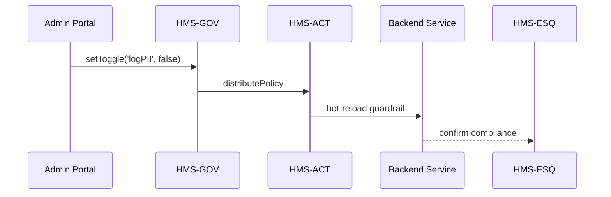

# Chapter 6: Governance Layer (HMS-SYS → HMS-GOV)


*Continuation of [Human-in-the-Loop (HITL) Control Panel](05_human_in_the_loop__hitl__control_panel_.md)*  

---

## 1. Why Do We Need a Governance Layer?

### 60-Second Story – “The Patriot Privacy Switch”

The **U.S. Fleet Forces Command (USFFC)** wants to let an AI bot auto-approve small parts orders (< \$500) to keep ships mission-ready.  
At the **same time**, Congress passes a rule limiting how much personally-identifiable information (PII) can be logged about vendors.  
How do we:

1. Roll out the auto-approval feature **fast**  
2. Guarantee the new privacy rule is followed **everywhere** (web portals, bots, APIs)  
3. Prove to auditors that we did it?

Answer: flip a single toggle on the **Governance Layer**—the courthouse’s *top floor* that watches everything below.

---

## 2. Key Concepts (Plain English)

| Term | Friendly Explanation |
|------|----------------------|
| **Admin Portal** | One dashboard where policy officers turn knobs. |
| **Policy Graph** | A visual map showing which microservice or agent inherits which rule. |
| **Compliance Toggle** | An on/off switch tied to a policy (“Log PII → OFF”). |
| **Audit Log** | Tamper-proof diary of every policy change and why. |
| **Guardrail** | Code generated from a policy that blocks a bad action before it happens. |

Analogy:  
Think of the Governance Layer as the *traffic-light control room* for the entire city. Change a light here, and intersections across town obey instantly.

---

## 3. A First Look at the Admin Portal

Below is a **React-ish** snippet that mounts the pre-built Governance screen inside any internal portal.

```javascript
// GovernanceScreen.js  (17 lines)
import { PolicyGraph, Toggle, AuditViewer } from '@hms-gov/bricks';
import { usePolicy } from '@hms-gov/client';

export default function GovernanceScreen() {
  const { policies, setToggle } = usePolicy(); // auto-load all rules

  return (
    <>
      <h1>Governance Dashboard</h1>
      <PolicyGraph data={policies} />
      <h2>Privacy Settings</h2>
      <Toggle
        label="Log Personally-Identifiable Info"
        checked={policies.logPII}
        onChange={val => setToggle('logPII', val)}
      />
      <AuditViewer limit={20} />   {/* last 20 changes */}
    </>
  );
}
```

What happens?  
1. `PolicyGraph` paints an inheritance tree: *USFFC API* → *Log PII (OFF)*.  
2. Toggling `logPII` immediately updates every downstream service (more on that soon).  
3. `AuditViewer` shows who toggled what and when.

---

## 4. Creating a New Guardrail in 10 Lines

Suppose MedPAC must review **all** budgets > \$5 M.

```javascript
// rules/largeBudget.js  (10 lines)
export default {
  id: 'budgetOver5M',
  when: ({ amount }) => amount > 5_000_000,
  then: 'requireHumanReview',       // sends to HITL panel
  reason: 'MedPAC Oversight FY24',
  owner: 'finance@medpac.gov'
};
```

Explanation  
• `when` is a plain JS function—easy for non-engineers to read.  
• `then` calls a built-in action (forward to [HITL](05_human_in_the_loop__hitl__control_panel_.md)).  
• Saved rules appear in the Admin Portal automatically.

---

## 5. Life of a Toggle – Step-By-Step



Only five actors, all traceable in the audit log.

---

## 6. Under the Hood

### 6.1 Policy Distribution (9 lines)

```javascript
// gov/distribute.js
import { broadcast } from '@hms-sys/events';

export async function distribute(policy) {
  await db.policies.save(policy);          // persist
  broadcast('policy:update', policy);      // WebSocket fan-out
}
```

Every subscribed service listens to the `policy:update` event and recompiles its guardrails on the fly.

### 6.2 Guardrail Middleware (12 lines)

```javascript
// svc/middleware/guard.js
export function guard(req, res, next) {
  const { rules } = req.app.locals;
  if (rules.budgetOver5M?.when(req.body) && req.user.role !== 'human-reviewer') {
    return res.status(403).send('Needs MedPAC review');
  }
  next();
}
```

Dropped into any Express route in [Backend Service APIs](10_backend_service_apis__hms_svc___hms_api__.md) — 0 extra code for product teams.

---

## 7. Browsing the Audit Log

```javascript
// showAudit.js  (13 lines)
import { getAudit } from '@hms-gov/client';

const logs = await getAudit({ limit: 5 });
logs.forEach(l =>
  console.log(`${l.time} — ${l.actor} toggled ${l.key} → ${l.value}`)
);
```

Sample output:

```
2024-05-08 14:03  pei.lin@usffc.mil  logPII → false
2024-04-22 09:10  alex@interior.gov   budgetOver5M rule added
```

Every line is hashed and signed by [Security & Compliance Engine](11_security___compliance_engine__hms_esq__.md).

---

## 8. Where Governance Fits in the Big Picture

* Provides the **rules** agents follow via [Agent Interaction Protocol](04_agent_interaction_protocol__hms_mcp__.md).  
* Feeds the **HITL Control Panel** with thresholds (e.g., MedPAC \$5 M).  
* Streams immutable logs to the **Telemetry Stack** in [HMS-OPS](12_monitoring___telemetry_stack__hms_ops__.md).  
* Stores policy objects that the upcoming **Policy & Process Model** layer (next chapter) will version and model formally.

---

## 9. Recap

You learned:

1. The Governance Layer is the single switchboard for transparency, ethics, safety, and privacy.  
2. Policies are just readable objects (tiny JS or JSON) that compile into guardrail middleware.  
3. A toggle or new rule cascades across portals, bots, and APIs in seconds.  
4. Every change is automatically audited and visible to both humans and compliance engines.

Ready to see how these policies are **modeled, versioned, and simulated** before they go live?  
Continue to [Policy & Process Model (HMS-CDF)](07_policy___process_model__hms_cdf__.md).

---

Generated by [AI Codebase Knowledge Builder](https://github.com/The-Pocket/Tutorial-Codebase-Knowledge)