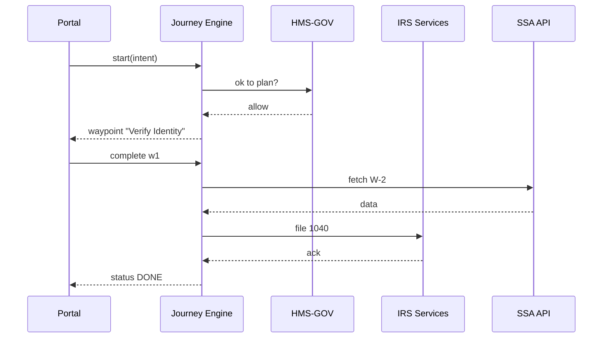

# Chapter 6: Intent-Driven Journey Engine  
[← Back to Chapter 5: Human-in-the-Loop Override](05_human_in_the_loop__hitl__override_.md)

---

## 0. Why Do We Need a “GPS for Bureaucracy”?

Imagine Alicia—an IRS trainee—testing the **public preview** of a new “Turbo-Refund” button.  
She types a single sentence:

> “I want my 2023 tax refund as fast as legally possible.”

Behind that one line hide *dozens* of chores:  
1. Pull W-2 data from Social Security.  
2. Verify identity with Login.gov.  
3. Check eligibility for Child Tax Credit.  
4. File Form 1040 & Form 8888.  
5. Trigger Treasury’s payment API.  
6. Offer live chat if anything fails.

Today citizens bounce through **maze-like menus**—one mis-click and they’re lost.  
The **Intent-Driven Journey Engine (IDJE)** works like Google Maps: you pick the *destination* (“get refund”), the engine picks the *turn-by-turn* steps, re-routes around outages, and never shows turns you’re not allowed to take.

---

## 1. Key Concepts (Plain English)

| Term | Meaning | Analogy |
|------|---------|---------|
| Intent | Final outcome the user wants (“Get tax refund”). | Destination in GPS. |
| Journey | Ordered list of *steps* prepared by the engine. | Turn-by-turn route. |
| Waypoint | A single step (e.g., “Upload W-2”). | Road intersection. |
| Constraint | Rules from [Governance Layer](02_governance_layer__hms_gov__.md) (e.g., “must verify identity”). | Road closed sign. |
| Re-plan | Automatic recalculation when a service is down. | GPS “Re-routing…”. |
| Context Bag | Facts collected so far (name, SSN, roles). | Passenger’s passport pouch. |

---

## 2. 3-Minute Walk-Through: “Fast Tax Refund”

### 2.1 One-Line API Call to Start a Journey

```bash
curl -X POST https://idje.hms/start \
     -H "Content-Type: application/json" \
     -d '{ "intent": "TAX_REFUND_2023", "userId": "u-42" }'
```

Response:

```json
{
  "journeyId": "jrny-99",
  "next": {
    "waypointId": "w1",
    "label": "Verify Identity",
    "endpoint": "https://login.gov/verify"
  }
}
```

Explanation (4 bullets)  
1. You only supply an **intent**; no menu IDs needed.  
2. Engine returns a unique `journeyId`.  
3. `next` tells the UI the very first screen to show.  
4. The UI now *drives* the user straight to identity verification.

### 2.2 Completing a Waypoint

```bash
curl -X POST https://idje.hms/complete \
     -d '{ "journeyId":"jrny-99", "waypointId":"w1", "result":"SUCCESS" }'
```

Possible reply:

```json
{
  "next": {
    "waypointId": "w2",
    "label": "Pull W-2 Data",
    "endpoint": "https://api.ssa.gov/w2/fetch"
  }
}
```

The portal simply follows the breadcrumbs until the engine finally returns:

```json
{ "status":"DONE", "paymentDate":"2024-05-15" }
```

No manual branching logic lives in the front end!

---

## 3. What Happens Behind the Curtain?



Key points  
• Every step is policy-checked by HMS-GOV.  
• The engine calls micro-services **on behalf of** the user; the UI never sees secrets.  
• If SSA is down, the engine **re-plans**: it might ask the user to upload a PDF of the W-2 instead.

---

## 4. Inside the Code (Baby-Size Snippets)

Folder snapshot:

```
journey-engine/
├─ planner/
│  └─ plan.py
├─ runtime/
│  └─ runner.py
└─ api/
   └─ app.py
```

### 4.1 The Brain: `plan.py` (≤ 15 lines)

```python
# planner/plan.py
TEMPLATES = {
  "TAX_REFUND_2023": ["VERIFY_ID", "FETCH_W2", "FILE_1040", "GET_PAYMENT"]
}

def build(intent, ctx):
    steps = TEMPLATES[intent].copy()
    # Drop steps the user already finished
    for done in ctx.get("completed", []):
        if done in steps: steps.remove(done)
    return steps            # e.g., ["VERIFY_ID", ...]
```

Explanation  
1. Load a template route.  
2. Remove already-completed waypoints (supports resume).  
3. Returns a simple list—no heavy AI yet! (Advanced AI plans are pluggable later.)

### 4.2 Runtime: `runner.py` (≤ 18 lines)

```python
# runtime/runner.py
from planner.plan import build
from services import map_step_to_call   # pretend helper

def next_step(journey):
    plan = build(journey["intent"], journey)
    return map_step_to_call(plan[0])    # returns {label, endpoint}

def mark_complete(journey, step):
    journey.setdefault("completed", []).append(step)
    # Persist to Redis / DB (omitted)
```

Explanation  
• Keeps state in memory/DB; picks the next waypoint each time.  
• `map_step_to_call` converts logical step → concrete API endpoint.

### 4.3 API Layer: `app.py` (≤ 20 lines)

```python
# api/app.py
from flask import Flask, request, jsonify
from runtime import next_step, mark_complete

app = Flask(__name__)
STORE = {}  # in-memory journeys

@app.post("/start")
def start():
    data = request.json
    jid = f"jrny-{len(STORE)}"
    STORE[jid] = { "intent": data["intent"] }
    return jsonify({ "journeyId": jid, "next": next_step(STORE[jid]) })

@app.post("/complete")
def complete():
    j = STORE[request.json["journeyId"]]
    mark_complete(j, request.json["waypointId"])
    nxt = next_step(j) if len(j.get("completed",[])) < 4 else "DONE"
    return jsonify({ "next": nxt } if nxt!="DONE" else { "status":"DONE" })

if __name__ == "__main__":
    app.run(port=7200)
```

Explanation (5 bullets)  
1. Extremely stripped-down—just to grasp the idea.  
2. Stores journeys in a Python dict (Redis in real life).  
3. `/start` creates the journey and returns first step.  
4. `/complete` marks progress and returns the next step or DONE.  
5. Replace the magic number “4” with `len(TEMPLATES[intent])` in real code.

---

## 5. Re-Planning When Something Breaks

Suppose the Treasury payment API is offline.  
`runner.py` can detect failure and swap the last step:

```python
if payment_api_down():
    plan.append("SCHEDULE_MAIL_CHECK")   # add fallback
```

This change is transparent to the user—they only see:  
“Your refund will be mailed as a paper check.”

All policy checks and audit logs still fire as usual.

---

## 6. How the Engine Respects Permissions

Before returning any waypoint, the engine asks the **Role-Based Access & Entitlement Matrix** ([Chapter 7](07_role_based_access___entitlement_matrix_.md)):

```python
if not entitlements.allowed(user_id, step):
    # Skip unauthorized step and pick the next
    plan.remove(step)
```

If *all* remaining steps are forbidden, the engine sends back:

```json
{ "error":"NO_AVAILABLE_ROUTE" }
```

The portal can then show “Contact support.”

---

## 7. Hands-On: Run the Toy Engine (4 Commands)

```bash
git clone https://github.com/example/hms-act
cd journey-engine && pip install -r requirements.txt
python api/app.py          # boots on :7200
# Start a journey
curl -X POST localhost:7200/start -d '{"intent":"TAX_REFUND_2023"}'
# Complete first step
curl -X POST localhost:7200/complete -d '{"journeyId":"jrny-0","waypointId":"VERIFY_ID"}'
```

Repeat `/complete` until you receive `status":"DONE"`.

---

## 8. Frequently Asked Questions

**Q: Can two intents merge?**  
A: Yes. The engine supports *multi-intent* journeys (e.g., “Renew Passport **and** Change Address”). It interleaves steps to minimize duplicate work.

**Q: Is AI required?**  
A: Not for simple templates. Advanced agencies can plug an LLM planner via a single Python interface (`planner/llm_plan.py`).

**Q: How does auditing work?**  
A: Every waypoint completion emits an event to the [Audit & Compliance Ledger](14_audit___compliance_ledger_.md) with user ID, timestamp, and outcome.

**Q: What if the user abandons?**  
A: Idle journeys expire after 30 days. On return, the engine resumes from the last completed waypoint.

---

## 9. What You Learned

• Users declare an **intent**, not a menu path.  
• The Intent-Driven Journey Engine converts that intent into safe, policy-compliant waypoints.  
• UI code stays minimal—just display the next step returned by the engine.  
• Outages and permission blocks trigger **automatic re-planning**.  
• Every step is policy-checked, logged, and restart-friendly.

Ready to see *who* is allowed to visit which waypoints?  
Continue to [Chapter 7: Role-Based Access & Entitlement Matrix](07_role_based_access___entitlement_matrix_.md).

---

Generated by [AI Codebase Knowledge Builder](https://github.com/The-Pocket/Tutorial-Codebase-Knowledge)