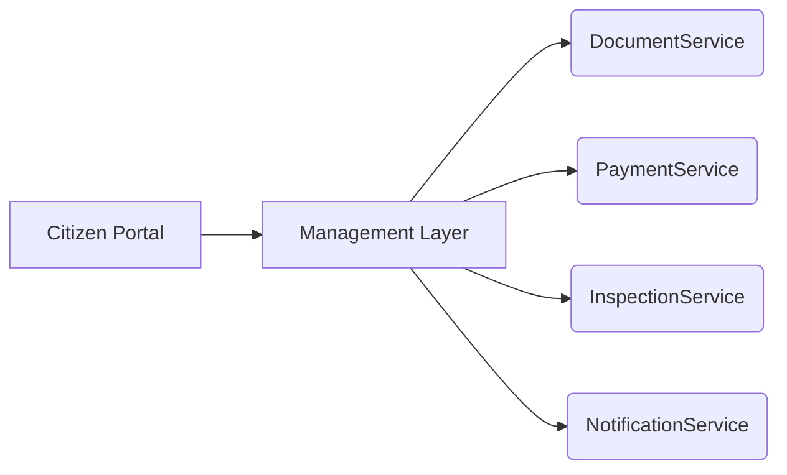
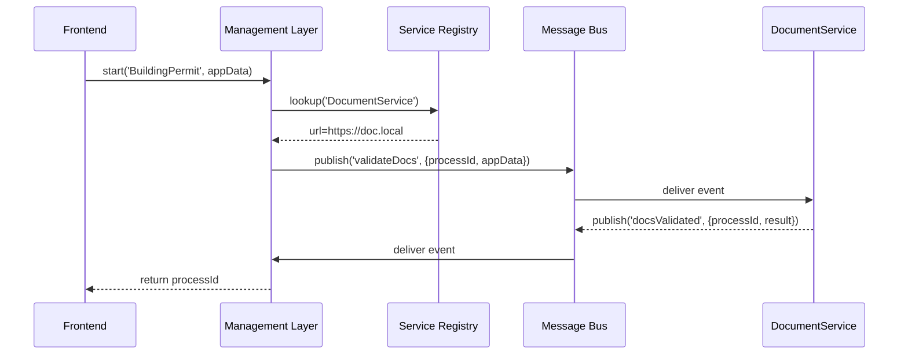

# Chapter 6: Management Layer

Welcome back! In [Chapter 5: Core Infrastructure (HMS-SYS)](05_core_infrastructure__hms_sys__.md) we learned how services register, secure themselves, and log centrally. Now we’ll meet the **Management Layer**—the “executive office” that coordinates workflows, messages, and data pipelines across all our services.

---

## Why a Management Layer?

Imagine a citizen applies online for a new building permit. Behind the scenes we must:

1. Validate their documents  
2. Charge the application fee  
3. Assign an inspector  
4. Schedule the inspection  
5. Send a final decision notice  

These steps involve different microservices—and someone needs to orchestrate them in order, handle retries, track status, and notify everyone when each step completes. That’s exactly what the **Management Layer** does. It’s like an agency’s operations center that:

- Keeps track of each case (process instance)  
- Knows where each supporting service lives (service registry)  
- Delivers events and messages (message bus)  
- Advances or rolls back steps (workflow engine)

---

## Central Use Case: Building Permit Workflow

Let’s walk through a simplified permit process:

1. Citizen submits their application  
2. Management Layer starts a **BuildingPermit** workflow  
3. It calls **DocumentService** for validation  
4. After validation, it calls **PaymentService** to collect fees  
5. Then it dispatches **InspectionService** to schedule an inspector  
6. Finally, it calls **NotificationService** to email the result  



Each arrow is a message or API call orchestrated by the Management Layer.

---

## Key Concepts

1. **Workflow Orchestration**  
   Defines and runs a sequence of steps (tasks) for a business process.  
2. **Service Registry**  
   A directory where each microservice “signs in” so the orchestrator can find it.  
3. **Message Bus**  
   A lightweight event system for sending and receiving messages between services.  
4. **Process Lifecycle**  
   Tracks each workflow instance from `Started` → `In Progress` → `Completed` or `Failed`.

---

## Using the Management Layer

Here’s how a frontend or API might kick off our building permit workflow:

```js
// src/api/permitWorkflow.js
import mgmt from '@hms-mgmt'; // our Management Layer SDK

export async function applyForPermit(data) {
  // 1. Register applicant data as workflow input
  const processId = await mgmt.workflow.start('BuildingPermit', data);
  return { processId, status: 'Started' };
}
```

Explanation:
- We call `mgmt.workflow.start(name, payload)`.  
- The layer returns a `processId` we can show to the citizen.  
- Behind the scenes, the workflow engine will run each step in order.

To check status later:

```js
// src/api/permitStatus.js
import mgmt from '@hms-mgmt';

export async function getStatus(processId) {
  return mgmt.workflow.status(processId);
}
```

---

## Under the Hood: Workflow Execution

Let’s trace what happens when `workflow.start()` is called:



Steps:
1. Frontend calls `start()`.  
2. Management Layer finds the DocumentService endpoint.  
3. It publishes a `validateDocs` event on the message bus.  
4. DocumentService picks it up, validates, then publishes `docsValidated`.  
5. The Management Layer listens for that event to move to the next step.

---

## Internal Implementation

Here’s a peek at how the Management Layer SDK is organized:

```
/hms-mgmt
  index.js            # exposes mgmt.workflow, mgmt.registry, mgmt.bus
  serviceRegistry.js  # register(), lookup()
  messageBus.js       # publish(), subscribe()
  workflowManager.js  # start(), status(), handleEvents()
```

### serviceRegistry.js

```js
// hms-mgmt/serviceRegistry.js
const registry = {};

export function register(name, url) {
  registry[name] = url;
}

export function lookup(name) {
  return registry[name];
}
```

Explanation:
- Services call `register()` at startup.  
- Orchestrator uses `lookup()` to find where to send messages.

### messageBus.js

```js
// hms-mgmt/messageBus.js
const listeners = {};

export function publish(event, payload) {
  (listeners[event] || []).forEach(cb => cb(payload));
}

export function subscribe(event, cb) {
  listeners[event] = listeners[event] || [];
  listeners[event].push(cb);
}
```

Explanation:
- We keep an in-memory map of event names → callbacks.  
- `publish()` invokes all subscribers for that event.

### workflowManager.js

```js
// hms-mgmt/workflowManager.js
import { lookup } from './serviceRegistry';
import { publish, subscribe } from './messageBus';

const processes = {};

export function start(definition, input) {
  const id = Math.random().toString(36).slice(2);
  processes[id] = { definition, input, state: 'Started' };
  publish(`${definition}.start`, { processId: id, input });
  return id;
}

export function status(id) {
  return processes[id]?.state || 'Unknown';
}

// Listen for task-complete events and advance the workflow
subscribe('docsValidated', ({ processId }) => {
  processes[processId].state = 'DocsValidated';
  // next step: fee payment
  const url = lookup('PaymentService');
  publish('collectFee', { processId, url });
});
```

Explanation:
- `start()` creates a new process record and fires the first event.  
- We subscribe to service-specific events (`docsValidated`) to update state and kick off next steps.

### index.js

```js
// hms-mgmt/index.js
export * as registry from './serviceRegistry';
export * as bus from './messageBus';
export * as workflow from './workflowManager';
```

Explanation:
- We bundle registry, bus, and workflow APIs under one module.

---

## Conclusion

In this chapter you learned how the **Management Layer**:

- Orchestrates multi-step processes like building permits  
- Keeps a registry of service endpoints ([Chapter 5: HMS-SYS](05_core_infrastructure__hms_sys__.md))  
- Uses a simple message bus to send and receive events  
- Tracks each workflow’s lifecycle and moves it forward

Next up, we’ll build on these workflows with business rules and policies in our **[Chapter 7: Policy Engine & Workflow Orchestration](07_policy_engine___workflow_orchestration_.md)**.

---

Generated by [AI Codebase Knowledge Builder](https://github.com/The-Pocket/Tutorial-Codebase-Knowledge)