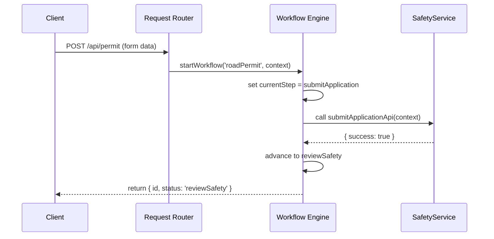

# Chapter 7: Management Layer

In the previous chapter, we built the [Interface Layer](06_interface_layer_.md) “town hall” where citizens and officers submit and review data. Now, we’ll zoom out one level to the **Management Layer**—our “municipal operations office” that coordinates **workflows**, **service orchestration**, and **request routing**.  

Imagine a state Department of Transportation that must:
- Accept **road permit** applications.
- Manage **incident reports** (e.g., potholes).
- Track the **status** of each request end-to-end.

The Management Layer ties all these pieces together.

---

## Why a Management Layer?

Without a central coordinator:
- Permit forms go to the wrong team.
- Incident reports stall without follow-up.
- Citizens can’t track progress.

The Management Layer solves this by:
1. Defining **workflows** (e.g., steps to approve a permit).  
2. Orchestrating **services** (calling the approval, notification, and tracking systems).  
3. Routing **requests** to the right microservice or team.  

Think of it as the city’s operations office that says “Permit #123: Step 1 complete, now send to structural review.”

---

## Key Concepts

1. **Workflow Definition**  
   A named sequence of steps (tasks) for a request type.  
2. **Workflow Engine**  
   Drives the execution of those steps in order.  
3. **Service Orchestrator**  
   Calls external services (APIs) or internal modules for each step.  
4. **Request Router**  
   Directs incoming requests to the correct workflow.  
5. **Status Tracker**  
   Records the current state and history of each workflow instance.

---

## Defining a Permit Workflow

First, we declare what steps a **road permit** takes:

```javascript
// File: src/management/workflows/permitWorkflow.js
module.exports = {
  steps: [
    { name: 'submitApplication' },
    { name: 'reviewSafety' },
    { name: 'issuePermit' },
    { name: 'notifyApplicant' }
  ]
};
```
> Here we list four ordered steps by name.

Next, we register this workflow with the Management Layer:

```javascript
// File: src/management/index.js
const { registerWorkflow } = require('./engine');
const permitWorkflow = require('./workflows/permitWorkflow');

registerWorkflow('roadPermit', permitWorkflow);
```
> Now, the engine knows about a workflow called `"roadPermit"`.

---

## Starting a Workflow

When the citizen’s form arrives, we start the workflow:

```javascript
// File: src/api/permitHandler.js
const { startWorkflow } = require('../management/engine');

async function handleSubmit(req, res) {
  const instance = await startWorkflow('roadPermit', {
    applicantId: req.body.applicantId,
    data: req.body
  });
  res.json({ workflowId: instance.id, status: instance.status });
}
```
> `startWorkflow` returns an object with an `id` and initial `status`.

Example response:
```json
{ "workflowId": "wf-001", "status": "submitApplication" }
```

---

## What Happens Under the Hood?



1. **Router** sends the request to the **Engine**.  
2. **Engine** loads the workflow definition, sets the first step.  
3. It **orchestrates** a call to the appropriate service.  
4. On success, it **moves** to the next step and returns the updated status.

---

## Inside the Implementation

### 1. Workflow Registry

```javascript
// File: src/management/engine.js
const workflows = new Map();

function registerWorkflow(name, definition) {
  workflows.set(name, definition);
}
```
> A simple Map keeps our named workflows.

### 2. Workflow Engine

```javascript
// File: src/management/engine.js (continued)
let counter = 1;

async function startWorkflow(name, context) {
  const def = workflows.get(name);
  const instance = { id: `wf-${counter++}`, context, stepIndex: 0 };
  return runStep(instance, def);
}

async function runStep(instance, def) {
  const step = def.steps[instance.stepIndex].name;
  // Call a task executor by step name
  await executors[step](instance.context);
  instance.stepIndex++;
  instance.status = def.steps[instance.stepIndex]?.name || 'completed';
  return instance;
}
```
> We assign an `id`, run the first step, then advance the index.

### 3. Task Executors

```javascript
// File: src/management/executors.js
exports.submitApplication = async (ctx) => {
  // e.g., save to database
};
exports.reviewSafety = async (ctx) => {
  // e.g., call SafetyService API
};
exports.issuePermit = async (ctx) => {
  // e.g., generate permit PDF
};
exports.notifyApplicant = async (ctx) => {
  // e.g., send email/SMS
};
```
> Each named function handles one step’s logic.

---

## Wrapping Up

In this chapter you learned how the **Management Layer** acts like a city operations office:

- **Registers** named workflows.  
- **Starts** workflows with `startWorkflow()`.  
- **Orchestrates** each step via task executors.  
- **Routes** requests to the right workflow.  
- **Tracks** status end-to-end.

Next, we’ll see how each of these services lives in its own container in [Microservices Architecture](08_microservices_architecture_.md).  
[Next Chapter: Microservices Architecture](08_microservices_architecture_.md)

---

Generated by [AI Codebase Knowledge Builder](https://github.com/The-Pocket/Tutorial-Codebase-Knowledge)