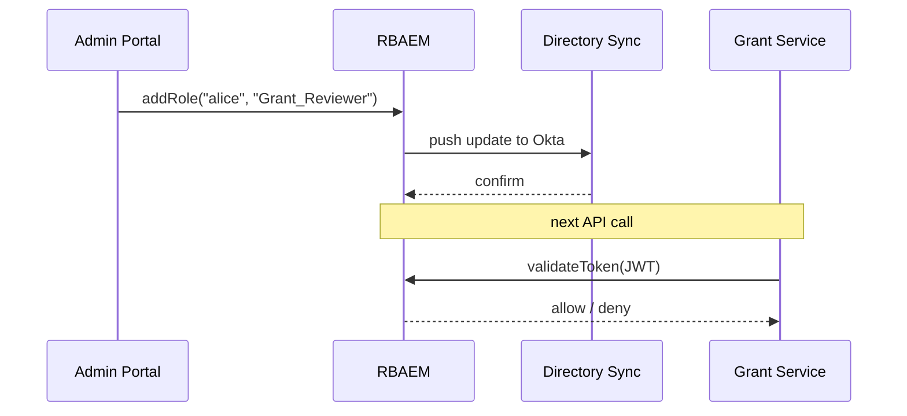

# Chapter 7: Role-Based Access & Entitlement Matrix  
[← Back to Chapter 6: Intent-Driven Journey Engine](06_intent_driven_journey_engine_.md)

---

## 0. Why Do We Need One More “Matrix” in Our Life?

Picture two real federal employees walking into the same portal:

* **Emma** – a clerk at the Centers for Medicare & Medicaid Services (CMS).  
* **Major Rivera** – a logistics officer at the Department of Defense (DoD).

Both land on `https://portal.gov`, but:

* Emma may **approve Medicare invoices up to \$5 000**.  
* Rivera must **schedule troop-movement aircraft**.

If the system lets Rivera see patient data—or lets Emma divert C-17 planes—Congress will have words with us.  

The **Role-Based Access & Entitlement Matrix (RBAEM)** is our **buddy-cop gatekeeper**:

1. Maps *human-friendly* roles ( “Grant Reviewer”, “Logistics Officer” ) to very *nerdy* permissions (“POST /hms-svc/grants/approve”).  
2. Issues short-lived, least-privilege tokens understood by every HMS micro-service.  
3. Syncs with whatever directory your agency already owns: PIV/CAC, LDAP, Okta, etc.  
4. Lets policy staff change access in **plain English**—no code deploy needed.

---

## 1. Key Concepts (Plain English Cheatsheet)

| Word | What It Really Means | One-Sentence Analogy |
|------|----------------------|----------------------|
| Role | Human-readable job hat (“Grant Reviewer”). | The badge hanging on your lanyard. |
| Entitlement | A single “yes” to perform an action. | The key on that badge that opens one door. |
| Matrix | Table that links roles → entitlements. | Hotel chart: which card opens which room. |
| Token | Digitally signed list of active entitlements. | A temporary guest card that expires at noon. |
| Directory Sync | Script that imports roles from LDAP/Okta. | Receptionist copying names from yesterday’s roster. |

---

## 2. A 3-Minute Use-Case: “Make Alice a Grant Reviewer”

The Rehabilitation Services Administration (RSA) just hired **Alice**. She needs permission to approve training grants but nothing else.

### 2.1 Admin Adds a Role (No Code!)

1. Open **Admin Portal → Roles**.  
2. Click “Grant Reviewer” → **Add User** → `alice@rsa.gov`.  
3. Hit **Save**. Done.

### 2.2 What Happens Under the Hood?



Key points  
• The *only* manual step was the click in the portal.  
• Alice’s ID in Okta now carries the new role.  
• Every micro-service will see the new entitlements on her next API call.

---

## 3. The Matrix, the Movie: A Tiny YAML Example

```yaml
# roles.yaml   (≤15 lines)
roles:
  Grant_Reviewer:
    description: "Can review & approve RSA training grants ≤ $50k"
    entitlements:
      - name: "GRANT_VIEW"
      - name: "GRANT_APPROVE"
        constraints:
          max_amount: 50000
  Logistics_Officer:
    entitlements:
      - "FLIGHT_SCHEDULE_CREATE"
      - "FLIGHT_SCHEDULE_VIEW"
```

Explanation  
1. Human wording lives right inside YAML → non-techies can read it.  
2. `constraints` embed least-privilege limits (amount, region, time-of-day, etc.).

---

## 4. Consuming the Matrix: 10-Line Service Guard

```python
# guard.py (≤10 lines)
import requests, os

RBAEM_URL = os.getenv("RBAEM_URL", "https://matrix.hms")

def allowed(user_token, action, ctx={}):
    payload = { "token": user_token, "action": action, "context": ctx }
    r = requests.post(f"{RBAEM_URL}/check", json=payload)
    return r.json()["allow"]
```

How a service might use it:

```python
# grant_service.py (≤15 lines)
from guard import allowed

def approve_grant(user_token, grant):
    if not allowed(user_token, "GRANT_APPROVE", {"amount": grant.amount}):
        raise PermissionError("Not permitted")
    # ...proceed to approve...
```

Beginner explanation  
• Service *outsources* the yes/no decision to the matrix.  
• No hard-coded roles inside business code—swap YAML and you’re done.

---

## 5. Internal Implementation (Bird-Eye View)

Folder snapshot:

```
roles-matrix/
├─ api/
│  └─ app.py
├─ core/
│  ├─ loader.py
│  ├─ evaluator.py
│  └─ token.py
└─ sync/
   └─ okta_sync.py
```

### 5.1 Token Issuer (`token.py` – 12 lines)

```python
import jwt, time, os

def issue(user_id, roles):
    claims = {
      "sub": user_id,
      "roles": roles,
      "iat": int(time.time()),
      "exp": int(time.time()) + 900   # 15-minute TTL
    }
    return jwt.encode(claims, os.getenv("JWT_KEY"), algorithm="HS256")
```

Explanation  
• Short TTL means stolen tokens expire quickly → least privilege.

### 5.2 Entitlement Evaluator (`evaluator.py` – 18 lines)

```python
import yaml, fnmatch
RULES = yaml.safe_load(open("roles.yaml"))

def check(token_claims, action, ctx):
    for role in token_claims["roles"]:
        ent = RULES["roles"][role]["entitlements"]
        for e in ent:
            if match(action, e, ctx):
                return True
    return False

def match(action, ent, ctx):
    if isinstance(ent, str):
        return fnmatch.fnmatch(action, ent)
    # handle constraints
    if ent["name"] == action:
        max_amt = ent.get("constraints", {}).get("max_amount", float("inf"))
        return ctx.get("amount", 0) <= max_amt
    return False
```

Explanation  
1. Loads YAML once at startup.  
2. Loops through roles → entitlements → checks constraints.  
3. Uses `fnmatch` for wildcard actions like `FLIGHT_*`.

### 5.3 REST Wrapper (`api/app.py` – 19 lines)

```python
from flask import Flask, request, jsonify
from core import token, evaluator
import jwt, os

app = Flask(__name__)

@app.post("/check")
def check():
    body = request.json
    claims = jwt.decode(body["token"], os.getenv("JWT_KEY"), algorithms=["HS256"])
    ok = evaluator.check(claims, body["action"], body.get("context", {}))
    return jsonify({"allow": ok})

@app.post("/token")
def get_token():
    data = request.json              # {userId: "alice", roles:["Grant_Reviewer"]}
    jwt_token = token.issue(data["userId"], data["roles"])
    return jsonify({"token": jwt_token})

if __name__ == "__main__":
    app.run(port=7300)
```

Explanation  
• Two endpoints: `/token` to mint a JWT, `/check` to verify an action.  
• Keeps the public surface *tiny* and easy to lock down behind TLS.

---

## 6. Directory Sync in a Nutshell

```python
# sync/okta_sync.py (≤15 lines)
import okta, requests

def pull_roles():
    users = okta.list_users()
    for u in users:
        roles = u.profile.get("hmsRoles", [])
        requests.post("https://matrix.hms/token",
                      json={"userId": u.id, "roles": roles})
```

• Runs every 5 minutes via cron or EventBridge.  
• If Okta admin renames a role, the next sync propagates instantly.

---

## 7. Hands-On Lab (4 Steps)

```bash
git clone https://github.com/example/hms-act
cd roles-matrix && pip install -r requirements.txt
python api/app.py        # Matrix on :7300

# 1. Mint a token for Alice
curl -X POST localhost:7300/token \
     -d '{"userId":"alice","roles":["Grant_Reviewer"]}' | jq .token > alice.jwt

# 2. Try to approve $40k (should pass)
curl -X POST localhost:7300/check \
     -d '{"token":'"$(cat alice.jwt)"',"action":"GRANT_APPROVE","context":{"amount":40000}}'

# 3. Try $60k (should fail)
curl -X POST localhost:7300/check \
     -d '{"token":'"$(cat alice.jwt)"',"action":"GRANT_APPROVE","context":{"amount":60000}}'
```

Observe `"allow": true` for \$40 k and `false` for \$60 k—constraint respected!

---

## 8. Frequently Asked Questions

**Q: Is this the same as OAuth scopes?**  
A: Similar spirit, but the Matrix lets non-developers edit high-level roles that **expand into** low-level scopes automatically.

**Q: What about “break-glass” emergencies?**  
A: Grant a temporary role like `Emergency_Admin` with a 1-hour TTL. The token will self-destruct afterward.

**Q: How does it link to the Journey Engine?**  
A: Before serving a waypoint, the [Intent-Driven Journey Engine](06_intent_driven_journey_engine_.md) calls `/check` to ensure the user can perform that step.

**Q: Does every micro-service call the Matrix?**  
A: Yes, but it caches results for the token’s lifetime (15 minutes by default) → near-zero latency penalty.

---

## 9. What You Learned

• **Roles** are human-friendly labels; **entitlements** are fine-grained keys.  
• A YAML **matrix** drives who can do what—no code deploy necessary.  
• Services simply ask “Can this token do X?” and get a fast yes/no.  
• Directory sync keeps roles aligned with PIV/CAC, LDAP, or Okta.  
• Short-lived tokens enforce least privilege and make audits easier.

Ready to see how encryption, masking, and other defenses wrap around these tokens?  
Jump to [Chapter 8: Security & Privacy Guardrails](08_security___privacy_guardrails_.md).

---

Generated by [AI Codebase Knowledge Builder](https://github.com/The-Pocket/Tutorial-Codebase-Knowledge)