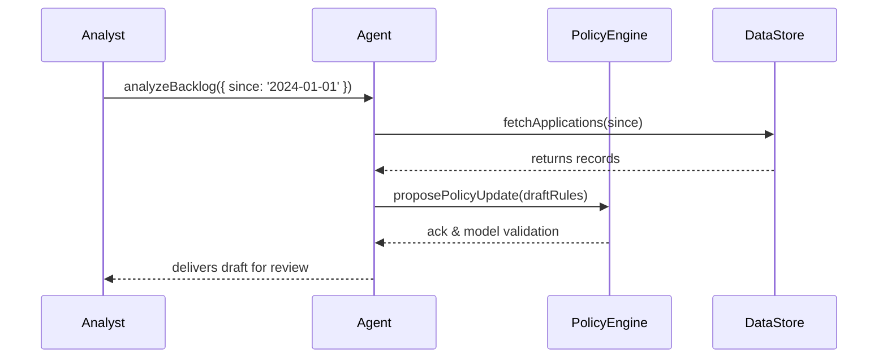

# Chapter 8: AI Agents (HMS-A2A)

Welcome back! In [Chapter 7: Policy Engine & Workflow Orchestration](07_policy_engine___workflow_orchestration_.md) we learned how to encode rules and drive workflows. Now we’ll introduce **AI Agents (HMS-A2A)**—digital assistants that analyze data, draft policy updates, or optimize workflows, always keeping humans in the loop.

---

## Why AI Agents?

Imagine you’re a policy analyst at the U.S. Department of Commerce. You need to:
1. Review thousands of permit applications for inconsistencies.  
2. Propose updates to processing thresholds.  
3. Draft new inspection guidelines and deploy them.  

Doing all this by hand is slow. An **AI Agent** can:
- Scan historical data for patterns  
- Suggest policy tweaks (e.g., “Raise fee threshold to \$5,000”)  
- Draft updated process documents  
- Interact with our [Policy Engine & Workflow Orchestration](07_policy_engine___workflow_orchestration_.md) to deploy changes  

All under your review before anything goes live.

---

## Central Use Case: Automated Policy Advisor

1. You load application backlog data.  
2. The AI Agent analyzes average review times and error rates.  
3. It proposes new policy rules (e.g., faster approval for low-risk cases).  
4. You review, tweak its draft, then deploy via the Policy Engine.  



---

## Key Concepts

1. AI Agent  
   A piece of code that uses machine learning (often via an LLM) to perform tasks—analysis, drafting, recommendations.

2. Human-in-the-Loop  
   Every proposal is reviewed by a person before deployment, ensuring trust and accountability.

3. Policy Engine Integration  
   The agent can call our [Policy Engine](07_policy_engine___workflow_orchestration_.md) API to validate or deploy new rules.

4. Workflow Optimization  
   Agents can suggest reorganizing steps or automating manual handoffs in a workflow.

5. Configuration  
   Agents are driven by simple JSON configs (e.g., which data to load, prompt templates).

---

## How to Use an AI Agent

Below is a minimal example showing how an AI Agent can be used in code:

```js
// src/agents/runPolicyAdvisor.js
import { PolicyAdvisorAgent } from '@hms-a2a';

async function run() {
  const agent = new PolicyAdvisorAgent({ userId: 'analyst1' });
  // Analyze past quarter data and draft rule changes
  const draft = await agent.proposePolicy({
    analysisWindow: '2024-Q1',
    targetProcess: 'PermitReview'
  });
  console.log('Draft Policy:', draft.rules);
}
run();
```

Explanation:
- We instantiate `PolicyAdvisorAgent` with user context.  
- `proposePolicy` fetches data, analyzes it, and returns a draft rule set.  
- You can log or display `draft.rules` for human review.

---

## Under the Hood: What Happens When You Call `proposePolicy()`

1. **Fetch Data**  
   Agent calls our data services to load application records.  
2. **Analyze**  
   It sends a prompt to an LLM (or local model) with summary statistics.  
3. **Draft**  
   The model returns suggested policy changes in structured JSON.  
4. **Validate**  
   Agent submits the JSON to the [Policy Engine](07_policy_engine___workflow_orchestration_.md) for schema checks.  
5. **Return**  
   Clean draft is returned to the analyst for feedback.

---

## Inside HMS-A2A

Folder structure:

```
/hms-a2a
  /agents
    PolicyAdvisorAgent.js
  /config
    agent-config.json
  index.js              # Exposes the agent SDK
```

### PolicyAdvisorAgent.js

```js
// hms-a2a/agents/PolicyAdvisorAgent.js
import { fetchData } from './dataClient.js';
import { PolicyEngineClient } from '@hms-policy';
import { callLLM } from './llmClient.js';

export class PolicyAdvisorAgent {
  constructor(ctx) { this.user = ctx.userId; }
  async proposePolicy({ analysisWindow, targetProcess }) {
    const data = await fetchData(analysisWindow);
    const prompt = `Analyze ${data.length} records for ${targetProcess}...`;
    const draft = await callLLM(prompt);
    // Validate draft with Policy Engine
    const engine = new PolicyEngineClient();
    await engine.loadPolicy('DraftRules', JSON.stringify(draft));
    return draft;
  }
}
```

Explanation:
- `fetchData` loads historical records.  
- `callLLM` wraps a call to an AI service.  
- We validate the draft via `PolicyEngineClient` before returning.

---

## Analogy

Think of the AI Agent as a junior policy advisor who:
- Reads all your case files overnight  
- Produces a draft memo with suggested changes  
- Hands it to you the next morning for edits  

You remain in charge, approving or modifying its work.

---

## Conclusion

In this chapter you learned how **AI Agents (HMS-A2A)** can:
- Automate data analysis and policy drafting  
- Integrate with the [Policy Engine](07_policy_engine___workflow_orchestration_.md)  
- Keep humans in the loop for final review  

Next up: we’ll dive into **[Chapter 9: Backend Services (HMS-SVC)](09_backend_services__hms_svc__.md)** to see how microservices build on these abstractions.

---

Generated by [AI Codebase Knowledge Builder](https://github.com/The-Pocket/Tutorial-Codebase-Knowledge)