# Chapter 8: Data Lake & Repository (HMS-DTA)

*(Finished building pages with  
[Micro-Frontend Interface Library (HMS-MFE)](07_micro_frontend_interface_library__hms_mfe__.md)?  
Great—now let’s learn where every form submission, photo upload, and analytic chart is **actually stored and protected**.)*  

---

## 1. Why Do We Need HMS-DTA?

### Story – “One Click, Many Audiences”

1. A citizen fills out the “Donate Blood” form hosted by the American Red Cross and HHS.  
2. HUD analysts later want to study whether housing insecurity affects donor rates.  
3. Journalists request **aggregate** figures under FOIA.  
4. Data scientists at CDC need raw, de-identified records for an AI model.  
5. Privacy officers must **prove** no name or SSN ever slipped into public dashboards.

Without a single, well-governed **data lake**, every agency might keep private copies, lose track of versions, or—worst of all—accidentally leak donor names into unrelated programs.

**HMS-DTA is the National Archives of our platform.**  
It stores every byte—from raw uploads to polished dashboards—while tracking **lineage** (who touched what) and enforcing **privacy controls** so the blood-donor registry never seeps into the art-grant database.

---

## 2. Key Concepts (Plain English)

| Word / Icon | What It Means | Everyday Analogy |
|-------------|---------------|------------------|
| **Zone**    | A folder with strict rules: Raw 🟠, Curated 🟢, Analytics 🔵, Sandbox 🧪 | Floors in a secure records building |
| **Ingest Job** | Script that uploads new data & tags it | Intake clerk stamping incoming boxes |
| **Tag**     | Label like `program=blood`, `pii=yes`, `year=2025` | Color sticker on a file |
| **Lineage Graph** | Auto-generated map: File A → Script B → Dashboard C | Chain-of-custody log |
| **Privacy Filter** | Reusable rule that removes or hashes sensitive columns | Black marker used by FOIA team |

If you remember **zones, tags, lineage, filters**, you already know 90 % of HMS-DTA.

---

## 3. Your First Walk-Through  
### Use Case: Ingest Blood-Donor CSV → Produce De-Identified Dashboard

We’ll:

1. Upload a raw CSV.  
2. Run a **privacy filter** that removes names & SSNs.  
3. Save the sanitized data in the *Curated* zone.  
4. Query it for a dashboard.

(Everything happens in <40 lines of Python.)

#### 3.1 Ingest the Raw File

```python
# file: ingest_blood.py
from hms_dta import DtaClient

dta = DtaClient(token="AGENCY_PIV")

job = dta.ingest(
    file_path="donors_2025.csv",
    tags={"program": "blood", "pii": "yes", "source": "redcross"}
)
print("🆕 Job ID:", job.id)
```

Explanation  
1. Authenticate once.  
2. `ingest` uploads the file straight into the **Raw** zone.  
3. Tags make future queries lightning-fast.

#### 3.2 Apply a Privacy Filter

```python
# file: sanitize.py
from hms_dta import DtaClient, filters

dta = DtaClient(token="AGENCY_PIV")

filtered_ds = dta.apply_filter(
    dataset="donors_2025.csv",
    filter_fn=filters.drop_columns(["full_name", "ssn"]),
    output_zone="curated",
    extra_tags={"pii": "no"}
)
print("✅ Curated dataset:", filtered_ds.uri)
```

Explanation  
`drop_columns` is a built-in helper; you can chain more (hash, mask, bucketize).

#### 3.3 Query for a Dashboard

```python
# file: donor_counts.py
import pandas as pd
from hms_dta import DtaClient

dta = DtaClient()
df = dta.read("dta://curated/donors_2025.csv")
chart_data = df.groupby("state")["donor_id"].count()
print(chart_data.head())
```

Output (sample):

```
state
CA    4802
DC     318
FL    3901
NY    5120
TX    6230
```

Your Micro-Frontend chart block can now fetch this endpoint directly.

---

## 4. What Happens Under the Hood?

```mermaid
sequenceDiagram
    participant UI  as Portal
    participant ING as Ingest Service
    participant DTA as Data Lake
    participant SAN as Privacy Filter
    participant ANA as Analytics Engine
    UI->>ING: upload CSV
    ING->>DTA: store in Raw🟠
    ING-->>UI: job id
    SAN->>DTA: read Raw🟠
    SAN-->>DTA: write Curated🟢
    ANA->>DTA: SQL query Curated🟢
```



Five simple actors; every step is logged with a **trace-id** from [Model Context Protocol (HMS-MCP)](05_model_context_protocol__hms_mcp__.md).

---

## 5. Peeking Inside the Source Tree

```
hms-dta/
├── ingest/
│   └── api.py           # POST /ingest
├── filters/
│   ├── base.py
│   └── pii.py           # drop_columns, hash_ssn, ...
├── lineage/
│   └── graph.py         # builds DAG ⟶ Neo4j
├── storage/
│   ├── raw/
│   ├── curated/
│   ├── analytics/
│   └── sandbox/
└── cli/dta.py           # dta ls, dta cat, dta lineage
```

### 5.1 Minimal Ingest Endpoint (18 lines)

```python
# ingest/api.py
from fastapi import APIRouter, UploadFile
from storage import save_raw
from lineage import record_edge

router = APIRouter()

@router.post("/ingest")
async def ingest(file: UploadFile, tags: str):
    path = save_raw(file)            # write to raw zone
    record_edge(src=file.filename, dst=path, op="ingest")
    return {"uri": path}
```

Beginner takeaway: **one write + one lineage record**; everything else (encryption, checksum) is handled by helpers.

### 5.2 Simple Privacy Filter (12 lines)

```python
# filters/pii.py
import pandas as pd

def drop_columns(cols):
    def _inner(df_path, out_path):
        df = pd.read_csv(df_path)
        df.drop(columns=cols).to_csv(out_path, index=False)
    return _inner
```

Filters are **callables** that accept `(input_path, output_path)`.  
HMS-DTA wraps them in a sandbox (seccomp + network off) before execution.

### 5.3 Lineage Record (10 lines)

```python
# lineage/graph.py
import neo4j

def record_edge(src, dst, op):
    cypher = """
        MERGE (s:Asset {uri:$src})
        MERGE (d:Asset {uri:$dst})
        MERGE (s)-[:USED_IN {op:$op, ts:timestamp()}]->(d)
    """
    neo4j.run(cypher, src=src, dst=dst, op=op)
```

Now auditors can query:  
“Show every dataset that **touched** `donors_2025.csv`.”

---

## 6. Zones & Governance

```mermaid
graph LR
    A[Raw 🟠] -->|filters| B[Curated 🟢]
    B -->|BI tools| C[Analytics 🔵]
    C -->|export| D[Sandbox 🧪]
```



• Only **Ingest Jobs** may write to Raw.  
• Only **Filters** with `pii=no` output may write to Curated.  
• BI dashboards query Analytics (materialized views).  
• Data scientists can request a temporary **Sandbox** copy—tags ensure it auto-expires per [Governance Layer (HMS-GOV)](01_governance_layer__hms_gov__.md) policy.

---

## 7. Relationship to Other Layers

Layer | How They Interact With HMS-DTA
------|--------------------------------
[HMS-GOV](01_governance_layer__hms_gov__.md) | Defines retention, encryption, & sharing rules.
[HMS-SVC](06_backend_service_core__hms_svc__.md) | Writes operational data via the **Data Gateway**.
[HMS-AGT](04_agent_framework__hms_agt___hms_agx__.md) | Reads curated data while honor­ing tag-based permissions.
[HMS-OPS](12_activity___operations_monitoring__hms_ops___hms_oms__.md) | Tails lineage events for usage dashboards.
[HMS-ESQ](10_compliance___legal_reasoner__hms_esq__.md) | Scans tags + lineage to verify legal compliance.

---

## 8. Try It Yourself (5-Minute Lab)

```bash
git clone https://github.com/hms-example/hms-dta
cd hms-dta/examples
# 1. Start the mini lake
docker compose up dta
# 2. Ingest sample CSV
python ingest_blood.py
# 3. Run the privacy filter
python sanitize.py
# 4. Explore lineage
dta lineage donors_2025.csv
```

You should see a graph like:

```
donors_2025.csv ── ingest ──▶ raw/donors_2025.csv
raw/donors_2025.csv ── drop_columns ──▶ curated/donors_2025.csv
```

---

## 9. Recap & What’s Next

You learned:

✓ HMS-DTA stores data in **zones**, labeled with **tags**, and tracks every hop with a **lineage graph**.  
✓ Built-in **privacy filters** remove or mask sensitive columns before broader sharing.  
✓ Services, agents, and dashboards all use the same lake—no rogue copies.

Ready to move money as cleanly as we move data?  
Head over to [Financial Transaction Engine (HMS-ACH)](09_financial_transaction_engine__hms_ach__.md) to see how payments flow through the platform.

---

---

Generated by [AI Codebase Knowledge Builder](https://github.com/The-Pocket/Tutorial-Codebase-Knowledge)