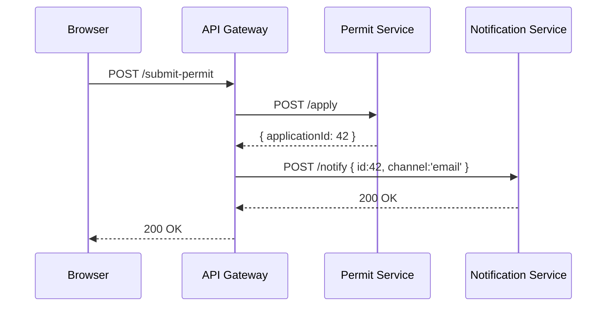

# Chapter 8: Microservices Architecture

In [Chapter 7: Management Layer](07_management_layer_.md) we saw how workflows get coordinated end-to-end. Now it’s time to break our big system into **tiny, focused services**—the Microservices Architecture.

---

## Why Microservices?

Imagine your state’s road permit system is one giant application. Whenever you need to update the **notification logic**, you have to redeploy the whole thing—and risk downtime for permit reviews. With microservices, we split responsibilities:

- **Auth Service** handles login and tokens.
- **Permit Service** processes road-permit applications.
- **Notification Service** sends emails or SMS.

Each service can be built, deployed, scaled, and upgraded on its own—no all-or-nothing deployments.

---

## Key Concepts

1. **Service**  
   A small, independent application owning one business capability (e.g., permit processing).

2. **API Gateway**  
   A single public entry-point that routes calls to each service.

3. **Communication**  
   Services talk over simple HTTP or messaging (queues).  

4. **Service Registry**  
   (Optional) A directory where each service registers its network address.

5. **Containerization**  
   Packaging each service in its own container (e.g., Docker) for easy deployment.

---

## Example Flow: Submitting a Permit



1. **Browser** calls the **Gateway** at `/submit-permit`.  
2. **Gateway** forwards to the **Permit Service**.  
3. Permit Service returns an `applicationId`.  
4. Gateway tells **Notification Service** to send an email.  
5. Finally, the gateway replies to the browser.

---

## Building the Services

### 1. Permit Service (permit-service/server.js)

```javascript
const express = require('express');
const app = express();
app.use(express.json());

app.post('/apply', (req, res) => {
  // pretend we save to a database
  const id = Math.floor(Math.random()*100);
  res.json({ applicationId: id });
});

app.listen(3001, () => console.log('Permit Service on 3001'));
```

This tiny Express app listens on port 3001 and returns a fake ID.

### 2. Notification Service (notification-service/server.js)

```javascript
const express = require('express');
const app = express();
app.use(express.json());

app.post('/notify', (req, res) => {
  // pretend to send email/SMS
  console.log('Notifying for', req.body);
  res.sendStatus(200);
});

app.listen(3002, () => console.log('Notification Service on 3002'));
```

On port 3002, it logs the payload and returns 200.

### 3. API Gateway (gateway/server.js)

```javascript
const express = require('express');
const fetch = require('node-fetch');
const app = express();
app.use(express.json());

app.post('/submit-permit', async (req, res) => {
  // step 1: call Permit Service
  const p = await fetch('http://localhost:3001/apply', {
    method:'POST', headers:{'Content-Type':'application/json'},
    body: JSON.stringify(req.body)
  });
  const data = await p.json();

  // step 2: trigger Notification Service
  await fetch('http://localhost:3002/notify', {
    method:'POST', headers:{'Content-Type':'application/json'},
    body: JSON.stringify({ id:data.applicationId, channel:'email' })
  });

  res.json(data);
});

app.listen(3000, () => console.log('API Gateway on 3000'));
```

The gateway on port 3000 orchestrates both calls and returns the permit ID.

---

## What Happens Under the Hood?

1. **Deploy** each service (e.g., as Docker containers).  
2. **Services register** (you can skip registry or use a simple file).  
3. **Gateway** routes incoming requests based on URL patterns.  
4. **Services communicate** over HTTP—no shared database required.  
5. **Independent updates**: you can redeploy Notification Service without touching Permit Service.

---

## Under the Hood: Service Registry (Optional)

```javascript
// registry.js
const services = {};
function register(name, url) { services[name] = url; }
function resolve(name) { return services[name]; }

module.exports = { register, resolve };
```

The gateway can use `resolve('permit')` instead of hard-coding URLs.

---

## Benefits & Analogy

- Like **separate shops in a mall**, each microservice is a specialist.  
- You can **close one shop for renovation** (update a service) **without shutting the mall** (whole platform).  
- Teams can own different services, move fast, and reduce risk.

---

## Conclusion

You now know how to split HMS-ACT into independent microservices:

- **Permit Service** processes applications.  
- **Notification Service** sends messages.  
- **API Gateway** ties them together.  

With microservices, you get independent deployments, better scaling, and more resilient systems.

Next up, we’ll look at our **Core System Platform**—the underlying infrastructure powering all these services.  
[Next Chapter: Core System Platform (HMS-SYS)](09_core_system_platform__hms_sys__.md)

---

Generated by [AI Codebase Knowledge Builder](https://github.com/The-Pocket/Tutorial-Codebase-Knowledge)