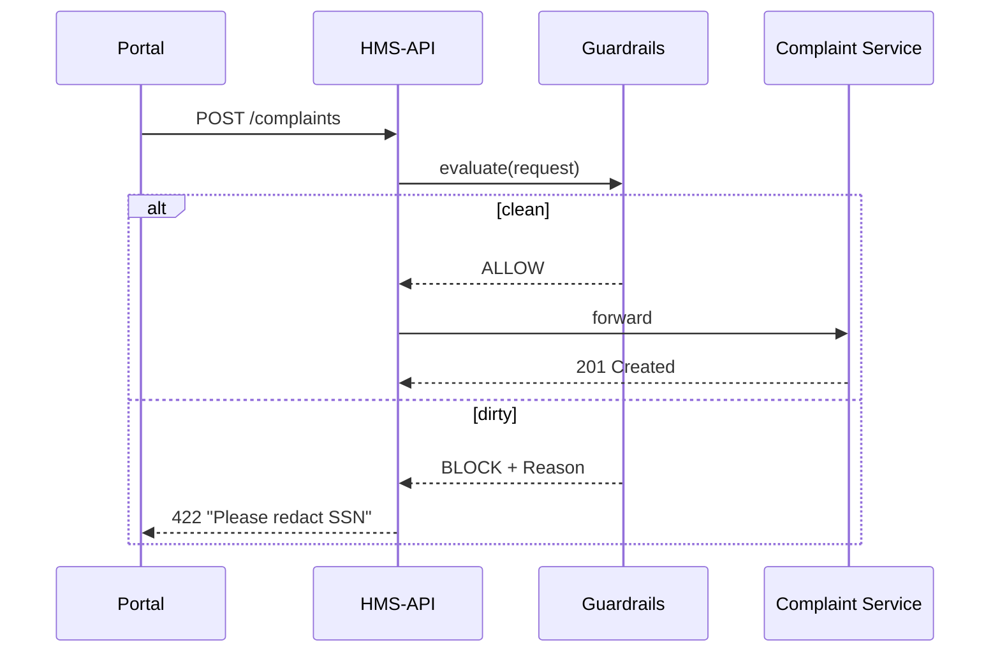

# Chapter 8: Security & Privacy Guardrails  
[← Back to Chapter 7: Role-Based Access & Entitlement Matrix](07_role_based_access___entitlement_matrix_.md)

---

## 0. “Why can’t I just POST the file?”

Picture a citizen emailing the **Office for Civil Rights (OCR)** at the Department of Education.  
They attach a PDF that (unbeknownst to them) contains:

* Their full Social-Security Number  
* Medical accommodation details (HIPAA)  
* A 30 MB scanned image (way over the size limit)

If that payload flows straight through micro-services we risk:

1. PII leakage to logs or 3rd-party vendors.  
2. Violating FISMA impact levels.  
3. Blowing up serverless costs with giant files.

**Security & Privacy Guardrails (SPG)** are the TSA check-points that open every suitcase (API call) **before** it boards the HMS-ACT airplane.  
No dev team has to remember 42 different rules; the guardrails do it automatically.

---

## 1. Key Concepts (plain English)

| Term | What It Does | Travel Analogy |
|------|--------------|----------------|
| Checkpoint | Middleware that inspects each request/response. | TSA agent at every gate. |
| Data Loss Prevention (DLP) Filter | Scans for PII and secrets. | X-ray machine that spots liquids. |
| Encryption Envelope | Automatically encrypts sensitive blobs at rest and in flight. | Sealed duty-free bag. |
| Consent Ledger | Stores the user’s yes/no for data use. | The form you sign before boarding. |
| Quarantine Bucket | Isolates violating payloads until fixed. | The special room where oversized bags wait. |
| Alert Bus | Publishes real-time violations to Slack/Splunk/PagerDuty. | Loudspeaker: “Passenger Smith to Gate 12!” |

---

## 2. Walk-Through: OCR Complaint Upload (5 Steps)

1. **Citizen** clicks “Upload Complaint” on the portal.  
2. Browser sends `POST /api/v1/complaints` with a 30 MB PDF.  
3. **Checkpoint** intercepts the call, finds SSN + HIPAA keywords, and file > 10 MB.  
4. Payload moves to **Quarantine Bucket**, user gets a polite error:  
   “Please remove personal identifiers and compress the file.”  
5. An **Alert** fires to OCR security staff; they can review the quarantined file.

Result: zero PII leakage, no service outage, full audit trail.

---

## 3. Using Guardrails in Your Service (10 Lines)

```python
# complaint_service.py
from spg_sdk import secure_route          # tiny helper

@secure_route("COMPLAINT_UPLOAD")         # 1️⃣ add one decorator
def create_complaint(request):
    # 2️⃣ business logic is untouched
    save_to_db(request.body)              # will only run if guardrails pass
    return {"status": "RECEIVED"}
```

**How it works**  
1. `secure_route` calls the central SPG API **before** your function.  
2. If SPG returns `BLOCK`, the decorator short-circuits and sends the user a friendly message.  
3. No duplicate DLP code in every service.

---

## 4. What Happens Under the Hood?



Only four moving parts—easy to reason about.

---

## 5. Internal Anatomy (Folder Tour)

```
security-privacy-guardrails/
├─ api/           # HTTP interface
│  └─ app.py
├─ checks/        # individual guardrail plugins
│  ├─ size.py
│  ├─ pii.py
│  └─ fisma.py
├─ quarantine/    # storage driver
│  └─ s3_driver.py
└─ alerts/
   └─ slack.py
```

### 5.1 Tiny Check Plugin (pii.py — 15 lines)

```python
# checks/pii.py
import re
SSN = re.compile(r"\b\d{3}-\d{2}-\d{4}\b")

def run(body, headers):
    """Return (is_ok, reason)"""
    if SSN.search(body.decode(errors="ignore")):
        return False, "Contains SSN"
    return True, ""
```

Explanation: searches for the classic `###-##-####` pattern; reusable across services.

### 5.2 Core Evaluator (app.py — 20 lines)

```python
# api/app.py
from flask import Flask, request, jsonify
from checks import size, pii, fisma
from quarantine import store
from alerts import notify

app = Flask(__name__)
CHECKS = [size.run, pii.run, fisma.run]

@app.post("/evaluate")
def evaluate():
    body = request.get_data()
    headers = dict(request.headers)
    for check in CHECKS:
        ok, reason = check(body, headers)
        if not ok:
            q_id = store(body, headers, reason)   # S3 + metadata
            notify(f"🚨 Guardrail BLOCK: {reason} (q:{q_id})")
            return jsonify({"decision": "BLOCK", "reason": reason}), 422
    return jsonify({"decision": "ALLOW"}), 200

if __name__ == "__main__":
    app.run(port=7400)
```

Explanation  
1. Loops through each plugin until one fails.  
2. On failure: saves to quarantine, fires Slack alert, returns `BLOCK`.  
3. On success: returns `ALLOW` instantly (< 20 ms in memory mode).

---

## 6. Connecting to Other Layers

* **Policies**: Which plugins run and their thresholds come from [Governance Layer](02_governance_layer__hms_gov__.md).  
* **Roles**: The caller’s JWT from [Role Matrix](07_role_based_access___entitlement_matrix_.md) is passed to SPG; special roles (e.g., `Security_Admin`) may bypass quarantine.  
* **Audit**: Every decision is appended to the [Audit & Compliance Ledger](14_audit___compliance_ledger_.md).  
* **HITL**: Quarantined payloads can be reviewed and released via the [Human-in-the-Loop Override](05_human_in_the_loop__hitl__override_.md).

---

## 7. Hands-On Lab (5 Commands)

```bash
git clone https://github.com/example/hms-act
cd security-privacy-guardrails && pip install -r requirements.txt
python api/app.py          # SPG on :7400

# 1. Try a clean payload
curl -X POST localhost:7400/evaluate -d 'Hello OCR'
# → {"decision":"ALLOW"}

# 2. Try a dirty payload
curl -X POST localhost:7400/evaluate -d 'My SSN is 123-45-6789'
# → {"decision":"BLOCK","reason":"Contains SSN"}
```

Open your Slack (or terminal) to see the instant alert from `alerts/slack.py`.

---

## 8. Frequently Asked Questions

**Q: Does this slow down requests?**  
A: In-memory plugins add ~10 ms. Heavy checks (e.g., virus scans) are off-loaded asynchronously; SPG replies `QUARANTINE` while scanning.

**Q: How do we add a new rule?**  
A: Drop a `*.py` plugin in `checks/` and list it in `CHECKS`.  
No service redeploy needed.

**Q: What about encryption keys?**  
A: SPG calls AWS KMS/Hashicorp Vault; services receive a pre-encrypted blob and never touch raw keys.

**Q: Can users appeal a block?**  
A: Yes—HITL can “release from quarantine” after manual redaction.

---

## 9. What You Learned

• Guardrails are TSA-style checkpoints for **every** API call.  
• Plugins handle DLP, encryption, consent, FISMA tagging, and more.  
• Services integrate with one decorator; no duplicated security code.  
• Violations are quarantined, alerted, and fully auditable.  

Ready to see how these safe, policy-compliant payloads become formal **Process Modules** your agency can reuse?  
Jump ahead to [Chapter 9: Process Module / Policy Artifact](09_process_module___policy_artifact_.md).

---

Generated by [AI Codebase Knowledge Builder](https://github.com/The-Pocket/Tutorial-Codebase-Knowledge)