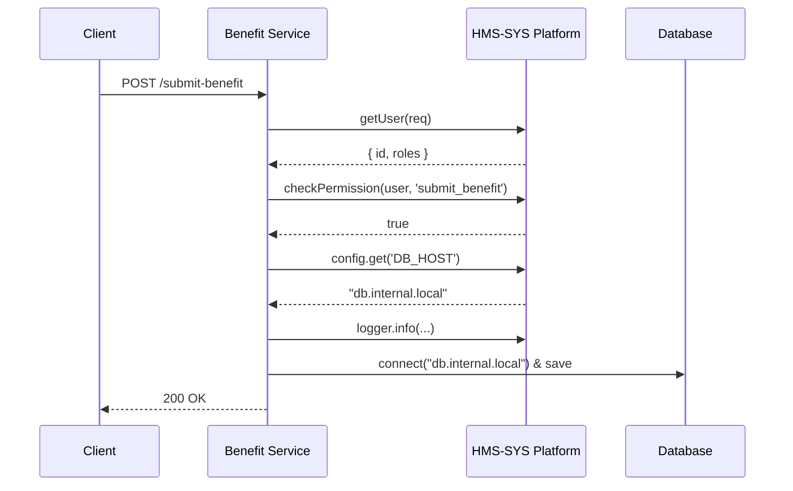

# Chapter 9: Core System Platform (HMS-SYS)

_In the last chapter, we broke our application into independent microservices with an [API Gateway and Docker containers](08_microservices_architecture_.md). Now it’s time to build the “city infrastructure” those services rely on: identity, logging, configuration, and security. Welcome to the Core System Platform (HMS-SYS)!_

---

## Why Do We Need a Core System Platform?

Imagine you’re building a **State Unemployment Benefits** service. Each microservice needs to:

1. **Know who** is calling (identity).  
2. **Record** what happened (logging).  
3. **Read** connection strings or feature flags (configuration).  
4. **Enforce** who can do what (security).

Without a shared platform, every team copies the same code, mistakes creep in, and upgrades become a nightmare. HMS-SYS is our **central infrastructure**—like roads, power, and water in a city—used by every microservice.

---

## Key Concepts

1. **Identity Service**  
   Who is this user or system?  
2. **Logging Service**  
   Write uniform, searchable logs.  
3. **Configuration Service**  
   Fetch settings from a central place.  
4. **Security Service**  
   Check roles, permissions, and tokens.

---

## Using HMS-SYS: A Benefit Submission Example

Below is how your **Unemployment Benefit** service might use HMS-SYS to handle a request:

```javascript
// File: src/benefit/submit.js
import { identity, logger, config, security } from 'hms-sys';

export async function submitBenefit(req, res) {
  const user = identity.getUser(req);  
  if (!security.checkPermission(user, 'submit_benefit')) {
    logger.warn('Forbidden access', { userId: user.id });
    return res.status(403).send('Forbidden');
  }

  const dbHost = config.get('DB_HOST');  
  logger.info('Processing submission', { userId: user.id });
  // ... connect to database at dbHost, save application ...
  return res.send({ status: 'ok' });
}
```

Explanation:
- We extract the caller’s identity (`getUser`).  
- We enforce a permission (`submit_benefit`).  
- We fetch a database host from configuration (`DB_HOST`).  
- We log each major step with structured messages.

---

## What Happens Under the Hood?



1. **Benefit Service** asks HMS-SYS for the user.  
2. It asks HMS-SYS to verify a permission.  
3. It fetches a config value.  
4. It writes a log entry.  
5. Then it talks to the database.

---

## Under the Hood: Core Modules

Let’s peek at simplified implementations of each HMS-SYS module.

### 1. Identity Service

```javascript
// File: hms-sys/identity.js
import jwt from 'jsonwebtoken';

export function getUser(req) {
  const token = req.headers.authorization?.split(' ')[1];
  return jwt.verify(token, process.env.JWT_SECRET);
}
// Returns an object like: { id: 'U123', roles: ['applicant'] }
```

_We parse a JWT token to return a user ID and roles._

### 2. Logging Service

```javascript
// File: hms-sys/logger.js
export const logger = {
  info: (msg, meta) => console.log('INFO', msg, meta),
  warn: (msg, meta) => console.warn('WARN', msg, meta),
  error:(msg, meta) => console.error('ERROR',msg, meta)
};
```

_All logs go through the same interface, making them easy to search and ship to a central log store._

### 3. Configuration Service

```javascript
// File: hms-sys/config.js
export function get(key, defaultVal) {
  return process.env[key] ?? defaultVal;
}
// You can later swap this for a central config server.
```

_Pulls settings from environment variables or a default._

### 4. Security Service

```javascript
// File: hms-sys/security.js
const permissions = {
  submit_benefit: ['applicant', 'caseworker'],
  approve_benefit: ['caseworker']
};

export function checkPermission(user, action) {
  const allowed = permissions[action] || [];
  return user.roles.some(role => allowed.includes(role));
}
```

_Maps actions to roles and checks if the user has one of the required roles._

---

## Conclusion

In this chapter you learned how **HMS-SYS** provides the “roads, power, and water” every microservice needs:

- **Identity**: Who is calling?  
- **Logging**: How do we record events?  
- **Configuration**: Where do we store settings?  
- **Security**: Who can do what?

With HMS-SYS in place, every service speaks the same “infrastructure language,” reducing duplication and simplifying maintenance.

Next up: let’s build on this foundation and dive into the **Account & Authorization System**.  
[Next Chapter: Account & Authorization System](10_account___authorization_system_.md)

---

Generated by [AI Codebase Knowledge Builder](https://github.com/The-Pocket/Tutorial-Codebase-Knowledge)